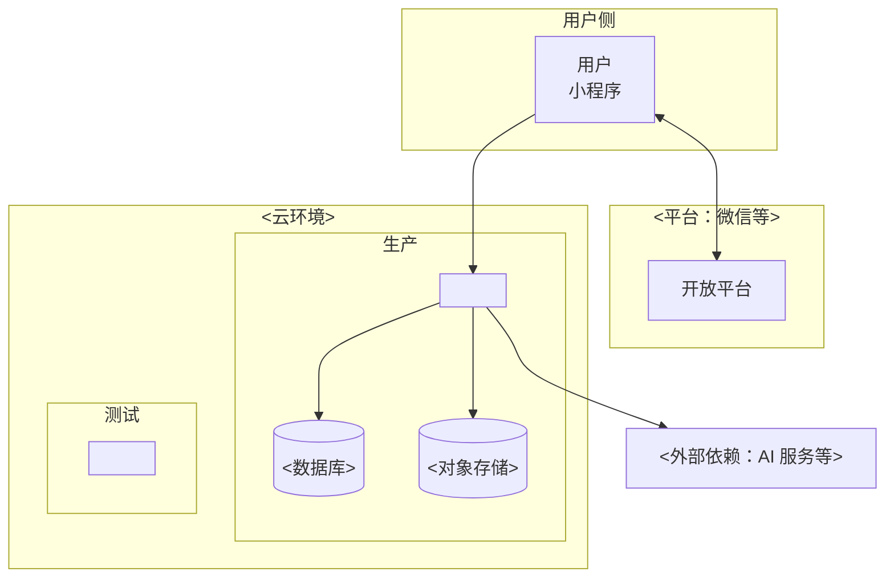

# DEPLOYMENT 文档更新规范（L4 交付层）

## 触发条件

当以下任一情况发生时，本规则必须生效：

- 编辑、新增或重建 `docs/L4/DEPLOYMENT.md`
- 关联文档变化需联动更新：
  - APPLICATION-ARCHITECTURE（部署单元 SSOT 在它 §2.2，应用增减需同步部署）
  - TECHNOLOGY-ARCHITECTURE（技术栈影响部署，选型变化需同步部署方式）
  - API（接口上线需同步部署）
  - INTEGRATION（外部服务密钥/回调需同步部署配置）
  - CONSTITUTION（版本号规则 SSOT 在它 §4）
- 用户要求"生成/更新 DEPLOYMENT"

## 执行流程

1. **工具**：Mermaid flowchart（§2.2 环境拓扑，图规范见宪法）
2. **问用户**（仅当有歧义）：部署形态（云开发/自建）有分歧时 → 问用户
3. **生成流程**：
   - 扫描（自主）：读应用清单 + 技术栈 + 目标文档
   - 已有 DEPLOYMENT → 参考旧文档有效信息，但结构按本模板重建
   - 按模板生成：§1 部署概述 → §2 环境 → §3 部署单元 → §4 操作手册 → §5 配置与发布命令脚本记录 → §6 密钥
4. **联动同步**：修改目标文档后，先读关联文档判断影响，受影响的一并同步修改，完成后校验关联一致性

## 硬性要求

- 运维手册定位（非架构设计）：部署脚本/步骤/参数/环境
- 部署单元来自 APPLICATION-ARCHITECTURE 应用划分图（引用不复制）
- 版本号规则（SSOT 见宪法），此处只记发布记录
- 密钥管理红线：密钥不入库、不落日志、不落前端包
- 每应用必须分环境说明部署参数与配置文件（参数/环境变量/配置文件路径按环境差异列清）
- **联动**：更新时按 related 同步关联文档（见触发条件）；跨层引用单向向下，下层不链回上层
- **图规范**：按 CONSTITUTION §3.2 用 D2 / Mermaid / ASCII

## 完成判定

以下全部通过才算完成：

- 部署单元与 APPLICATION-ARCHITECTURE 应用划分一致
- 部署单元数 == APPLICATION-ARCHITECTURE §2.2 应用数
- 每个应用都有分环境部署说明且参数/配置文件齐全
- 版本发布记录不含版本号规则（在 宪法）
- 密钥未出现在任何示例/配置（红线）

---

## 模板（生成/更新文档的结构基准）

以下为 `docs/L4/DEPLOYMENT.md` 的模板正文（不含 YAML frontmatter，生成/更新时以此结构为准，按 `> 【指引】` 填写，实例不含 `> 【指引】` 说明）：

# DEPLOYMENT — 部署与发布

> 本文档是「<项目名>」的 **DEPLOYMENT（部署与发布模板）**——L4 交付层的部署与发布文档（运维手册）。
> 【模板使用指引】复制为 `docs/L4/DEPLOYMENT.md`，按各章节指引填写。
> 【原则】① **运维手册定位**（非架构设计）：部署脚本、部署步骤、部署参数、环境配置——回答"怎么部署上线、怎么运维"；② 部署单元来自 APPLICATION-ARCHITECTURE 应用划分图（引用不复制）；③ 版本号规则（SSOT 见宪法），本文档只记录发布记录；④ 密钥管理红线：密钥不入库、不落日志、不落前端包；⑤ 图用 **Mermaid**无元信息表、无变更记录。

---

## 1. 部署概述

### 1.1 部署形态与范围

- 部署形态：<云开发 / 自建服务端 / 混合>
- 部署范围：<子系统清单>
- 不部署：<如管理后台是否纳入>

### 1.2 术语表

| 术语     | 含义                                    |
| -------- | --------------------------------------- |
| 环境     | 一套相互隔离的运行时（开发/测试/生产…） |
| 部署单元 | 最小可独立构建/发布/回滚的组件          |
| （补充） |                                         |

---

## 2. 环境

### 2.1 环境矩阵

> 【指引】环境 | 用途 | 入口 | 版本/分支 | 配置来源 | 数据源 | 负责人。小程序形态需同时覆盖「前端版本（体验/正式）」与「后端环境」两个维度。

| 环境      | 用途                 | 入口   | 版本/分支 | 配置来源   | 数据源   | 负责人 |
| --------- | -------------------- | ------ | --------- | ---------- | -------- | ------ |
| 本地/开发 | 开发者自测、联调     | <入口> | <分支>    | <本地 env> | 测试数据 |        |
| 测试      | 功能验证、提审前回归 | <入口> | <分支>    | <环境配置> | 测试数据 |        |
| 预发布    | 发布演练、验收       | <入口> | <分支>    | <环境配置> | 脱敏数据 |        |
| 生产      | 线上真实流量         | <入口> | <分支>    | <生产配置> | 生产数据 |        |

### 2.2 环境拓扑

> 【指引】本图为 **部署拓扑图**（Mermaid flowchart + subgraph 按环境分区，图规范见宪法）。用户 → 平台 → 系统 → 数据与外部依赖，按环境分区。

---

## 3. 部署单元清单

> 【指引】最小可独立构建/发布/回滚的组件。**来自 APPLICATION-ARCHITECTURE 应用划分图**（引用不复制）。**硬性**：部署单元数必须等于 APPLICATION-ARCHITECTURE §2.2 应用数，不多不少；应用增减必须同步本节。启动顺序：数据层 → 基础服务 → 业务服务 → 前端发布（前端最后，需后端已就绪）。

| 单元     | 类型               | 部署方式 | 依赖   | 启动顺序 | 健康检查 | 回滚方式 |
| -------- | ------------------ | -------- | ------ | -------- | -------- | -------- |
| <单元 1> | <前端包/服务/数据> | <方式>   | <依赖> | <顺序>   | <检查>   | <方式>   |
| （补充） |                    |          |        |          |          |          |

> 校验：单元数 == 应用数，启动顺序按依赖

---

## 4. 部署操作手册

### 4.0 总述

> 【指引】本节是运维手册的核心——**具体怎么部署**（脚本/步骤/参数），供运维/开发者照做。**按应用分环境展开**：每个应用一节（§4.1、§4.2…），节内含部署方式、部署脚本、部署步骤（按环境差异说明）、部署参数表（参数 × 环境）、配置文件清单（路径 × 环境差异）、健康检查。**每个应用都必须分环境部署，参数与配置文件按环境列清，密钥引用 SECURITY**（不入库/不落日志/不落前端包）。

### 4.1 <应用 1：如 前端小程序>

> 【指引】部署方式：<构建产物/静态托管/上传平台>；部署脚本：<上传/发布命令>；部署步骤：<按环境差异说明>；健康检查：<版本号核对/冒烟>。

- **部署方式**：<如 构建静态包 + 上传微信开发者工具提审>
- **部署脚本**：<如 npm run build:prod → miniprogram-ci upload>
- **部署步骤**（按环境差异说明）：
  1. <dev/test：构建 dev/test 包，上传体验版>
  2. <prod：构建 prod 包，正式版提审发布>
  3. （补充）
- **健康检查**：<如 线上版本号核对、核心页面冒烟>

### 4.2 <应用 2：如 后端 API>

> 【指引】部署方式：<容器/云函数/服务编排>；部署脚本：<构建/部署命令>；部署步骤：<按环境差异说明>；健康检查：<探针/接口自检>。

- **部署方式**：<如 容器镜像 + k8s 部署>
- **部署脚本**：<如 docker build → kubectl apply>
- **部署步骤**（按环境差异说明）：
  1. <dev/test：构建 dev 镜像，部署测试环境>
  2. <prod：构建 prod 镜像，灰度/全量发布>
  3. （补充）
- **健康检查**：<如 就绪/存活探针、健康接口>

> 【说明】每个应用都必须分环境部署；配置与发布命令脚本按环境列清，详见 §6。

---

## 5. 配置与发布命令脚本记录（分应用）

> 【指引】按应用记录配置与发布命令脚本，配置按环境差异列清，命令脚本可直接执行。

### 5.1 <应用 1：如 前端小程序>

- **配置文件**：

| 文件路径    | 环境          | 关键配置项        | 说明   |
| ----------- | ------------- | ----------------- | ------ |
| <如 env.js> | dev/test/prod | <后端 API 域名等> | <说明> |
| （补充）    |               |                   |        |

- **发布命令脚本**：

| 步骤         | 命令脚本                   | 环境          | 说明   |
| ------------ | -------------------------- | ------------- | ------ |
| <如 1. 构建> | <如 npm run build>         | dev/test/prod | <说明> |
| <如 2. 发布> | <如 miniprogram-ci upload> | prod          | <说明> |
| （补充）     |                            |               |        |

### 5.2 <应用 2：如 后端 API>

- **配置文件**：

| 文件路径                  | 环境 | 关键配置项    | 说明   |
| ------------------------- | ---- | ------------- | ------ |
| <如 application-dev.yml>  | dev  | <数据源/日志> | <说明> |
| <如 application-prod.yml> | prod | <生产数据源>  | <说明> |
| （补充）                  |      |               |        |

- **发布命令脚本**：

| 步骤             | 命令脚本           | 环境     | 说明   |
| ---------------- | ------------------ | -------- | ------ |
| <如 1. 构建镜像> | <如 docker build>  | dev/prod | <说明> |
| <如 2. 部署>     | <如 kubectl apply> | prod     | <说明> |
| （补充）         |                    |          |        |

---

## 6. 密钥与配置管理

> 【指引】配置分层：代码内置默认值（兜底）→ 环境级配置（域名/开关）→ 运行期配置（热更新）→ 密钥（严禁入库/落日志/落前端包，用密钥管理服务注入，支持轮换）。密钥安全红线详见 SECURITY。

| 层             | 内容            | 管理方式                        |
| -------------- | --------------- | ------------------------------- |
| 代码内置默认值 | 兜底配置        | 代码库（git 可追踪）            |
| 环境级配置     | 域名、URL、开关 | 环境变量/配置文件（按环境分离） |
| 运行期配置     | 动态开关、阈值  | 配置中心（可热更新）            |
| 密钥           | 密钥/token/证书 | 密钥管理服务 + 注入（严禁入库） |
