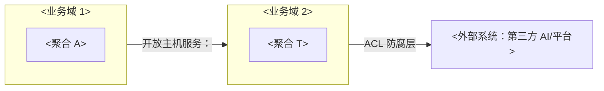
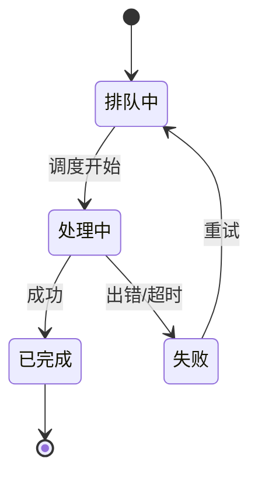
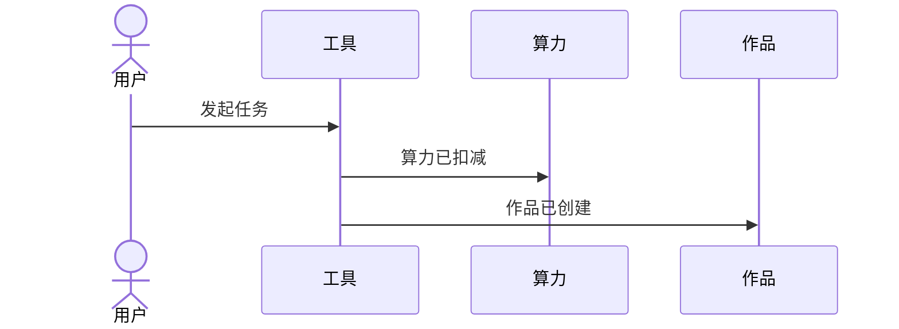
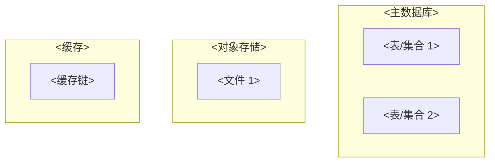
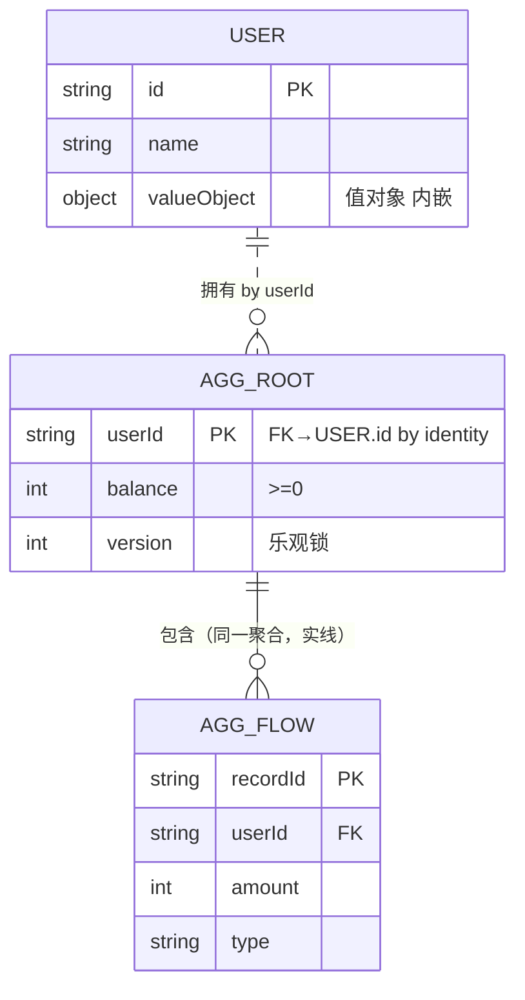

# DOMAIN-MODEL 文档更新规范（L2 架构层）

## 触发条件

当以下任一情况发生时，本规则必须生效：

- 编辑、新增或重建 `docs/L2/DOMAIN-MODEL.md`
- 关联文档变化需联动更新（来自 generation.related）：
  - `PRODUCT`（业务能力 SSOT，功能变化需联动建模）
  - `USER-STORY`（需求源头，新故事需联动领域建模）
  - `DATA-DICTIONARY`（字段级细节 SSOT 在它，本模型只写表/集合级）
  - `APPLICATION-ARCHITECTURE`（模块划分在它 §3.1，领域对象需映射到模块）
- 用户要求"生成/更新 DOMAIN-MODEL"

## 执行流程

1. **工具**：
   - Mermaid flowchart（§2.2 业务域映射图）
   - Mermaid stateDiagram-v2（§3.6 状态机，图规范见宪法）
   - Mermaid erDiagram（§5.2 ER，图规范见宪法）
2. **扫描**（自主，不问用户）：
   - 读 产品规格（功能全景）+ USER-STORY（需求源头）：提取业务领域
   - 读 PRODUCT + USER-STORY（若已有）：功能全景与需求源头
   - 扫描目标文档：DOMAIN-MODEL 是否已存在
3. **问用户**（仅当有歧义）：
   - 建模方法选择（事件风暴 vs 最小建模）→ 问用户确认
   - 聚合边界有争议（哪些对象强一致绑一起）→ 问用户确认
4. **生成流程**：
   - 扫描（自主）：读 L1 + 目标文档
   - 已有 DOMAIN-MODEL → 参考旧文档有效信息，但结构按本模板重建
   - 按模板生成：§1 概述+子域划分 → §2 业务域划分 → §3 聚合设计（含业务规则索引+跨聚合服务）→ §4 领域事件 → §5 数据设计 → §6 跨业务域契约落地 → §7 与架构/API 衔接

## 硬性要求

- 建模方法：事件风暴（发现领域）→ 聚合设计（收敛边界）；项目规模小/无跨团队协作时用最小建模起步（实体+值对象，不超前建全套 DDD 构件）。建模方法决策是生成过程的事，不写入实例正文
- 业务规则索引（§3.0）：12 条内不独立成章，作聚合设计下的导航索引；规则 ID（R1/Rn）与聚合小节不变量/操作入口双向引用
- §3.6 聚合状态机在此唯一定义（SSOT，环式）
- §5 数据设计（数据资产/ER/表结构/存储映射）与领域同文档，先业务后存储
- 集合设计在 §5.1 物理内按数据源展开（集合/字段/类型/约束/索引，含关键字段 5-10 个示例）；全量字段/枚举/事件级在 DATA-DICTIONARY（SSOT），本节不重复全量字典
- 聚合行为流程：每个 action 附一张流程图（action → 操作实体 → 状态转移 → event，一 action 一图，图内须标操作了哪些实体与产生了哪些事件，直接跟在其操作入口条目下）
- 聚合边界 = 事务边界（一个聚合内强一致，跨聚合最终一致）
- **联动**：更新时按 related 同步关联文档（见触发条件）；跨层引用单向向下，下层不链回上层
- **不用 emoji**（S8，grep 校验）
- **图规范**：按 generation.tools 与 CONSTITUTION §3.2 用 D2 / Mermaid / ASCII

## 完成判定

以下全部通过才算完成（generation.checks 逐条）：

- 每个有状态领域对象都有状态机（§3.6）
- §5 数据设计仅集合级+关键字段示例（全量在 DATA-DICTIONARY）
- 实体/聚合与 PRODUCT 功能对齐
- ER 关系与聚合边界一致（无跨聚合强依赖）
- §1.2 子域划分已填（核心/支撑/通用，对应业务域）
- §2.2 业务域映射图连线已标注关系模式（§2.3 决策表选出的模式）
- S8：文档不含 emoji（grep 检查通过，详见 CONSTITUTION S8 依据）
- 内容条目无顺序编号（规则/聚合/实体/事件按名称标识，不用 R-N/E-N/A-N）

---

## 模板（生成/更新文档的结构基准）

以下为 `docs/L2/DOMAIN-MODEL.md` 的模板正文（不含 YAML frontmatter，生成/更新时以此结构为准，按 `> 【指引】` 填写，实例不含 `> 【指引】` 说明）：

# DOMAIN-MODEL — 领域模型

> 本文档是「<项目名>」的 **DOMAIN-MODEL（领域模型模板）**——L2 架构层的领域模型文档。
> 【模板使用指引】复制为 `docs/L2/DOMAIN-MODEL.md`，按各章节指引填写。
> 【原则】① **领域建模视角**（DDD）：限界业务域、聚合、实体、值对象、领域事件——回答"业务领域怎么建模"；② 从**业务规则与行为**出发，**数据设计（存储映射/表结构/ER）在同一文档 §5 维护**（领域与数据同文档，先业务后存储）；③ **字段/枚举/事件级细节在 DATA-DICTIONARY（SSOT）**，本文档只写表/集合级结构；④ 建模方法（事件风暴/最小建模）在 generation 元信息中决策，**不写入实例正文**；⑤ **领域对象状态机在此唯一定义（SSOT）**；⑥ 关键建模决策记 **ADR**；⑦ 图用 **Mermaid**；⑧ **不用 emoji**、无元信息表、无变更记录。


## 1. 业务域概述

### 1.1 背景与目标

> 【指引】该业务域解决什么问题、为什么需要领域建模（2~5 句）。

<背景与目标>

### 1.2 子域划分（核心/支撑/通用）

> 【指引】先切子域（业务问题分类），再划限界业务域（解决方案边界）。子域决定投资优先级，避免过度建模。判断标准：
>
> - **核心子域**：差异化竞争力（做不好公司会输）→ 重点建模、优先投入
> - **支撑子域**：必须有但不构成壁垒 → 适当投入，不外包
> - **通用子域**：行业有现成方案/可买/SaaS → 直接引入，不重复造轮子

| 子域     | 类型（核心/支撑/通用） | 判断理由                      | 对应业务域 |
| -------- | ---------------------- | ----------------------------- | ---------- |
| <子域 1> | <核心>                 | <为何是核心竞争力/为何可外购> | <业务域>   |
| （补充） |                        |                               |            |

> 【指引】子域只切到"够指导架构设计"的粒度（一般 3~9 个），不再细分；复杂度交给限界业务域承载（一个子域可对应多个业务域）。


## 2. 业务域划分

> 【指引】业务模型的边界划分：每个业务域内概念含义唯一。**业务域清单**列核心聚合；**映射图**表达协作关系（ACL 防腐层/开放主机服务等模式）。

### 2.1 业务域清单

| 业务域     | 职责     | 核心聚合 | 依赖的业务域 | 被谁依赖   |
| ---------- | -------- | -------- | ------------ | ---------- |
| <业务域 1> | <干什么> | <聚合>   | <依赖>       | <谁依赖它> |
| （补充）   |          |          |              |            |

### 2.2 业务域映射图



> 【指引】标注业务域间协作模式（ACL 防腐层 / 开放主机服务 / 共享内核…），防止外部模型污染内部模型。
>
> **图例约定**（参照 Brandolini/ContextMapper，生成时按此绘制，实例不重复说明）：
>
> - ○ = 外部系统 ｜ □ = 内部业务域（subgraph）
> - 对称关系（SK/P）= 双向箭头；非对称（OHS/C-S）= 单向箭头，标注 U/D 角色
> - 边标签 = 关系模式 + 实现技术
>   关系模式定义见 §2.3。

### 2.3 业务域映射关系模式决策表

> 【指引】DDD 9 种模式标准术语（来源 Eric Evans《领域驱动设计》+ Vaughn Vernon《实现领域驱动设计》）。按下面的决策速查，为每条业务域关系选择关系模式（在 §2.2 图的连线标注模式缩写 + 实现技术）。核心目的：**防止外部/不可控模型污染内部核心模型**。

| 关系模式         | 缩写 | 何时用                                                               | 模型层面发生什么                                                       |
| ---------------- | ---- | -------------------------------------------------------------------- | ---------------------------------------------------------------------- |
| **防腐层**       | ACL  | 下游对接外部/不可控系统（巨头 API、遗留系统）时，保护自己核心域      | 边界加翻译层：外部模型 → 翻译 → 本地领域模型，核心域永远见不到外部模型 |
| **共享内核**     | SK   | 两业务域愿意共享一小块**明确划定**的模型（共用一个值对象库）         | 同一份模型代码被两业务域共用；共享范围必须极小，扩大即耦合             |
| **开放主机服务** | OHS  | 上游把多个业务域能力当**公共协议**暴露（REST/gRPC/SDK），有 SLA/版本 | 上游定义标准化协议模型，下游按它编程                                   |
| **顺奉者**       | CF   | 上游不可控且**翻译成本 > 收益**时，被迫接受上游模型                  | 下游直接跟随上游模型不翻译；代价是模型污染，慎用                       |
| **客户-供应商**  | C-S  | 上游决定交付，但下游需求能进入上游排期协商                           | 下游部分接受上游模型，但有谈判权                                       |
| **合作关系**     | P    | 两业务域荣辱与共，绑定同一交付节奏                                   | 两模型共同演化，无谁主导                                               |
| **另谋他路**     | SW   | 两业务域根本不集成                                                   | 双方模型零接触，各自独立                                               |

**决策速查**：

```
Q1 两业务域完全不相关？→ SW（另谋他路）
Q2 上游是外部/不可控供应商？→ 必须 ACL（隔离保护自己）
Q3 上游在本公司但无资源响应下游？→ CF（或自建 ACL）
Q4 上游希望被多下游消费？→ OHS（开放标准协议）
Q5 两业务域同团队、可共享小模型？→ SK（严格限定范围）
Q6 其余 → C-S（上下游协商 SLA）
```

> **范式（CF 治理）**：发现 CF（业务域直接用对方模型，无翻译）→ 记 TECHDEBT → 演进为 ACL。CF 是流程演进中需优化的信号，不作为常态。

## 3. 聚合设计

> 【指引】每个聚合一小节。**聚合行为流程：每个聚合附 Action→State→Event 流程图（action 校验不变量→状态转移→发布事件）- 聚合边界 = 事务边界**：一个聚合内的修改在一次事务内完成；聚合根是外部唯一入口。

### 3.0 业务规则索引

> 【指引】领域核心业务规则汇总表（导航索引）。**规则类型**（SBVR 分类）：**结构规则**（对象必须满足的结构约束，如 openid 唯一）/ **行为规则**（操作触发时需满足的条件，IF-THEN，如算力不足拒绝）/ **推导规则**（从其他值推导，如余额 = 入账 - 扣减）。**SSOT**：完整定义见各聚合小节（不变量/操作入口）与 §3.7 跨聚合服务，本表为导航索引，改规则先改聚合小节。规则 ID（R1/Rn）与聚合小节双向引用。

| ID       | 规则名称 | 类型             | 所属聚合 | 来源   | 优先级     | 落地位置                        |
| -------- | -------- | ---------------- | -------- | ------ | ---------- | ------------------------------- |
| R1       | <规则名> | <结构/行为/推导> | <聚合>   | <来源> | <高/中/低> | <§3.x 不变量 / 操作入口 / §3.7> |
| （补充） |          |                  |          |        |            |                                 |

### 3.1 聚合：<聚合名>

**聚合根**：<聚合根实体>

**聚合边界内对象**：

| 对象   | 类型（实体/值对象） | 说明   |
| ------ | ------------------- | ------ |
| <对象> | <类型>              | <说明> |

**业务不变量（Invariants）**：

- <不变量 1：如余额 ≥ 0>
- <不变量 2>

**聚合操作入口**（只有这些方法可修改聚合，一个 action 一张流程图，图内须含操作实体与产生事件）：

- `<操作(参数)>`：<行为>

  ```mermaid
  flowchart TD
      A["action: <操作(参数)>"] --> B["操作实体: <实体>.<修改>"]
      B --> C["状态转移"]
      C --> D["event: <事件>"]
  ```

- `<操作(参数)>`：<行为>

  ```mermaid
  flowchart TD
      A["action: <操作(参数)>"] --> B["操作实体: <实体>.<修改>"]
      B --> C["状态转移"]
      C --> D["event: <事件>"]
  ```

**为什么这么划边界**：<为什么这些对象在一个聚合内/为什么某些对象不放进来>

（每个聚合一小节，补充）


### 3.6 聚合状态机（SSOT）

> 【指引】**状态机是聚合根的内在行为**，并入聚合设计，不独立成章。状态机完整在此唯一定义。无状态对象不画。状态转移由聚合方法触发，同时发布对应领域事件。

#### 工具任务 ToolTask（如有状态）



**状态转移表（带发布事件）**：

| 起始态   | 触发命令 | 终止态   | 发布事件 |
| -------- | -------- | -------- | -------- |
| <起始态> | <触发>   | <终止态> | <事件>   |

#### 充值订单 RechargeOrder（如有状态）

（有状态则补充状态机图 + 转移表；无状态对象不列本节）


### 3.7 跨聚合服务（Domain Service）

> 【指引】不属于任何实体/值对象、跨聚合的领域行为（如并发控制下的核算逻辑）。

> **领域服务 vs 应用服务（分工）**：
>
> | 维度           | 领域服务（Domain Service）               | 应用服务（Application Service） |
> | -------------- | ---------------------------------------- | ------------------------------- |
> | 放哪层         | `domain/`（领域层）                      | `service/`（应用层）            |
> | 管什么         | **跨聚合的业务规则**（如转账涉及两账户） | **编排用例**（事务/权限/协调）  |
> | 有没有业务规则 | 有（转账校验、核算）                     | 无（只编排）                    |
> | 厚度           | 可厚                                     | 薄                              |
>
> - 领域服务：操作多个聚合的业务行为，无法归属到单个实体/值对象时用（如 `TransferService`）
> - 应用服务：编排用例流程，调领域服务/聚合根，管事务与权限，**不承载业务规则**（薄）
> - 应用服务在**应用架构文档（APPLICATION-ARCHITECTURE）的 service 层**描述，本节只列领域服务

| 领域服务 | 所属业务域 | 职责   | 涉及聚合 |
| -------- | ---------- | ------ | -------- |
| <服务>   | <业务域>   | <行为> | <聚合>   |
| （补充） |            |        |          |


## 4. 领域事件（Domain Event）

> 【指引】领域内已发生的事实，用于解耦与审计。事件**只记已发生的事**（过去时命名），不记意图。目录标准：领域事件归**发布方** `service/<业务域>/domain/events/`；Payload 中的共享值对象放 `service/shared-kernel/`；事件机制（EventBus）放 `infra/` 或 `integration/`。

### 4.0 事件来源与性质

> 【指引】**领域事件本质是变更事件**，读取不产生事件。事件从**聚合操作(Action)的状态变更点**中抽象而来：每个聚合的写操作(Action)对应一个领域事件（见 §3 操作入口），查询类操作（如作品.复用）无事件。

| 能力/聚合操作(Action) | 类型      | 变更点   | 事件   | 因果链   |
| --------------------- | --------- | -------- | ------ | -------- |
| <能力 → 聚合.操作>    | 命令/查询 | <变更点> | <事件> | <因果链> |

### 4.1 事件总览

> 【指引】所有领域事件一览（一个都不能少）。按所属业务域组织，含类型/触发时机/消费者/载荷。版本通过事件名体现（如需演进：用户已注册V1、用户已注册V2），不单独设版本列。

| 事件   | 所属业务域 | 类型     | 触发时机   | 消费者   | 关键载荷 |
| ------ | ---------- | -------- | ---------- | -------- | -------- |
| <事件> | <业务域>   | 领域事件 | <何时触发> | <谁消费> | <载荷>   |

### 4.2 事件详情卡片

> 【指引】每个事件一节，含载荷字段表（值对象快照，不可变，含 eventId/occurredAt 等）。

#### <事件名>（<英文名>）

| 字段    | 类型   | 必填 | 说明               |
| ------- | ------ | ---- | ------------------ |
| eventId | string | 必填 | 全局唯一，用于幂等 |
| <字段>  | <类型> | 必填 | <说明>             |

### 4.3 事件因果图

> 【指引】跨业务域事件因果链（时序图），展示谁发给谁。




## 5. 数据设计（领域模型 → 存储）

> 【指引】数据架构并入领域模型（同一文档，先业务后存储）。**业务规则/不变量在 §1-§9（领域视角），本节只写存储形态**；**字段/枚举/事件级细节在 DATA-DICTIONARY（SSOT）**，此处只写表/集合级结构。

### 5.1 数据全景与设计原则

> 【指引】数据全景与设计原则：含**数据资产分类与存储选型**（总览图+矩阵）+ **数据流转与字段血缘**（来源→落库→同步策略）+ **物理存储格式（按数据源/存储分块：内部存储+外部数据源+临时产物+预留，含集合设计/目录/键格式）**，同属数据全景（先业务后存储，字段级在 DATA-DICTIONARY）。集合设计（集合/字段/类型/约束/索引）属物理层，在此展开，不单列章节。
>
> **说明**：物理存储格式表格随技术栈变化，无统一模板——文档型关注集合/文档结构，RDS 关注表/列/索引/唯一约束，HBase 关注 RowKey/列族，ES 关注分词/映射，KV 关注键模式/TTL。按本章节"内部存储/外部数据源/临时产物/预留"顺序排版即可。

| 数据域   | 数据资产 | 存储位置           | 归属模块 |
| -------- | -------- | ------------------ | -------- |
| <数据域> | <资产>   | <库/对象存储/缓存> | <模块>   |
| （补充） |          |                    |          |



**物理存储格式（按数据源/存储分块，物理层）**：

> 每类存储/数据源一小节：内部存储（云数据库/云存储）、外部数据源（微信开放平台/第三方 AI）、临时存储（ISAAC 解密/ffmpeg 转码）、预留（Redis/HBase）。每节含格式/约束/示例，业务语义见 §3/§5.2，字段明细见 DATA-DICTIONARY。

| 集合/目录/键 | 主键/路径/键模式 | 存储内容 | 备注   |
| ------------ | ---------------- | -------- | ------ |
| <集合/路径>  | <PK/路径>        | <内容>   | <说明> |

### 5.2 实体关系（ER，按聚合分 + 跨聚合 by identity）

> 【指引】ER 是 §3 聚合的**持久化视图**，非领域模型。**实线 `--` = 聚合内强一致（同一事务），虚线 `..` = 跨聚合 by identity（最终一致，事件驱动见 §4.3）**。值对象内嵌为 `object` 字段，不单独成表。实体清单与 §3 聚合设计对齐；**业务规则/不变量在 §3，此处只写结构与关系**。主图为聚合根全览（全虚线），分图按业务域/聚合用 `subgraph` 标边界，聚合根高亮，关系标签用业务动词（拥有 by userId）。



### 5.3 核心数据模型（表/集合级索引，与 §5.1 物理互补）

> 【指引】库表详细设计（字段/类型/约束/索引/示例）**已在 §5.1 物理存储格式内按数据源展开（含集合设计，每集合 5-10 关键字段示例）**，此处为表/集合级索引（集合清单+存储映射），与 §5.1 互补，不重复全量字典。**全量字段/枚举/事件级定义在 DATA-DICTIONARY（SSOT）**。

#### 5.3.1 <表/集合名>

| 字段   | 类型   | 约束（主键/必填/唯一/默认） | 说明   |
| ------ | ------ | --------------------------- | ------ |
| <字段> | <类型> | <约束>                      | <说明> |

**索引**：<索引列表>

**说明**：<用途/生命周期/关联>

（每个核心表一小节，补充）

### 5.4 领域模型 → 存储映射

> 【指引】聚合与存储形态的对应（两者**可不同**，如 JSON 列存聚合）。

| 聚合     | 存储形态（表/文档/JSON 列） | 映射说明 |
| -------- | --------------------------- | -------- |
| <聚合>   | <形态>                      | <说明>   |
| （补充） |                             |          |


## 6. 跨业务域契约落地

> 【指引】业务域关系（SK/OHS）的代码落地标准（代码放哪）。关系语义在 §2 业务域映射，落地标准在此。

### 6.1 共享内核（SK）目录标准

> 【指引】**shared-kernel 的目录落地标准**（这是"代码放哪"的标准，不是原则）。当两个及以上业务域要共享一小块模型时，用独立共享模块。

**标准（全局 4 个一级目录：controller/service/infra/integration，全小写）**：

```
controller/                     ← 接入层（薄，翻译 + HTTP）
  ├─ quota/
  │  ├─ QuotaController.java
  │  └─ assembler/QuotaAssembler.java  ← 翻译 DTO→Domain
  ├─ user/
  ├─ tool/
  └─ work/

service/                        ← 业务层（含 domain 横向层）
  ├─ shared-kernel/             ← SK 共享模块（需要共享的业务域都依赖它）
  │  ├─ UserId.java
  │  └─ Money.java
  ├─ quota/                     ← 依赖 shared-kernel
  │  ├─ contract/               ← OHS 契约（见 §2.5）
  │  └─ domain/                 ← 领域模型（聚合/实体/值对象）
  ├─ user/                      ← 依赖 shared-kernel
  ├─ tool/                      ← 不依赖 shared-kernel
  └─ work/                      ← 依赖 shared-kernel

infra/                          ← 支撑层-内部（自己管：DB/缓存）
  ├─ quota/mapper/QuotaMapper.java  ← 翻译 Domain↔PO
  ├─ user/
  ├─ tool/
  └─ work/

integration/                    ← 支撑层-外部（别人管：微信/AI/支付）
  ├─ quota/
  ├─ user/adapter/WechatAdapter.java  ← ACL 防腐层
  ├─ tool/adapter/DeepSeekAdapter.java
  └─ work/
```

**规则**：

| 规则                            | 说明                                                                                            |
| ------------------------------- | ----------------------------------------------------------------------------------------------- |
| **独立模块**                    | SK 用独立目录 `shared-kernel/`（或独立 jar/库），不属于任何业务域——SK 无主、共同拥有            |
| **命名不用 common/user-shared** | 不叫 `common/`（暗示所有都能访问）；不叫 `user-shared/`（暗示属于 user）——就叫 `shared-kernel/` |
| **只装共享值对象/契约**         | 只放真正共享的值对象、ID、集成事件契约、Entity 基类等；**绝不装工具类/helper/业务服务**         |
| **范围小**                      | 共享范围要极小（业界红线：超过 ~20 个类 = 出问题）                                              |
| **依赖管理控制范围**            | 谁能访问靠构建依赖（Maven/Gradle 只让需要的业务域声明依赖），不靠包名                           |
| **共同维护**                    | 改 SK 两边要一起同步 + 持续集成，发现共享模型破坏                                               |

### 6.2 契约包（Contract）目录标准（OHS 落地）

> 【指引】**契约包的目录落地标准**（这是"代码放哪"的标准，不是原则）。当一个业务域要对外暴露稳定接口供其他业务域调用（OHS 开放主机服务）时，用独立契约包。

**标准**：

```
service/quota/                ← 算力业务域（上游，有契约包）
  ├─ contract/                ← OHS 契约包（只放接口 + DTO，下游依赖它）
  │  ├─ QuotaService.java     ← 接口
  │  └─ QuotaDeductReq.java   ← DTO
  ├─ service/                 ← 应用服务层（编排）
  └─ domain/                  ← 领域层（横向层，聚合/实体/值对象）

service/tool/                 ← 工具业务域（下游）
  └─ 依赖 service/quota/contract/

# 每层的翻译器（每层都有翻译，都叫翻译）：
controller/quota/assembler/QuotaAssembler.java  ← 翻译 DTO→Domain
infra/quota/mapper/QuotaMapper.java            ← 翻译 Domain↔PO
integration/user/adapter/WechatAdapter.java    ← 翻译 外部→Domain（ACL）
```

**规则**：

| 规则                   | 说明                                                                                       |
| ---------------------- | ------------------------------------------------------------------------------------------ |
| **按业务域放**         | 契约包在**所属业务域内部**（如 `quota/contract/`），不放顶层 `api/`——归属明确              |
| **只放契约**           | 只放对外暴露的**接口（interface）+ DTO（请求/响应）**；不放领域对象/实现/工具类            |
| **可控暴露**           | 想让外部看到的才放 `contract/`，内部实现随便改不影响外部（内部不暴露）                     |
| **下游只依赖契约**     | 下游（如 `tool/`）只 `import quota/contract/`，不 import `quota/service/`/`quota/domain/`  |
| **不叫 api/interface** | 不叫 `api/`（和控制器 `api/` 冲突）；不叫 `interface/`（Java/Go 关键字）——就叫 `contract/` |
| **有需要才建**         | 只有被别的业务域依赖时才建契约包；不被依赖就不用建（避免过度设计）                         |


## 7. 层间模型翻译（Domain ↔ 各层）

> 【指引】领域对象不直接跨层，每跨一层必经翻译。翻译器仅做结构转换，不含业务规则。

### 7.1 翻译矩阵

| 跨层                 | 翻译器        | 位置                           | 方向          | 职责                        | 示例 |
| -------------------- | ------------- | ------------------------------ | ------------- | --------------------------- | ---- |
| controller ↔ domain  | Assembler     | `controller/{业务}/assembler/` | DTO → Domain  | `<X>Assembler.toDomain()`   |
| domain ↔ infra       | Mapper        | `infra/{业务}/mapper/`         | Domain ↔ PO   | `<X>Mapper.toPO/toDomain()` |
| domain ↔ integration | Adapter (ACL) | `integration/{业务}/adapter/`  | 外部 → Domain | `<X>Adapter.toDomain()`     |

### 7.2 约束

- **Assembler**：`controller` 层，单向 `DTO → Domain`，仅字段映射 + 校验
- **Mapper**：`infra` 层，双向 `Domain ↔ PO`，隐藏存储细节
- **Adapter**：`integration` 层，单向 `外部 → Domain`，防腐隔离
- **命名统一**：`*Assembler.java` / `*Mapper.java` / `*Adapter.java`，不混用
