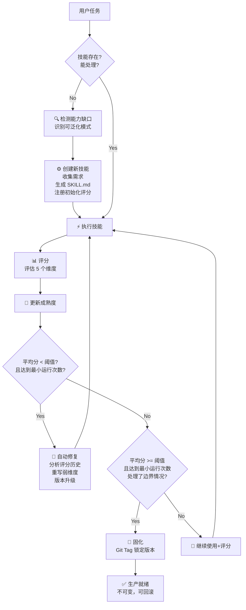
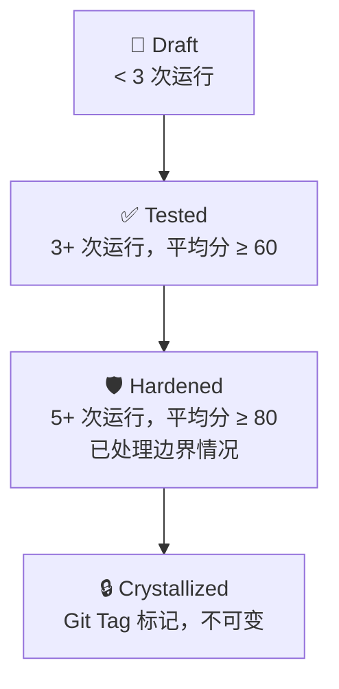

# Claude Code 自改进工具设计

结合 `claude-reflect-system` (haddock-development)、`singularity-claude` (Shmayro) 思路，基于 Agent Skills 开放标准，适配
Claude Code 的自反思自动学习工具设计。

---

## 设计目标

实现一个 Claude Code 自进化技能引擎，能够：

1. **从用户纠正中学习**：用户纠正一次，永久记住不再重复犯错（借鉴 claude-reflect-system）
2. **完整进化循环**：缺口检测 → 创建 → 执行 → 评分 → 修复 → 固化（借鉴 singularity-claude）
3. **自动更新 Skill**：直接修改 `SKILL.md`，持久化学习成果
4. **完全兼容 Agent Skills 标准**：可通过 `npx skills` 管理，适配 Claude Code

---

## 现有方案对比

| 特性                  | claude-reflect-system | singularity-claude                       | 本设计             |
|---------------------|-----------------------|------------------------------------------|-----------------|
| **学习来源**            | 用户纠正                  | 自动评分 + 可选用户纠正                            | 双模式：用户纠正 + 自动评分 |
| **改进范围**            | 现有技能修正                | 从创建到固化完整生命周期                             | 完整生命周期          |
| **量化评分**            | 置信度分级                 | 5维度 0-100 量化                             | 支持两种方式          |
| **成熟度等级**           | 无                     | Draft → Tested → Hardened → Crystallized | 采纳成熟度模型         |
| **缺口检测**            | 无                     | 自动检测重复任务，建议创建新技能                         | ✅ 支持            |
| **Git 固化**          | 每次学习提交                | 仅高评分固化打 Tag                              | ✅ 可配置           |
| **遵循 Agent Skills** | 自定义插件结构               | Claude Code 插件                           | ✅ 完全兼容标准        |
| **npx skills 安装**   | ❌                     | ❌                                        | ✅ 原生支持          |

---

## 架构设计

### 完整进化循环



### 成熟度等级



### 目录结构

本仓库作为技能集合仓库，结构遵循 Agent Skills 标准：

```
<this-repo>/
├── README.md
├── CLAUDE.md
├── self-evolve/                # 自进化主技能
│   ├── SKILL.md                 # 主技能入口
│   ├── .internal/               # 开发元数据（不会被安装）
│   │   ├── create.md            # 创建记录
│   │   ├── improve.md           # 改进历史
│   │   ├── benchmark.md         # 基准评测
│   │   └── eval.md              # 效果评估
│   ├── scripts/                # 工具脚本
│   │   ├── extract-signals.py  # 提取纠正信号
│   │   ├── score-manager.py    # 评分管理
│   │   ├── telemetry.py         # 执行日志
│   │   ├── update-skill.py      # 更新技能文件
│   │   └── validate.py          # 验证 YAML frontmatter
├── <other-skill>/               # 其他自定义技能
│   ├── SKILL.md                 # 公开技能
│   └── .internal/              # 该技能的开发元数据
│       ├── create.md
│       ├── improve.md
│       ├── benchmark.md
│       └── eval.md
└── ...
```

**设计说明**：

- `.internal/` 目录存放开发元数据，这些文件**不叫** `SKILL.md` → 不会被识别为独立技能，不会被默认安装
- 可选添加 `metadata.internal: true` 双重保险，确保不会被 `npx skills` 默认安装
- 不会浪费 token，因为 skills CLI 只发现 `SKILL.md`，这些元数据不会被加载
- 评分和遥测数据可以存储在 `~/.claude/self-evolve/` 目录，与 singularity-claude 保持兼容

### 信号分级（融合两个方案）

#### 用户纠正分级（借鉴 claude-reflect-system）

| 级别            | 用户说法                              | 处理方式                                     |
|---------------|-----------------------------------|------------------------------------------|
| 🔴 **HIGH**   | "不，用 X 代替 Y" / "永远不要 X" / "总是要 Y" | 在技能中添加 **Critical Corrections** 章节，最高优先级 |
| 🟡 **MEDIUM** | "对，完美" / "这样正确" / "正好"            | 添加到 **Best Practices** 章节                |
| 🟢 **LOW**    | "有没有考虑过..." / "如果...怎么样"          | 添加到 **Considerations** 章节                |

#### 自动化评分（借鉴 singularity-claude）

每次执行后在 5 个维度评分（每个维度 0-20，总分 0-100）：

| 维度       | 评分说明       |
|----------|------------|
| **正确性**  | 是否达成目标？    |
| **完整性**  | 是否满足所有需求？  |
| **边界情况** | 是否处理了异常输入？ |
| **效率**   | 方法是否直接简洁？  |
| **可复用性** | 输出是否可复用？   |

### 安全机制

1. **备份**：每次更新前创建时间戳备份
2. **验证**：验证 YAML frontmatter 格式正确
3. **用户审批**：重大变更必须用户审查 diff 后才能应用
4. **Git 提交**：每一次学习都生成 Git 提交，包含描述
5. **自动回滚**：验证失败自动恢复备份
6. **配置阈值**：自动修复和固化都有可配置阈值

---

## 技能设计：`self-evolve` 主入口

### self-evolve/SKILL.md

```markdown
---
name: self-evolve
description: 自进化技能引擎 - 通过递归改进循环让技能自动创建、评分、修复、固化。支持从用户纠正中学习，自动检测能力缺口。
disable-model-invocation: true
allowed-tools: Read Write Grep Bash Git
context: fork
agent: Explore
---

# Self-Evolve 自进化技能引擎

让 Claude Code 技能能够自动进化：从缺口检测 → 创建 → 执行 → 评分 → 修复 → 固化，实现"一次创建，持续改进，最终固化"。

## When to Use

- 用户纠正了 Claude 的行为，希望永久记住这个纠正
- 需要对现有技能进行反思和改进
- 检测到重复模式，需要创建新技能
- 对已有技能评分和自动修复
- 查看技能进化仪表盘

## Commands

| 命令 | 说明 |
|------|------|
| `/self-evolve reflect` | 手动触发对当前会话的反思学习（用户纠正后） |
| `/self-evolve create` | 从头创建新技能 |
| `/self-evolve score [skill-name]` | 对最近执行评分 |
| `/self-evolve repair [skill-name]` | 手动触发修复低评分技能 |
| `/self-evolve dashboard` | 显示所有托管技能的概览 |
| `/self-evolve status` | 显示当前配置状态 |
| `/self-evolve auto-on` | 开启会话结束自动检查 |
| `/self-evolve auto-off` | 关闭会话结束自动检查 |

## Instructions

### 能力缺口检测

当检测到以下情况，建议创建新技能：

1. **重复** — 在多个会话中重复执行相同的多步骤过程
2. **无覆盖失败** — 没有现有技能能处理该任务
3. **可泛化** — 该模式适用于当前任务之外

### 用户纠正反思流程

当用户触发 `/self-evolve reflect`:

### 步骤 1：分析会话，提取信号

1. 读取当前会话历史，定位最近的用户纠正
2. 识别纠正类型（HIGH/MEDIUM/LOW 置信度）
3. 识别目标：哪个技能需要被更新？

### 步骤 2：定位目标技能

技能文件位置遵循标准 Agent Skills 格式：

- 项目技能：`.claude/skills/<skill-name>/SKILL.md`
- 全局技能：`~/.claude/skills/<skill-name>/SKILL.md`
- 本仓库技能：`skills/<skill-name>/SKILL.md`

如果用户没指定技能，但纠正发生在某个技能被调用后，推断目标为该技能。

### 步骤 3：提取纠正内容

提取：

- **旧模式**：原来的错误做法
- **新模式**：用户要求的正确做法
- **理由**：用户解释的原因（如果有）

### 步骤 4：更新技能文件

根据置信度更新对应章节：

| 置信度 | 更新位置 |
|--------|----------|
| HIGH | `## Critical Corrections` 章节（如果不存在则创建） |
| MEDIUM | `## Best Practices` 章节（如果不存在则创建） |
| LOW | `## Considerations` 章节（如果不存在则创建） |

格式示例：

```markdown
## Critical Corrections

- **用 uv 代替 pip**：
  - ❌ 不要：`pip install`
  - ✅ 要：`uv pip install`
  - 原因：更快更现代，更好的依赖解析
```

### 步骤 5：记录评分（如果启用评分）

在评分数据中记录本次用户纠正，更新平均分。

### 步骤 6：生成 diff 供审查

**必须**得到用户明确批准（如"批准"、"A"、"应用"）才能继续。

### 步骤 7：应用更新

1. 创建备份
2. 写入更新后的内容
3. 验证 YAML frontmatter 格式
4. 如果验证失败，恢复备份并报错
5. Git 提交：`evolve: learn that <correction-summary>`
6. 如果平均分低于自动修复阈值，提示是否触发修复
7. 告知用户学习完成，下次生效

### 步骤 8：元数据记录

如果技能目录下存在 `.internal/`，在 `.internal/improve.md` 追加本次改进记录：

```markdown
## 改进记录 - YYYY-MM-DD

### 改进内容：

用户纠正：<用户原始说法>

### 变更：

- 在 SKILL.md 的 Critical Corrections 添加了 ...

### 效果：

下次调用该技能会自动遵循新的纠正
```

## 自动修复流程 (`/self-evolve repair`)

1. 读取评分历史和遥测数据
2. 识别最低分的维度
3. 分析失败原因，定位需要修改的部分
4. 生成修复方案
5. 创建备份，写入更新
6. 验证，提交 Git
7. 提示用户重新测试

## Hooks 集成

要启用自动检查，在 `~/.claude/settings.local.json` 添加：

```json
{
  "hooks": {
    "stop": [
      {
        "command": "/self-evolve auto-check",
        "description": "Auto-check for learning opportunities after session"
      }
    ]
  }
}
```

自动检查会在会话结束时：

1. 扫描会话是否有用户纠正或可检测的缺口
2. 如果有，提示用户是否运行 `/self-evolve reflect` 或创建新技能

```

---

## 配置

配置文件位置 `~/.claude/self-evolve/config.json`:

```json
{
  "autoRepairThreshold": 50,
  "crystallizationThreshold": 90,
  "crystallizationMinExecutions": 5,
  "scoringMode": "hybrid",
  "requireApproval": true
}
```

| 设置                             | 默认         | 说明                                                 |
|--------------------------------|------------|----------------------------------------------------|
| `autoRepairThreshold`          | 50         | 平均分低于此触发自动修复建议                                     |
| `crystallizationThreshold`     | 90         | 平均分高于此允许固化                                         |
| `crystallizationMinExecutions` | 5          | 允许固化前最少运行次数                                        |
| `scoringMode`                  | `"hybrid"` | `auto` 全自动化评分，`manual` 全用户评分，`hybrid` agent评分用户可覆盖 |
| `requireApproval`              | true       | 应用变更前是否需要用户批准                                      |

## 数据存储

所有数据本地存储，不会离开机器：

```
~/.claude/self-evolve/
├── scores/          # 每个技能的评分历史 (JSON)
├── telemetry/       # 每个技能的执行日志 (JSON)
├── registry.json    # 所有托管技能注册表
└── config.json      # 配置
```

---

## 脚本设计

### scripts/extract-signals.py

```python
#!/usr/bin/env python3
"""Extract correction signals from session history."""

import re
import yaml
from dataclasses import dataclass
from enum import Enum
from typing import List, Optional


class Confidence(Enum):
    HIGH = "HIGH"  # 明确纠正: "不，用X代替Y"
    MEDIUM = "MEDIUM"  # 批准: "对，这样正确"
    LOW = "LOW"  # 建议: "可以考虑..."


@dataclass
class Signal:
    confidence: Confidence
    pattern_old: Optional[str]
    pattern_new: Optional[str]
    raw_text: str
    line_number: int


def extract_signals(session_text: str) -> List[Signal]:
    """Extract correction signals from session history."""
    signals = []
    # ... pattern matching logic ...
    return signals


def detect_target_skill(signals: List[Signal], context: str) -> Optional[str]:
    """Detect which skill to update based on context."""
    # ... heuristics ...
    return None


if __name__ == "__main__":
    import sys

    text = sys.stdin.read()
    signals = extract_signals(text)
    print(yaml.dump({"signals": [s.__dict__ for s in signals]}))
```

### scripts/update-skill.py

```python
#!/usr/bin/env python3
"""Update skill file with new correction."""

import argparse
import datetime
import shutil
import yaml
from pathlib import Path

BACKUP_DIR = ".backups"


def create_backup(skill_path: Path) -> Path:
    """Create timestamped backup."""
    timestamp = datetime.datetime.now().strftime("%Y%m%d-%H%M%S")
    backup_name = f"{skill_path.name}.bak.{timestamp}"
    backup_path = skill_path.parent / BACKUP_DIR / backup_name
    (skill_path.parent / BACKUP_DIR).mkdir(exist_ok=True)
    shutil.copy2(skill_path, backup_path)
    return backup_path


def validate_frontmatter(content: str) -> bool:
    """Validate YAML frontmatter."""
    # ... parsing and validation ...
    pass


def add_correction(content: str, signal, confidence) -> str:
    """Add correction to appropriate section."""
    # ... add to Critical Corrections / Best Practices / Considerations ...
    return content


if __name__ == "__main__":
    parser = argparse.ArgumentParser()
    parser.add_argument("--skill", required=True)
    parser.add_argument("--signal", required=True)
    args = parser.parse_args()
    # ... main logic ...
```

---

## 自举：本技能自身也能自进化

因为 `self-evolve` 本身就是一个遵循标准格式的技能，所以：

1. `self-evolve` 技能可以被**自身改进**
2. 用户对 `self-evolve` 工作方式的纠正会被 `self-evolve` 自己学习
3. 实现自举：技能随着使用不断改进自身

这就是递归自改进的奇点概念。

---

## 对比现有方案

| 特性                   | claude-reflect-system | singularity-claude | 本设计               |
|----------------------|-----------------------|--------------------|-------------------|
| 遵循 Agent Skills 开放标准 | ❌                     | ❌                  | ✅ 完全兼容            |
| 支持 `npx skills` 一键安装 | ❌                     | ❌                  | ✅ 原生支持            |
| 开发元数据不污染技能加载         | ❌                     | ❌                  | ✅ `.internal/` 方案 |
| 用户纠正学习               | ✅                     | ⚠ 次要功能             | ✅ 一等支持            |
| 完整进化循环 (创建→评分→修复→固化) | ❌                     | ✅                  | ✅ 完整支持            |
| 能力缺口自动检测             | ❌                     | ✅                  | ✅ 支持              |
| 五级安全机制               | ✅                     | ✅                  | ✅ 备份+验证+审批+回滚+Git |
| Claude Code Hooks 集成 | ✅                     | ✅                  | ✅                 |
| Git 版本控制             | ✅                     | ✅                  | ✅                 |
| 完全本地化隐私              | ✅                     | ✅                  | ✅ 所有数据本地          |

## 优点

1. **完全兼容标准** - 可通过 `npx skills add syllr/skills/self-evolve` 一键安装
2. **不浪费 token** - 开发元数据放在 `.internal/`，不会被加载
3. **融合两家所长** - 结合 claude-reflect-system 的用户纠正体验和 singularity-claude 的完整进化循环
4. **安全可靠** - 备份、验证、审批、回滚、Git 提交五级安全
5. **递归自举** - 自改进技能可以改进自己
6. **完全本地化** - 所有数据本地存储，不上传
7. **可共享** - 整个仓库可以 Git 版本控制，团队共享学习成果
8. **可配置** - 阈值和模式都可配置

---

## 下一步实现

1. 创建 `self-evolve/SKILL.md`
2. 创建 `self-evolve/scripts/` 工具脚本
3. 创建 `self-evolve/.internal/` 存放开发元数据
4. 测试端到端流程：缺口检测 → 创建 → 纠正学习 → 评分 → 修复
5. 收集使用反馈，通过自改进迭代优化
