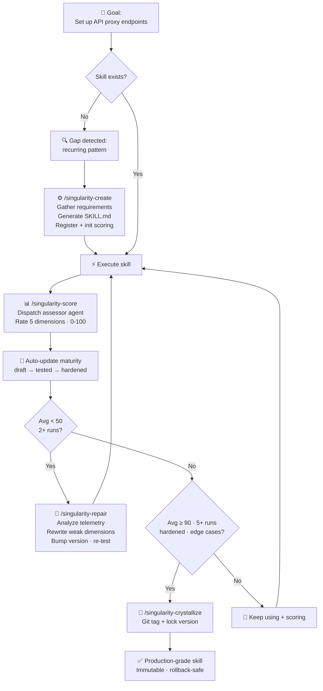
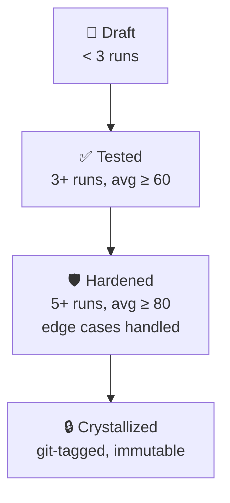

# Claude Code 自改进工具全景：三种方案完整分析与对比

> 本文整合了 `claude-reflect-system`、`singularity-claude`、`agent-playbook/self-improving-agent` 三种主流 Claude Code
> 自改进方案的完整分析，并从多个维度进行对比。

---

## 目录

1. [方案一：claude-reflect-system](#方案一claude-reflect-system)
2. [方案二：singularity-claude](#方案二singularity-claude)
3. [方案三：agent-playbook/self-improving-agent](#方案三agent-playbookself-improving-agent)
4. [多维度完整对比](#多维度完整对比)
5. [架构设计对比](#架构设计对比)
6. [工作流程对比](#工作流程对比)
7. [适用场景推荐](#适用场景推荐)
8. [引用与参考](#引用与参考)

---

## 方案一：claude-reflect-system

**仓库地址**: https://github.com/haddock-development/claude-reflect-system  
**作者**: haddock-development  
**核心口号**: "Correct once, never again" —— 纠正一次，永不再犯

---

### 项目概述

Claude Reflect System 是一个专为 Claude Code 设计的**自学习 AI 系统**，核心思想是通过用户的纠正实现**自动技能改进**。与传统
AI 编码助手在会话之间忘记一切不同，Reflect 从你的反馈中创建**永久学习**。

### 核心问题与解决方案

#### 问题场景

传统 AI 会重复犯相同错误：

```
Session 1: Claude uses pip
You:      "No, use uv instead"
Claude:   "Ok, using uv"

Session 2: Claude uses pip again 😞
You:      "I told you to use uv!"
```

#### 解决方案

通过 Reflect 系统：

```
Session 1: Claude uses pip
You:      "No, use uv instead"
          → /reflect → Skill learns ✅

Session 2: Claude uses uv ✨
Session 3: Claude uses uv ✨
Forever:  Claude uses uv ✨
```

### 架构设计

#### 核心组件

| 组件                    | 作用               |
|-----------------------|------------------|
| **Pattern Detection** | 检测用户纠正、批准、建议三种信号 |
| **Confidence Levels** | 基于置信度分级更新技能      |
| **Safe Updates**      | 备份、验证、自动回滚       |
| **Git Integration**   | 完整版本控制           |
| **Hook Integration**  | 支持会话结束自动反射       |

#### 三置信度分级系统

##### 🔴 **HIGH - 明确纠正**

模式示例：

```
"No, use X instead of Y"
"Never do X"
"Always check Y"
```

处理方式：创建 **Critical Corrections** 章节，优先级最高。

##### 🟡 **MEDIUM - 批准认可**

模式示例：

```
"Yes, perfect!"
"That works well"
"Exactly right"
```

处理方式：添加到 **Best Practices** 章节。

##### 🟢 **LOW - 建议提议**

模式示例：

```
"Have you considered...?"
"What about...?"
```

处理方式：记录到 **Considerations** 章节。

### 安全机制

每一次变更都包含安全保障：

- ✅ **时间戳备份**：每个变更都有备份，保留 30 天
- ✅ **YAML 验证**：验证 frontmatter 格式
- ✅ **用户审批**：手动模式下需要用户批准才能应用
- ✅ **自动回滚**：出错时自动回滚
- ✅ **Git 提交**：使用 Git 记录每一次学习历史

### 命令接口

| 命令                | 动作         |
|-------------------|------------|
| `/reflect`        | 手动分析当前会话   |
| `/reflect-on`     | 开启会话结束自动反射 |
| `/reflect-off`    | 关闭自动反射     |
| `/reflect-status` | 显示当前配置     |

### 工作流

#### 基本使用流程

1. **工作** - 让 Claude 正常工作，它可能会犯错
2. **纠正** - 你说 "不，用 X 代替 Y"
3. **运行反射** - 输入 `/reflect`
4. **查看变更** - 审查 diff，用 `A` 批准
5. **完成** - Claude 永久学会了

### 安装方式

```bash
# 复制到你的 Claude Code skills 目录
cp -r reflect ~/.claude/skills/
cp -r python-project-creator ~/.claude/skills/

# 检查状态
/reflect-status
```

### Hook 配置

通过 Claude Code 的 Stop hook 在会话结束自动运行：

```json
{
  "hooks": {
    "stop": [
      {
        "command": "~/.claude/skills/reflect/scripts/hook-stop.sh",
        "description": "Auto-reflect for learning"
      }
    ]
  }
}
```

### 技术规格

- **代码量**：~2,000 行（Python + Shell）
- **依赖**：仅需 PyYAML
- **Python 版本**：3.8+
- **支持平台**：macOS/Linux（Windows 未测试）
- **隐私**：所有数据 100% 本地存储，不上传任何地方
- **磁盘占用**：通常 <1MB + ~5KB 每次更新

### 优缺点分析

#### 优点

✅ **永久记忆**：一次学会，永久记住  
✅ **完全透明**：所有变更可见，可审查  
✅ **版本可控**：完整 Git 历史  
✅ **安全可靠**：多级安全机制，自动回滚  
✅ **零配置**：开箱即用  
✅ **隐私保护**：所有数据本地存储  
✅ **可共享**：通过 Git 分享团队知识

#### 局限性

- 仅支持 Claude Code CLI，其他 Agent 需要适配
- 模式匹配基于关键词，ML 模式还在计划中
- Windows 支持未测试

### 适用场景

- 🔧 **开发工作流** - 教 Claude 你偏好的工具（uv, pytest, ruff）
- 🎨 **代码风格** - 自动执行你的编码标准
- 📦 **项目模板** - 记住你偏好的项目结构
- 🔐 **安全实践** - 永远不会忘记安全检查
- 🚀 **CI/CD 流水线** - 一致的部署模式
- 👥 **团队协作** - 通过 Git 共享团队知识，新成员直接获得标准

---

## 方案二：singularity-claude

**仓库地址**: https://github.com/Shmayro/singularity-claude  
**作者**: Shmayro  
**核心口号**: "Skills that evolve themselves" —— 技能能够自我进化

---

### 项目概述

**singularity-claude** 是 Claude Code 的**自进化技能引擎**，通过**自主递归改进循环**让技能能够自我创建、评分、修复、固化。

> "Skills that evolve themselves. A self-evolving skill engine for Claude Code — create, score, repair, and crystallize
> skills through autonomous recursive improvement loops."

### 核心问题

Claude Code 技能现在是**静态的**：你写一次，它们就保持原样 —— 即使失败、输出平庸、遇到新的边界情况。没有反馈循环，无法知道哪些技能工作良好，也没有机制随时间改进它们。

最终你会积累越来越多的技能堆，其中一些很好，一些平庸，一些默默地坏掉了。修复它们的唯一方法是人工审查。

### 核心解决方案

singularity-claude 给技能添加了**递归进化循环**：



每次执行后对技能评分。低分触发自动修复。高分导致固化 —— 一个锁定、久经考验的版本。每一步都有日志记录，完全可审计。

**无外部依赖**。不需要 SmythOS，不需要 OpenTelemetry collector，不需要 Docker。纯 Claude Code。

### 架构组件

#### 核心技能 (7 个)

| 技能                    | 命令                         | 用途                   |
|-----------------------|----------------------------|----------------------|
| **using-singularity** | *(自动加载)*                   | 引导上下文 + 能力缺口检测       |
| **creating-skills**   | `/singularity-create`      | 通过结构化工作流构建新技能        |
| **scoring**           | `/singularity-score`       | 按 5 维度评分标准评分 (0-100) |
| **repairing**         | `/singularity-repair`      | 通过分析评分历史自动修复失败技能     |
| **crystallizing**     | `/singularity-crystallize` | 通过 git tag 锁定验证版本    |
| **reviewing**         | `/singularity-review`      | 健康检查 + 趋势分析          |
| **dashboard**         | `/singularity-dashboard`   | 所有托管技能概览             |

#### Subagents (2 个)

| Agent              | 模型    | 用途              |
|--------------------|-------|-----------------|
| **skill-assessor** | Haiku | 快速、低成本的自动评分     |
| **gap-detector**   | Haiku | 分析失败任务发现缺失的技能能力 |

#### 脚本 (2 个)

| 脚本                    | 用途                                 |
|-----------------------|------------------------------------|
| `score-manager.sh`    | 读写评分 JSON 文件的 CLI (原子写，jq/node 降级) |
| `telemetry-writer.sh` | 结构化执行日志 CLI，支持回放                   |

### 进化循环详解

#### 1. Create - 创建

`/singularity-create` 引导你构建新技能：需求收集、重复检查、生成 `SKILL.md`、注册、初始评分。

#### 2. Score - 评分

每次技能执行后，`/singularity-score` 分派一个 Haiku 评估 agent，在 **5 个维度**评分（每个维度 0-20 分，总分 0-100）：

| 维度                      | 测量什么       |
|-------------------------|------------|
| **Correctness** (0-20)  | 是否达成目标？    |
| **Completeness** (0-20) | 是否满足所有需求？  |
| **Edge Cases** (0-20)   | 是否处理了异常输入？ |
| **Efficiency** (0-20)   | 方法是否直接最小化？ |
| **Reusability** (0-20)  | 输出是否可复用？   |

#### 3. Repair - 修复

当技能平均分低于 **50**（可配置），`/singularity-repair` 启动：

- 读取评分历史 + telemetry
- 识别最弱的评分维度
- 重写技能修复问题
- 版本升级，重新测试

#### 4. Harden - 成熟

每个遇到的边界情况都会被记录。处理更多边界情况且分数更高的技能会进阶成熟度等级。

#### 5. Crystallize - 固化

一旦技能在 5+ 次运行中平均分达到 **90+** 且处理了边界情况，`/singularity-crystallize` 用 git tag
锁定它。固化技能是不可变的 —— 你始终可以回滚到生产级快照。

### 成熟度等级



### 能力缺口检测

`using-singularity` 技能（每个会话开始注入）教 Claude 识别何时需要新技能：

- **重复** — 在多个会话中做相同的多步骤过程
- **无覆盖失败** — 没有现有技能能处理任务
- **可泛化模式** — 该过程适用于当前任务之外

检测到缺口时，Claude 会建议自动创建新技能。

### 数据存储

所有数据都在本地，**不会离开你的机器**。

```
~/.claude/singularity/
├── scores/          # 每个技能的评分历史 (JSON)
├── telemetry/       # 每个技能的执行日志 (JSON)
├── registry.json    # 所有托管技能
└── config.json      # 阈值和偏好设置
```

### 配置

编辑 `~/.claude/singularity/config.json`:

```json
{
  "autoRepairThreshold": 50,
  "crystallizationThreshold": 90,
  "crystallizationMinExecutions": 5,
  "scoringMode": "auto"
}
```

| 设置                             | 默认       | 描述                                                                |
|--------------------------------|----------|-------------------------------------------------------------------|
| `autoRepairThreshold`          | 50       | 平均分低于此触发修复建议                                                      |
| `crystallizationThreshold`     | 90       | 平均分高于此允许固化                                                        |
| `crystallizationMinExecutions` | 5        | 允许固化前最少运行次数                                                       |
| `scoringMode`                  | `"auto"` | `"auto"` (agent 评分), `"manual"` (你来评分), `"hybrid"` (agent 评分，你覆盖) |

### 安装

#### 从官方 Claude Code 插件仓库

需要 Claude Code CLI：

```
/plugin marketplace add Shmayro/singularity-claude
/plugin install singularity-claude
```

#### 从源代码

```bash
git clone https://github.com/shmayro/singularity-claude.git
cd singularity-claude
```

然后在 Claude Code 会话内：

```
/plugin marketplace add .
/plugin install singularity-claude
```

### 快速开始

```bash
# 1. 启动新的 Claude Code 会话 —— singularity 自动加载

# 2. 创建你的第一个技能
/singularity-create

# 3. 使用技能，然后评分
/singularity-score

# 4. 查看仪表盘
/singularity-dashboard
```

就这样。从第一次评分开始，进化循环就开始运行了。

### 优缺点

#### 优点

✅ 完整的自进化循环：从缺口检测到创建 → 评分 → 修复 → 固化  
✅ 基于量化评分，不是只依赖用户纠正  
✅ 五级成熟度模型，清晰演进  
✅ 零外部依赖，纯 Claude Code 原生  
✅ 所有数据本地存储，隐私保护  
✅ 成熟固化后不可变，支持回滚  
✅ 与其他插件兼容共存

#### 局限性

- 仅支持 Claude Code，其他 Agent 需要适配
- 需要 Haiku 模型做评分，增加一点成本
- 实验性项目，还在活跃开发

### 灵感来源

灵感来自 [Moltron](https://github.com/adridder/moltron) —— 构建在 SmythOS 上的自进化技能引擎。singularity-claude
采用相同核心思想（评分、自动修复、固化、成熟），但为 Claude Code 原生重构，零外部依赖。

---

## 方案三：agent-playbook/self-improving-agent

**项目地址**: https://github.com/syllr/agent-playbook  
**来源**: agent-playbook 内置技能  
**核心思想**: "An AI agent that learns from every interaction, accumulating patterns and insights to continuously
improve its own capabilities."

---

### 项目概述

**self-improving-agent** 是 agent-playbook 体系中的**通用终身自改进系统**，能够从**所有技能的执行经验中学习**，持续进化技能体系。

核心设计思想：**从每一次交互中学习，将具体经验抽象为可复用模式，更新技能指导**。

### 核心问题与解决方案

#### 问题场景

传统技能体系是静态的：

- 技能写好后就不变了，即使发现问题也无法自动改进
- 同类错误重复发生，无法从经验中学习
- 没有系统化机制积累最佳实践和避免错误

#### 解决方案

完整的闭环反馈系统：

```
Skill Event → Extract Experience → Abstract Pattern → Update Skill → Consolidate Memory
```

每次技能执行都提供学习机会，技能随着使用次数增加越来越精准。

### 架构设计

#### 多内存架构 (Multi-Memory Architecture)

基于 2025 年研究 (SimpleMem, Multi-Memory Survey)，采用三类内存分离存储：

| 内存类型                | 存储内容              | 位置                                        | 作用         |
|---------------------|-------------------|-------------------------------------------|------------|
| **Semantic Memory** | 抽象模式和规则 (可跨上下文复用) | `memory/semantic-patterns.json`           | 沉淀可泛化的知识   |
| **Episodic Memory** | 具体的经验片段和发生了什么     | `memory/episodic/YYYY-MM-DD-{skill}.json` | 保存完整上下文供追溯 |
| **Working Memory**  | 当前会话上下文           | `memory/working/`                         | 支持错误检测和自修正 |

#### Semantic Memory 结构

```json
{
  "patterns": {
    "pattern_id": {
      "id": "pat-2025-01-11-001",
      "name": "Pattern Name",
      "source": "user_feedback|implementation_review|retrospective",
      "confidence": 0.95,
      "applications": 5,
      "created": "2025-01-11",
      "category": "prd_structure|react_patterns|async_patterns|...",
      "pattern": "One-line summary",
      "problem": "What problem does this solve?",
      "solution": {
        ...
      },
      "quality_rules": [
        ...
      ],
      "target_skills": [
        ...
      ]
    }
  }
}
```

#### Episodic Memory 结构

```json
{
  "id": "ep-2025-01-11-001",
  "timestamp": "2025-01-11T10:30:00Z",
  "skill": "debugger",
  "situation": "User reported data not refreshing after form submission",
  "root_cause": "Empty callback in onRefresh prop",
  "solution": "Implement actual refresh logic in callback",
  "lesson": "Always verify callbacks are not empty functions",
  "related_pattern": "callback_verification",
  "user_feedback": {
    "rating": 8,
    "comments": "This was exactly the issue"
  }
}
```

### 自改进循环

#### 完整四阶段流程

##### Phase 1: 经验提取 (Experience Extraction)

任何技能完成后，提取：

```yaml
What happened:
  skill_used: { which skill }
  task: { what was being done }
  outcome: { success|partial|failure }

Key Insights:
  what_went_well: [ what worked ]
  what_went_wrong: [ what didn't work ]
  root_cause: { underlying issue if applicable }

User Feedback:
  rating: { 1-10 if provided }
  comments: { specific feedback }
```

##### Phase 2: 模式抽象 (Pattern Abstraction)

将具体经验转化为可复用模式：

| 具体经验                               | 抽象模式                               | 目标技能          |
|------------------------------------|------------------------------------|---------------|
| "User forgot to save PRD notes"    | "Always persist thinking to files" | prd-planner   |
| "Code review missed SQL injection" | "Add security checklist item"      | code-reviewer |
| "Callback was empty, didn't work"  | "Verify callback implementations"  | debugger      |

**抽象规则**：

```yaml
If experience_repeats 3+ times:
  pattern_level: critical
  action: Add to skill's "Critical Mistakes" section

If solution_was_effective:
  pattern_level: best_practice
  action: Add to skill's "Best Practices" section

If user_rating >= 7:
  pattern_level: strength
  action: Reinforce this approach

If user_rating <= 4:
  pattern_level: weakness
  action: Add to "What to Avoid" section
```

##### Phase 3: 技能更新 (Skill Updates)

使用**进化标记**更新相关技能文件：

```markdown
<!-- Evolution: 2025-01-12 | source: ep-2025-01-12-001 | skill: debugger -->

## Pattern Added (2025-01-12)

**Pattern**: Always verify callbacks are not empty functions

**Source**: Episode ep-2025-01-12-001

**Confidence**: 0.95

### Updated Checklist

- [ ] Verify all callbacks have implementations
- [ ] Test callback execution paths
```

**修正标记**（修复错误指导）：

```markdown
<!-- Correction: 2025-01-12 | was: "Use callback chain" | reason: caused stale refresh -->

## Corrected Guidance

Use direct state monitoring instead of callback chains:

```typescript
// ✅ Do: Direct state monitoring
const prevPendingCount = usePrevious(pendingCount);
```

```

##### Phase 4: 内存合并 (Memory Consolidation)

1. 更新 semantic memory (`semantic-patterns.json`)
2. 存储 episodic memory (`episodic/`)
3. 根据应用/反馈更新模式置信度
4. 剪枝过时模式（低置信度，无近期应用）

### 触发机制

#### 自动触发（通过 hooks）

| 事件 | 触发动作 |
|------|----------|
| `before_start` | 任何技能开始时，记录会话开始到 session-logger |
| `after_complete` | 任何技能完成后，提取模式，更新技能 |
| `on_error` | Bash 非零退出/测试失败，捕获错误上下文，触发自修正 |

#### 手动触发

- "自我进化" / "self-improve"
- "从经验中学习"
- "分析今天的经验" / "总结教训"
- 要求改进特定技能

### 自修正 (Self-Correction)

当技能指导产生错误结果时触发：

**自修正工作流**：

1. **检测错误** - 从 working/last_error.json 获取错误上下文
2. **验证根因** - 判断是技能指导错误 / 被误解 / 不完整
3. **应用修正** - 更新技能文件，添加修正标记，更新语义内存
4. **验证修复** - 测试修正后的指导，请求用户验证

### 进化优先级矩阵

触发进化的条件和优先级：

| 触发条件 | 目标技能 | 优先级 | 动作 |
|----------|----------|----------|------|
| 发现新 PRD 模式 | prd-planner | High | 添加到质量检查清单 |
| 架构权衡澄清 | architecting-solutions | High | 添加决策模式 |
| API 设计规则学到 | api-designer | High | 更新模板 |
| 调试方案发现 | debugger | High | 添加到反模式 |
| 评审清单有缺口 | code-reviewer | High | 添加清单项 |
| 性能/安全洞见 | performance-engineer, security-auditor | High | 添加模式 |
| UI/UX 规范问题 | prd-planner, architecting-solutions | High | 添加视觉规范要求 |
| React/state 模式 | debugger, refactoring-specialist | Medium | 添加模式 |
| 测试策略改进 | test-automator, qa-expert | Medium | 更新方法 |
| CI/deploy 修复 | deployment-engineer | Medium | 添加故障排除 |

### Hooks 集成

#### Claude Code Settings 配置

```json
{
  "hooks": {
    "PreToolUse": [
      {
        "matcher": "Bash|Write|Edit",
        "hooks": [
          {
            "type": "command",
            "command": "bash ${SKILLS_DIR}/self-improving-agent/hooks/pre-tool.sh \"$TOOL_NAME\" \"$TOOL_INPUT\""
          }
        ]
      }
    ],
    "PostToolUse": [
      {
        "matcher": "Bash",
        "hooks": [
          {
            "type": "command",
            "command": "bash ${SKILLS_DIR}/self-improving-agent/hooks/post-bash.sh \"$TOOL_OUTPUT\" \"$EXIT_CODE\""
          }
        ]
      }
    ],
    "Stop": [
      {
        "matcher": "",
        "hooks": [
          {
            "type": "command",
            "command": "bash ${SKILLS_DIR}/self-improving-agent/hooks/session-end.sh"
          }
        ]
      }
    ]
  }
}
```

替换 `${SKILLS_DIR}` 为实际技能路径。

### 人在回路 (Human-in-the-Loop)

#### 反馈收集

每次更新后向用户收集反馈：

```markdown
## Self-Improvement Summary

I've learned from our session and updated:

### Updated Skills

- `debugger`: Added callback verification pattern
- `prd-planner`: Enhanced UI/UX specification requirements

### Patterns Extracted

1. **state_monitoring_over_callbacks**: Use usePrevious for state-driven side effects
2. **ui_ux_specification_granularity**: Explicit visual specs prevent rework

### Confidence Levels

- New patterns: 0.85 (needs validation)
- Reinforced patterns: 0.95 (well-established)

### Your Feedback

Rate these improvements (1-10):

- Were the updates helpful?
- Should I apply this pattern more broadly?
- Any corrections needed?
```

#### 反馈整合

```yaml
User Feedback:
  positive (rating >= 7):
    action: Increase pattern confidence
    scope: Expand to related skills

  neutral (rating 4-6):
    action: Keep pattern, gather more data
    scope: Current skill only

  negative (rating <= 3):
    action: Decrease confidence, revise pattern
    scope: Remove from active patterns
```

### 完整工作流集成

```
Any Skill Run
  -> workflow-orchestrator
    -> self-improving-agent (background)
    -> create-pr (ask_first)
    -> session-logger (auto)
```

完成后如果技能文件被修改，会触发 `create-pr` 询问用户是否提交 PR。

### 优缺点分析

#### 优点

✅ **普适性** - 从 ALL 技能学习，不限于特定领域  
✅ **基于研究** - 采用最新 2025 终身学习研究成果 (SimpleMem, Multi-Memory)  
✅ **多内存分离** - 语义/情景/工作内存分离，符合认知科学  
✅ **可追溯** - 进化/修正标记保留完整来源，可回溯  
✅ **置信度跟踪** - 模式置信度随使用反馈调整  
✅ **人在回路** - 始终需要用户确认，不擅自覆盖  
✅ **钩子集成** - 通过 Claude Code hooks 实现全自动触发  
✅ **零外部依赖** - 纯 Claude Code 原生，不需要额外服务

#### 局限性

- 需要正确配置 hooks 才能捕捉错误事件
- 模式抽象质量依赖 AI 判断，需要用户反馈校准
- 实验性架构，仍在活跃演进

---

## 多维度完整对比

### 基础信息对比

| 维度          | claude-reflect-system                     | singularity-claude         | agent-playbook/self-improving-agent              |
|-------------|-------------------------------------------|----------------------------|--------------------------------------------------|
| **作者**      | haddock-development                       | Shmayro                    | syllr                                            |
| **仓库**      | haddock-development/claude-reflect-system | Shmayro/singularity-claude | syllr/agent-playbook/skills/self-improving-agent |
| **发布时间**    | 2025-2026                                 | 2025-2026                  | 2025-2026                                        |
| **适用平台**    | Claude Code CLI                           | Claude Code CLI            | Claude Code CLI (通过 hooks)                       |
| **外部依赖**    | PyYAML (Python)                           | Haiku 模型 (内置)              | 无（纯 Claude 原生）                                   |
| **代码量**     | ~2000 行 (Python+Shell)                    | 原生插件                       | ~10KB Markdown + 几个钩子脚本                          |
| **License** | MIT                                       | MIT                        | MIT                                              |

### 核心设计理念对比

| 维度        | claude-reflect-system | singularity-claude | agent-playbook/self-improving-agent |
|-----------|-----------------------|--------------------|-------------------------------------|
| **核心思想**  | 纠正一次，永不再犯             | 技能能够自我进化           | 从每一次交互学习，持续进化                       |
| **核心问题**  | AI 重复犯相同错误            | 静态技能无法自动改进，越堆越烂    | 整个技能体系需要持续积累知识                      |
| **学习来源**  | 用户纠正                  | 自动评分 + 用户可选        | 全技能经验 + 用户反馈                        |
| **改进范围**  | 仅改进现有技能               | 从创建到固化完整生命周期       | 全技能体系持续进化                           |
| **自动化程度** | 用户手动触发 /reflection    | 全自动循环              | 全自动（hooks触发）                        |

---

## 架构设计对比

### 内存架构

| 方案                        | 存储方式                            |
|---------------------------|---------------------------------|
| **claude-reflect-system** | 直接修改 skill 文件本身                 |
| **singularity-claude**    | 评分和 telemetry 独立存储，skill 文件还是静态 |
| **self-improving-agent**  | **语义+情景+工作 三内存分离                |

**self-improving-agent:

- **语义内存**：抽象模式，跨上下文复用
- **情景内存**：完整经验记录，可追溯
- **工作内存**：当前会话上下文，错误处理

### 置信度/评分系统

| 方案                        | 分级方式                      |
|---------------------------|---------------------------|
| **claude-reflect-system** | 三级置信度：HIGH/MEDIUM/LOW     |
| **singularity-claude**    | 五个维度，每个 0-20，总分 0-100     |
| **self-improving-agent**  | 0.0-1.0 连续置信度 + 用户评分 1-10 |

### 成熟度模型

| 方案                        | 成熟度等级                                        |
|---------------------------|----------------------------------------------|
| **claude-reflect-system** | ❌ 无，直接永久保存                                   |
| **singularity-claude**    | Draft → Tested → Hardened → Crystallized（四级） |
| **self-improving-agent**  | 通过置信度隐式实现，置信度越高越可靠                           |

### 数据存储结构

```
# claude-reflect-system
修改 skill 文件本身，没有独立存储

# singularity-claude
~/.claude/singularity/
├── scores/          # 每个技能的评分历史 (JSON)
├── telemetry/       # 每个技能的执行日志 (JSON)
├── registry.json    # 所有托管技能
└── config.json      # 阈值和偏好设置

# self-improving-agent
self-improving-agent/
├── memory/
│   ├── semantic-patterns.json    # 语义模式
│   ├── episodic/                 # 情景记忆
│   │   └── YYYY/
│   │       └── *.json
│   └── working/                  # 工作记忆
│       ├── current_session.json
│       ├── last_error.json
│       └── session_end.json
├── references/
├── templates/
└── hooks/
    ├── pre-tool.sh
    ├── post-bash.sh
    └── session-end.sh
```

---

## 工作流程对比

### 完整循环对比

**claude-reflect-system**:

```
1. Claude 工作 → 犯错
2. 用户纠正："No, use X instead of Y"
3. 用户输入 /reflect
4. Reflect 提取模式，更新 skill 文件
5. Done — 永久学会
```

**singularity-claude**:

```
缺口检测 → 创建 → 执行 → 评分 → 成熟 → 修复（低分）→ 固化（高分）
```

**self-improving-agent**:

```
1. 任何技能完成
   ↓
2. 提取经验 → 抽象模式 → 更新技能 → 合并内存
   ↓
3. 如果修改了技能 → 触发 create-pr 询问提交
```

### 自修正流程对比

| 方案                        | 触发条件             | 修复方式           |
|---------------------------|------------------|----------------|
| **claude-reflect-system** | 用户输入 `/reflect`  | 用户纠正后手动提取      |
| **singularity-claude**    | 平均分低于阈值          | 自动分析修复         |
| **self-improving-agent**  | Bash 错误 / 钩子捕捉错误 | 分析错误上下文 → 更新技能 |

### 缺口检测能力

| 方案                        | 缺口检测                        |
|---------------------------|-----------------------------|
| **claude-reflect-system** | ❌ 无                         |
| **singularity-claude**    | ✅ 自动检测重复任务/无覆盖失败，建议创建       |
| **self-improving-agent**  | ⚠️ 通过经验重复度隐式检测，重复 3+ 次抽象为模式 |

### 用户参与度

| 方案                        | 用户角色          |
|---------------------------|---------------|
| **claude-reflect-system** | 必须用户纠正，用户审批变更 |
| **singularity-claude**    | 可全自动，用户可选评分   |
| **self-improving-agent**  | 每次更新后收集评分反馈   |

---

## 功能特性对比表

| 特性         | claude-reflect-system | singularity-claude | agent-playbook/self-improving-agent |
|------------|-----------------------|--------------------|-------------------------------------|
| **从用户纠正学习  | ✅                     | ✅ (可选)             | ✅                                   |
| **自动从错误中学习 | ❌                     | ✅                  | ✅ (钩子触发)                            |
| **自动创建新技能  | ❌                     | ✅                  | ❌ (仅改进现有)                           |
| **能力缺口检测   | ❌                     | ✅                  | 隐式                                  |
| **跨技能知识迁移  | ❌                     | ✅                  | ✅ 模式可应用到多技能                         |
| **量化评分/置信度 | 三级置信度                 | 5维度 0-100          | 0.0-1.0 置信度 + 用户评分                  |
| **成熟度分级    | ❌                     | ✅ 四级               | ❌ (置信度替代                            |
| **自动修复     | ❌                     | ✅ 低分触发             | ✅ 错误触发                              |
| **Git 集成   | ✅ 每次提交                | ✅ 固化打标签            | ✅ 改进后创建 PR                          |
| **安全回滚     | ✅                     | ✅                  | ✅ 通过 Git PR                         |
| **多内存架构    | ❌                     | ❌                  | ✅                                   |
| **可追溯来源    | ✅                     | ✅                  | ✅ 进化/修正标记                           |
| **人在回路     | ✅                     | 可选                 | ✅                                   |
| **钩子集成     | ✅                     | ❌                  | ✅                                   |
| **零外部依赖    | ❌ (需要 PyYAML)         | ❌ (需要 Haiku)       | ✅                                   |

---

## 优缺点对比总结

| 方面      | claude-reflect-system   | singularity-claude | self-improving-agent |
|---------|-------------------------|--------------------|----------------------|
| **优点**  | 简单直接，开箱即用，永久记忆          | 完整自进化循环，量化评分       | 普适全体系，多内存架构，基于研究     |
| **缺点**  | 只能改进现有技能，无法创建，只能从用户纠正学习 | 需要 Haiku，实验性       | 需要配置 hooks           |
| **代码量** | ~2000 行                 | 插件实现               | 轻量架构，Markdown + 钩子   |
| **依赖**  | Python + PyYAML         | Claude Code 插件     | 零依赖                  |

---

## 适用场景推荐

### 选型决策树

```
你需要自改进吗？
  ├─→ 你只需要让 Claude 记住你的个人偏好？
  │   ├─→ ✅ 推荐：claude-reflect-system
  │   └─→ 为什么：简单直接，纠正一次永久记住
  │
  ├─→ 你想要从 从零开始自动创建并进化技能？
  │   ├─→ ✅ 推荐：singularity-claude
  │   └─→ 为什么：完整缺口检测→创建→评分→修复→固化循环
  │
  └─→ 你已经在用 agent-playbook 技能体系？
      ├─→ ✅ 推荐：self-improving-agent
      └─→ 为什么：天然集成，从所有技能经验学习，多内存架构
```

### 按场景推荐

| 场景                               | 推荐方案                      | 理由                       |
|----------------------------------|---------------------------|--------------------------|
| 个人使用，只需要记住工具偏好和代码风格              | **claude-reflect-system** | 最简单，最直接，开箱即用             |
| 需要自动创建新技能并让它们自我进化                | **singularity-claude**    | 完整递归进化循环，真正的自进化引擎        |
| 已经在使用 agent-playbook，需要从所有技能经验学习 | **self-improving-agent**  | 原生集成，多内存架构，持续进化整个体系      |
| 团队协作，需要沉淀最佳实践                    | **self-improving-agent**  | 模式沉淀，可共享，通过 PR 评审        |
| 需要从零开始搭建技能库                      | **singularity-claude**    | 自动检测缺口，自动创建技能            |
| 最小依赖，纯 Claude Code 原生            | **self-improving-agent**  | 零外部依赖，纯 Markdown + hooks |

### 复杂度对比

- **最低复杂度**: claude-reflect-system → 安装就能用
- **中等复杂度**: self-improving-agent → 需要配置几个 hooks
- **最高复杂度**: singularity-claude → 需要理解进化循环，但功能最强大

---

## 总结

三种方案代表了三种不同的自改进哲学：

1. **claude-reflect-system**：**极简主义** —— 聚焦一个问题（解决 "AI 重复犯相同错误"，解决方案优雅且有效

2. **singularity-claude**：**雄心勃勃** —— 给 Claude Code 技能赋予完整的生命循环，从生到死，让技能自己进化

3. **self-improving-agent**：**体系集成** —— 在现有的多技能体系中，让整个体系从每一次交互中学习，持续进化所有技能

三者并不互斥，可以结合使用：singularity-claude 创建进化单个技能，self-improving-agent 在整个体系层面沉淀跨技能模式，claude-reflect-system
处理简单的个人偏好。

---

## 引用与参考

### claude-reflect-system

```
Repository: haddock-development/claude-reflect-system
URL: https://github.com/haddock-development/claude-reflect-system
License: MIT
Retrieved: 2026-04-05
```

### singularity-claude

```
Repository: Shmayro/singularity-claude
URL: https://github.com/Shmayro/singularity-claude
License: MIT
Retrieved: 2026-04-05
```

### agent-playbook/self-improving-agent

```
Repository: syllr/agent-playbook
Path: skills/self-improving-agent
URL: https://github.com/syllr/agent-playbook
License: MIT
Retrieved: 2026-04-05
```

### 研究参考文献

- [SimpleMem: Efficient Lifelong Memory for LLM Agents](https://arxiv.org/html/2601.02553v1)
- [A Survey on the Memory Mechanism of Large Language Model Agents](https://dl.acm.org/doi/10.1145/3748302)
- [Lifelong Learning of LLM based Agents](https://arxiv.org/html/2501.07278v1)
- [Evo-Memory: DeepMind's Benchmark](https://shothota.medium.com/evo-memory-deepminds-new-benchmark)
- [Moltron](https://github.com/adridder/moltron)
