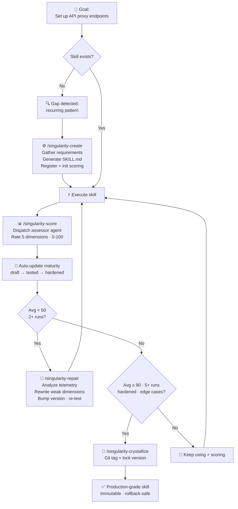
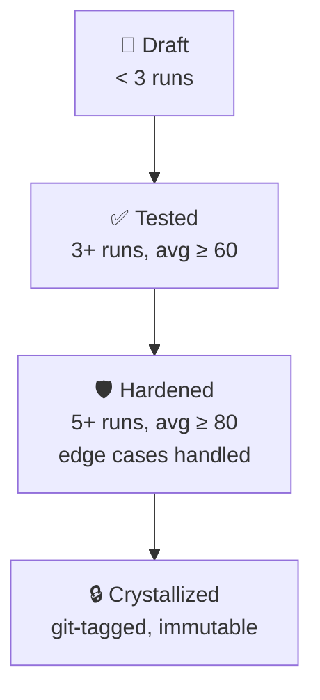

# singularity-claude 分析

**仓库地址**: https://github.com/Shmayro/singularity-claude  
**信息来源**: 官方 README (获取于 2026-04-05)

---

## 项目概述

**singularity-claude** 是 Claude Code 的**自进化技能引擎**，通过**自主递归改进循环**让技能能够自我创建、评分、修复、固化。

> "Skills that evolve themselves. A self-evolving skill engine for Claude Code — create, score, repair, and crystallize
> skills through autonomous recursive improvement loops."

## 核心问题

Claude Code 技能现在是**静态的**：你写一次，它们就保持原样 —— 即使失败、输出平庸、遇到新的边界情况。没有反馈循环，无法知道哪些技能工作良好，也没有机制随时间改进它们。

最终你会积累越来越多的技能堆，其中一些很好，一些平庸，一些默默地坏掉了。修复它们的唯一方法是人工审查。

## 核心解决方案

singularity-claude 给技能添加了**递归进化循环**：



每次执行后对技能评分。低分触发自动修复。高分导致固化 —— 一个锁定、久经考验的版本。每一步都有日志记录，完全可审计。

**无外部依赖**。不需要 SmythOS，不需要 OpenTelemetry collector，不需要 Docker。纯 Claude Code。

## 架构组件

### 核心技能 (7 个)

| 技能                    | 命令                         | 用途                   |
|-----------------------|----------------------------|----------------------|
| **using-singularity** | *(自动加载)*                   | 引导上下文 + 能力缺口检测       |
| **creating-skills**   | `/singularity-create`      | 通过结构化工作流构建新技能        |
| **scoring**           | `/singularity-score`       | 按 5 维度评分标准评分 (0-100) |
| **repairing**         | `/singularity-repair`      | 通过分析评分历史自动修复失败技能     |
| **crystallizing**     | `/singularity-crystallize` | 通过 git tag 锁定验证版本    |
| **reviewing**         | `/singularity-review`      | 健康检查 + 趋势分析          |
| **dashboard**         | `/singularity-dashboard`   | 所有托管技能概览             |

### Subagents (2 个)

| Agent              | 模型    | 用途              |
|--------------------|-------|-----------------|
| **skill-assessor** | Haiku | 快速、低成本的自动评分     |
| **gap-detector**   | Haiku | 分析失败任务发现缺失的技能能力 |

### 脚本 (2 个)

| 脚本                    | 用途                                 |
|-----------------------|------------------------------------|
| `score-manager.sh`    | 读写评分 JSON 文件的 CLI (原子写，jq/node 降级) |
| `telemetry-writer.sh` | 结构化执行日志 CLI，支持回放                   |

## 进化循环详解

### 1. Create - 创建

`/singularity-create` 引导你构建新技能：需求收集、重复检查、生成 `SKILL.md`、注册、初始评分。

### 2. Score - 评分

每次技能执行后，`/singularity-score` 分派一个 Haiku 评估 agent，在 **5 个维度**评分（每个维度 0-20 分，总分 0-100）：

| 维度                      | 测量什么       |
|-------------------------|------------|
| **Correctness** (0-20)  | 是否达成目标？    |
| **Completeness** (0-20) | 是否满足所有需求？  |
| **Edge Cases** (0-20)   | 是否处理了异常输入？ |
| **Efficiency** (0-20)   | 方法是否直接最小化？ |
| **Reusability** (0-20)  | 输出是否可复用？   |

### 3. Repair - 修复

当技能平均分低于 **50**（可配置），`/singularity-repair` 启动：

- 读取评分历史 + telemetry
- 识别最弱的评分维度
- 重写技能修复问题
- 版本升级，重新测试

### 4. Harden - 成熟

每个遇到的边界情况都会被记录。处理更多边界情况且分数更高的技能会进阶成熟度等级。

### 5. Crystallize - 固化

一旦技能在 5+ 次运行中平均分达到 **90+** 且处理了边界情况，`/singularity-crystallize` 用 git tag
锁定它。固化技能是不可变的 —— 你始终可以回滚到生产级快照。

## 成熟度等级



## 能力缺口检测

`using-singularity` 技能（每个会话开始注入）教 Claude 识别何时需要新技能：

- **重复** — 在多个会话中做相同的多步骤过程
- **无覆盖失败** — 没有现有技能能处理任务
- **可泛化模式** — 该过程适用于当前任务之外

检测到缺口时，Claude 会建议自动创建新技能。

## 数据存储

所有数据都在本地，**不会离开你的机器**。

```
~/.claude/singularity/
├── scores/          # 每个技能的评分历史 (JSON)
├── telemetry/       # 每个技能的执行日志 (JSON)
├── registry.json    # 所有托管技能
└── config.json      # 阈值和偏好设置
```

## 配置

编辑 `~/.claude/singularity/config.json`:

```json
{
  "autoRepairThreshold": 50,
  "crystallizationThreshold": 90,
  "crystallizationMinExecutions": 5,
  "scoringMode": "auto"
}
```

| 设置                             | 默认       | 描述                                                                |
|--------------------------------|----------|-------------------------------------------------------------------|
| `autoRepairThreshold`          | 50       | 平均分低于此触发修复建议                                                      |
| `crystallizationThreshold`     | 90       | 平均分高于此允许固化                                                        |
| `crystallizationMinExecutions` | 5        | 允许固化前最少运行次数                                                       |
| `scoringMode`                  | `"auto"` | `"auto"` (agent 评分), `"manual"` (你来评分), `"hybrid"` (agent 评分，你覆盖) |

## 安装

### 从官方 Claude Code 插件仓库

需要 Claude Code CLI：

```
/plugin marketplace add Shmayro/singularity-claude
/plugin install singularity-claude
```

### 从源代码

```bash
git clone https://github.com/shmayro/singularity-claude.git
cd singularity-claude
```

然后在 Claude Code 会话内：

```
/plugin marketplace add .
/plugin install singularity-claude
```

## 快速开始

```bash
# 1. 启动新的 Claude Code 会话 —— singularity 自动加载

# 2. 创建你的第一个技能
/singularity-create

# 3. 使用技能，然后评分
/singularity-score

# 4. 查看仪表盘
/singularity-dashboard
```

就这样。从第一次评分开始，进化循环就开始运行了。

## 与其他项目对比

| 特性         | claude-reflect-system | singularity-claude                       |
|------------|-----------------------|------------------------------------------|
| **学习来源**   | 用户纠正                  | 自动评分 + 用户纠正可选                            |
| **改进对象**   | 现有技能                  | 从创建到固化完整生命周期                             |
| **成熟度等级**  | 无                     | Draft → Tested → Hardened → Crystallized |
| **评分维度**   | 置信度分级                 | 5维度 0-100 量化评分                           |
| **自动修复**   | 用户触发                  | 低分自动触发                                   |
| **缺口检测**   | 无                     | 自动检测重复任务，建议创建新技能                         |
| **Git 固化** | 提交每一次学习               | 只有高评分固化才打 Git Tag                        |
| **数据存储**   | 修改 skill 文件本身         | 评分和 telemetry 单独存储                       |

## 优缺点

### 优点

✅ 完整的自进化循环：从缺口检测到创建 → 评分 → 修复 → 固化  
✅ 基于量化评分，不是只依赖用户纠正  
✅ 五级成熟度模型，清晰演进  
✅ 零外部依赖，纯 Claude Code 原生  
✅ 所有数据本地存储，隐私保护  
✅ 成熟固化后不可变，支持回滚  
✅ 与其他插件兼容共存

### 局限性

- 仅支持 Claude Code，其他 Agent 需要适配
- 需要 Haiku 模型做评分，增加一点成本
- 实验性项目，还在活跃开发

## 灵感来源

灵感来自 [Moltron](https://github.com/adridder/moltron) —— 构建在 SmythOS 上的自进化技能引擎。singularity-claude
采用相同核心思想（评分、自动修复、固化、成熟），为 Claude Code 原生重构，零外部依赖。

---

## 引用

```
Repository: Shmayro/singularity-claude
URL: https://github.com/Shmayro/singularity-claude
License: MIT
Retrieved: 2026-04-05
```
