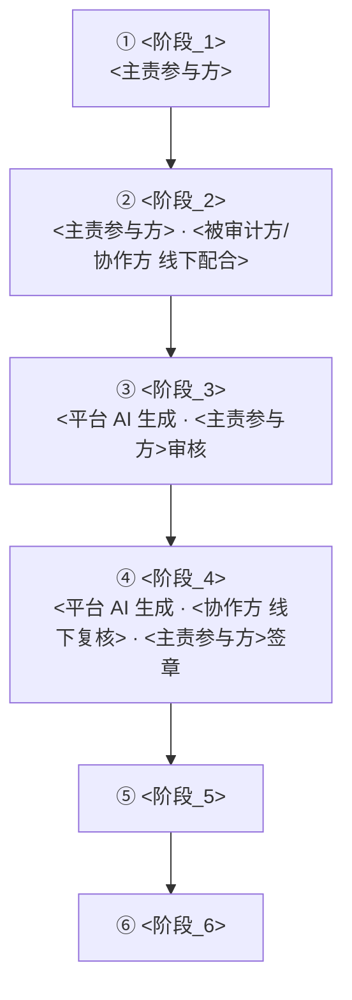

# BUSINESS — 业务与产品全景

> 本文档是「<项目名>」的业务与产品全景（BUSINESS 模板）——L1 产品层的业务全景与产品能力聚合文档。
> 【模板使用指引】复制为 `docs/L1/BUSINESS.md`，按各章节指引填写。
> 【原则】① 章节全保留，用不到留空；② `> 【指引】` 是给填写者的说明，填写后删除；③ BUSINESS = L1 产品层业务与产品全景文档：上半部为业务全景（§2：参与方/业务主线/业务模式/业务对象/系统主责/业务关系图），下半部为产品能力图（§3：能力分层与实现状态的维护处）；④ 业务全景写业务形态、端到端主线、跨系统流向与主责分工，参与方角色明细引用 USER-STORY §1，业务对象本体引用 domain/ 各域文档，应用/技术边界引用 APPLICATION-ARCHITECTURE、跨系统接口契约引用 L3；⑤ 与具体技术栈/框架无关；⑥ 产品能力图（§3：图例图 + 能力架构图 3.1 + 能力清单表 3.2）是功能分层与状态的维护处（D2 文本图，直接写入 Markdown），其他文档引用不复制；⑦ 产品能力图优先级热力可选（核心/支撑/边缘，与架构图热力色对应；不用则省略——投资优先级是主观决策，非能力属性，默认不图上；图例 = 状态线型）。
> 【占位符声明】本文示例均用 <占位> 表示，实际填具体业务名；占位覆盖提取/转化/生成/交易/账户等场景类型。

---

## 1. 业务定位与目标

> 【指引】一句话业务定位与目标：这项业务是什么、给谁用、解决什么问题，并覆盖业务定性/形态/边界。合并原「产品目标」与「业务定性」，README 的"一句话目标"引用本节，不复制。

<一句话业务定位与目标>

---

## 2. 业务全景

> 【指引】本节为业务全景：§2.1 业务参与方与关系 + §2.2 业务主线（价值链）+ §2.3 业务模式 + §2.4 业务对象与系统流转 + §2.5 系统边界与主责 + §2.6 业务关系图。参与方角色明细见 USER-STORY §1，业务对象本体见 domain/ 各域文档，应用/技术边界见 APPLICATION-ARCHITECTURE，跨系统接口契约见 L3——本节点到为止、不复制。

### 2.1 业务参与方与关系

> 【指引】列出业务涉及的全部参与方（组织/角色），说明所属组织、与平台的业务关系、对应 USER-STORY §1 的角色名。只写参与方/所属组织/业务关系/对应角色，不复制 USER-STORY §1 的职责文字。

| 参与方     | 所属组织 | 业务关系                         | 对应角色 |
| ---------- | -------- | -------------------------------- | -------- |
| <参与方_A> | <组织>   | <业务关系：采购方/供货方/运营方> | <角色名> |
| （补充）   |          |                                  |          |

### 2.2 业务主线（价值链）

> 【指引】跨角色的端到端业务主线（整体视角）——从触发到闭环分阶段，各参与方如何接续推进、平台在哪几段提供 AI 生成；单角色在系统内的界面操作细节见 USER-STORY §4（不重复）。

本图为业务主线图（跨角色整体旅程）——按阶段顺序呈现各参与方的接续与交接；图规范见 references/diagram-spec.md。



> 【指引】上图为端到端主线（阶段 + 主责参与方）；下表面向结构化阅读，补充主责系统与产出业务对象。

| 阶段     | 主责参与方 | 主责系统 | 产出业务对象 |
| -------- | ---------- | -------- | ------------ |
| <阶段_1> | <参与方>   | <系统>   | <业务对象>   |
| （补充） |            |          |              |

### 2.3 业务模式

> 【指引】业务模式按项目实际可多表：采购方式 / 定价机制 / 交易形态 / 结算方式等，逐一列表说明。业务模式变化 → 联动 §3 产品能力图。

| 业务模式 | 适用场景 | 关键机制 | 说明     |
| -------- | -------- | -------- | -------- |
| <模式_1> | <场景>   | <机制>   | <一句话> |
| （补充） |          |          |          |

### 2.4 业务对象与系统流转

> 【指引】只列业务对象清单 + 跨系统单据对应/流向 + 主责；字段/状态机/约束见 domain/ 各域文档（本文不定义本体）。

| 业务对象   | 产出方 | 流向          | 对应外部单据 | 主责       |
| ---------- | ------ | ------------- | ------------ | ---------- |
| <业务对象> | <系统> | <系统 → 系统> | <外部单据>   | <主责系统> |
| （补充）   |        |               |              |            |

### 2.5 系统边界与主责

> 【指引】只写业务主责分工：谁是主数据权威、谁主责哪一段业务；应用/技术边界（Context/应用划分）见 APPLICATION-ARCHITECTURE，不重复。

| 系统     | 业务定位   | 主责范围       | 数据权威      |
| -------- | ---------- | -------------- | ------------- |
| <系统_1> | <业务定位> | <主责哪段业务> | <主数据/从属> |
| （补充） |            |                |               |

### 2.6 业务关系图

> 【指引】业务关系图用 D2（参与方层/平台层/下游层三层结构），边标签 = 业务流向。本图为业务关系图（业务全景图）——绘制规范见 references/diagram-spec.md。下方为完整实例，替换为实际参与方、平台入口、业务能力与下游系统。

```d2
# 图名: <项目名>业务关系图
# 视角: 业务关系（参与方 + 业务主线 + 业务对象流转）
# 用途: 一图看清参与方 → 平台 → 下游/后台的业务关系与业务流向
# 边界: 只画业务级流向，技术边界见 APPLICATION-ARCHITECTURE，接口契约见 L3
# 说明: 三层结构（参与方层/平台层/下游层）；节点 id（p1/m1/c1/s1 等）仅技术标识，与业务名无关
vars: { d2-config: { layout-engine: elk } }

业务架构: {
  grid-rows: 1
  grid-columns: 1
  grid-gap: 24
  style.border-radius: 16

  参与方层: {
    label: "① <参与方层>"
    width: 1000
    grid-columns: 4
    grid-gap: 12
    style.fill: "#dbeafe"
    style.stroke: "#2563eb"
    style.font-color: "#1e293b"
    style.stroke-width: 2
    style.border-radius: 12
    p1: { label: "<参与方_A>"; width: 235; height: 56; class: mod }
    p2: { label: "<参与方_B>"; width: 235; height: 56; class: mod }
    p3: { label: "<参与方_C>"; width: 235; height: 56; class: mod }
    p4: { label: "<参与方_D>\n线下"; width: 235; height: 56; class: mod }
  }

  平台层: {
    label: "② <平台层>"
    width: 1000
    grid-columns: 1
    grid-gap: 12
    style.fill: "#ede9fe"
    style.stroke: "#7c3aed"
    style.font-color: "#1e293b"
    style.stroke-width: 2
    style.border-radius: 12

    # 平台入口（前端触点）
    入口分区: {
      width: 880
      grid-columns: 4
      grid-gap: 12
      style.fill: "#f5f3ff"
      style.stroke: "#a855f7"
      style.border-radius: 8
      m1: { label: "<平台入口>"; width: 205; height: 50; class: mod }
      m2: { label: "<平台入口>"; width: 205; height: 50; class: mod }
      m3: { label: "<平台入口>"; width: 205; height: 50; class: mod }
      m4: { label: "<平台入口>"; width: 205; height: 50; class: mod }
    }
    # 核心业务能力
    能力分区: {
      width: 880
      grid-columns: 6
      grid-gap: 12
      style.fill: "#f5f3ff"
      style.stroke: "#a855f7"
      style.border-radius: 8
      c1: { label: "<业务能力>"; width: 132; height: 50; class: mod }
      c2: { label: "<业务能力>"; width: 132; height: 50; class: mod }
      c3: { label: "<业务能力>"; width: 132; height: 50; class: mod }
      c4: { label: "<业务能力>"; width: 132; height: 50; class: mod }
      c5: { label: "<业务能力>"; width: 132; height: 50; class: mod }
      c6: { label: "<业务能力>"; width: 132; height: 50; class: mod }
    }
  }

  下游层: {
    label: "③ <下游层>"
    width: 1000
    grid-columns: 2
    grid-gap: 12
    style.fill: "#e2e8f0"
    style.stroke: "#64748b"
    style.font-color: "#1e293b"
    style.stroke-width: 2
    style.border-radius: 12

    供货方组: {
      label: "<供货方>"
      width: 482
      grid-columns: 1
      grid-gap: 12
      style.fill: "#dcfce7"
      style.stroke: "#16a34a"
      style.font-color: "#1e293b"
      style.border-radius: 8
      s1: { label: "<参与方_E>\n入驻供货"; width: 362; height: 56; class: mod }
      s2: { label: "<参与方_F>\n第三方货源"; width: 362; height: 56; class: mod }
    }
    企业后台组: {
      label: "<企业后台>"
      width: 482
      grid-columns: 1
      grid-gap: 12
      style.fill: "#ffedd5"
      style.stroke: "#c2410c"
      style.font-color: "#1e293b"
      style.border-radius: 8
      e1: { label: "<业务对象_单据>\n<业务对象_履约>"; width: 362; height: 56; class: mod }
      e2: { label: "<业务对象_主数据>\n<业务对象_基础数据>"; width: 362; height: 56; class: mod }
    }
  }
}

业务架构.参与方层 -> 业务架构.平台层: <业务流向>
业务架构.平台层 -> 业务架构.下游层.供货方组: <业务流向>
业务架构.平台层 -> 业务架构.下游层.企业后台组: <业务流向>

classes: {
  mod: {
    style: {
      border-radius: 6
      fill: "#ffffff"
      stroke: "#94a3b8"
      font-color: "#1e293b"
      stroke-width: 1
    }
  }
}
```

> 图内 label 为占位，实际填具体业务名

---

## 3. 产品能力图

> 【指引】本节为产品能力全景三件套：§3.0 图例图 + §3.1 产品能力架构图（本图为产品能力架构图：能力分层 × 状态）+ §3.2 能力清单表。产品能力架构图是功能分层与状态的维护处，其他文档引用不复制；产品层不画技术底座（数据存储/消息/网络/缓存归 TECHNOLOGY-ARCHITECTURE）。图规范见 references/diagram-spec.md。

### 3.0 图例（状态线型编码规则）

> 【指引】本图为产品能力图例：两节点 label 即状态线型编码含义（实线=已实现含本迭代 / 虚线=待规划），随文档保留；图规范见 references/diagram-spec.md。

```d2
# 图名: 产品能力图例（Product Capability Legend）
# 视角: 编码规则说明（线型 = 状态）
# 用途: 产品能力架构图的视觉通道图例——线型（已实现含本轮 / 待规划）
# 说明: 独立图例图（绘制规范见 rule 图规范条款），与产品能力架构图（§3.1）分开；状态线型两档或三档（两档=已实现/待规划；三档=已实现/待规划/中间态）

vars: { d2-config: { layout-engine: elk } }

产品能力图例: {
 grid-columns: 2; grid-gap: 12; style.font-color: "#1e293b"; style.border-radius: 12
 l1: { label: "已实现（实线）\n含本迭代要实现"; width: 482; height: 60; class: [solid] }
 l2: { label: "待规划（虚线）\n本迭代不做"; width: 482; height: 60; class: [dashed] }
}

classes: {
 solid: { style: { border-radius: 6; fill: "#ffffff"; stroke: "#1e40af"; font-color: "#1e293b"; stroke-width: 3 } }
 dashed: { style: { border-radius: 6; fill: "#ffffff"; stroke: "#64748b"; font-color: "#1e293b"; stroke-width: 3; stroke-dash: 10 } }
}
```

### 3.1 产品能力架构图（唯一图）

> 【指引】下方 d2 图为完整实例（<产品名>已填充）：替换为实际能力节点与能力域，右侧放横向/系统内置能力（被 ≥2 个垂直能力共用者 + 开箱自带者）；布局、配色与状态线型沿用实例样式（图规范见 references/diagram-spec.md）。

```d2
# 图标准元信息 · 中文注释
# 图名: 产品能力架构图（Product Capability Architecture Map）
# 视角: 逻辑视图（能力分层 × 状态）
# 用途: 产品功能全貌 + 分层支撑 + 实现状态
# 反映的问题: 产品有哪些能力、能力在哪层、做到哪一步
# 边界: 产品层不画技术底座（数据存储/消息/网络/缓存归 TECHNOLOGY-ARCHITECTURE）
# 说明: 节点 id（h1/c1/s1 等）仅技术标识，与功能名无关；能力状态两档或三档（两档=已实现（含本迭代）/待规划；三档=已实现/待规划/中间态，线型映射实线/虚线/点线）
# 校验: 业务能力层节点数 == §3.2 表「类型=业务能力」行数，一能力一行；共享业务服务层节点数 == §3.2 表「类型=系统内置/横向」行数；能力 → Action 映射详见 domain/ 各域文档

vars: {
 d2-config: {
 layout-engine: elk
 }
}

产品能力: {
 grid-rows: 1
 grid-columns: 2
 grid-gap: 16
 style.font-color: "#1e293b"
 style.border-radius: 16

 左主体: {
 grid-rows: 1; grid-columns: 1; grid-gap: 24
 style.font-color: "#1e293b"
 style.border-radius: 12

 入口层: {
 # 入口层 · 仅示意触点，非能力，无状态与热力维度，白底实线
 label: "① 入口层（前台 · 用户触点）"
 width: 1000; grid-columns: 3; grid-gap: 12; style.fill: "#dbeafe"; style.font-color: "#1e293b"; style.stroke: "#2563eb"; style.border-radius: 12
 h1: { label: "<页面_首页>"; width: 317; height: 60; class: module }
 h2: { label: "<页面_作品>"; width: 317; height: 60; class: module }
 h3: { label: "<页面_用户中心>"; width: 317; height: 60; class: module }
 h4: { label: "<页面_工具使用>"; width: 317; height: 60; class: module }
 h5: { label: "<页面_充值>"; width: 317; height: 60; class: module }
 h6: { label: "<页面_推广>"; width: 317; height: 60; class: module }
 }

 业务能力层: {
 # 业务能力层 · 垂直能力按能力域分列，线型=状态（实线=已实现含本迭代、虚线=待规划）
 label: "② 业务能力层（垂直能力 · 按能力域分列）"
 width: 1000; grid-columns: 4; grid-gap: 12; style.fill: "#ede9fe"; style.font-color: "#1e293b"; style.stroke: "#7c3aed"; style.border-radius: 12
 内容获取: { label: "<能力域_提取>"; width: 235; grid-columns: 2; grid-gap: 12; style.fill: "#f3e8ff"; style.font-color: "#1e293b"; style.stroke: "#a855f7"; style.border-radius: 8
 c1: { label: "<能力_提取类>"; width: 103; height: 50; class: [solid] }
 c2: { label: "<能力_提取类>"; width: 103; height: 50; class: [solid] }
 c3: { label: "<能力_提取类>"; width: 103; height: 50; class: [dashed] }
 c4: { label: "<能力_提取类>"; width: 103; height: 50; class: [dashed] }
 }
 内容创作: { label: "<能力域_创作>"; width: 235; grid-columns: 2; grid-gap: 12; style.fill: "#cffafe"; style.font-color: "#1e293b"; style.stroke: "#06b6d4"; style.border-radius: 8
 c5: { label: "<能力_转化类>"; width: 103; height: 50; class: [solid] }
 c6: { label: "<能力_生成类>"; width: 103; height: 50; class: [dashed] }
 c7: { label: "<能力_编辑类>"; width: 103; height: 50; class: [solid] }
 }
 商业化: { label: "<能力域_商业化>"; width: 235; grid-columns: 2; grid-gap: 12; style.fill: "#ffedd5"; style.font-color: "#1e293b"; style.stroke: "#f97316"; style.border-radius: 8
 c8: { label: "<能力_交易类>"; width: 103; height: 50; class: [solid] }
 c9: { label: "<能力_交易类>"; width: 103; height: 50; class: [dashed] }
 c10: { label: "<能力_交易类>"; width: 103; height: 50; class: [dashed] }
 }
 作品沉淀: { label: "<能力域_沉淀>"; width: 235; grid-columns: 2; grid-gap: 12; style.fill: "#dcfce7"; style.font-color: "#1e293b"; style.stroke: "#22c55e"; style.border-radius: 8
 c11: { label: "<能力_查询类>"; width: 103; height: 50; class: [solid] }
 c12: { label: "<能力_查询类>"; width: 103; height: 50; class: [dashed] }
 }
 }
 }

 共享业务服务层: {
 # 共享业务服务层 · 横向能力与系统内置底座（被多垂直能力共用 / 开箱自带无管理界面），右侧竖条支撑左侧主体
 label: "③ 共享业务服务层\n（横向/系统内置）"
 grid-columns: 1
 style.fill: "#fef3c7"; style.font-color: "#1e293b"; style.stroke: "#f59e0b"; style.border-radius: 12
 s1: { label: "<能力_用户类>"; width: 160; height: 90; class: [solid] }
 s2: { label: "<能力_账户类>"; width: 160; height: 90; class: [solid] }
 s3: { label: "<能力_生成类>"; width: 160; height: 90; class: [dashed] }
 s4: { label: "<外部_支付>"; width: 160; height: 90; class: [dashed] }
 s5: { label: "<能力_存储类>"; width: 160; height: 90; class: [solid] }
 }
}

# 层间支撑关系（上层依赖下层；右侧竖条支撑左侧主体）
产品能力.共享业务服务层 -> 产品能力.左主体.业务能力层: 支撑 { style.stroke: "#f59e0b" }
产品能力.左主体.业务能力层 -> 产品能力.左主体.入口层: 支撑 { style.stroke: "#7c3aed" }

classes: {
 # 样式类 · 中文注释：线型表达状态（实线=已实现含本迭代、虚线=待规划）
 module: { style: { border-radius: 6; fill: "#ffffff"; stroke: "#1e40af"; font-color: "#1e293b"; stroke-width: 1 } }
 solid: { style: { border-radius: 6; fill: "#ffffff"; stroke: "#1e40af"; font-color: "#1e293b"; stroke-width: 2 } }
 dashed: { style: { border-radius: 6; fill: "#ffffff"; stroke: "#64748b"; font-color: "#1e293b"; stroke-width: 2; stroke-dash: 8 } }
}
```

> 图内 label 为占位，实际填具体业务名

### 3.2 能力清单表

> 【指引】能力清单的文本化记录——产品层能力清单，每能力一行，字段：能力 / 能力域 / 类型 / 能力状态 / 说明（可选列：优先级 / 对应 Action / Action 状态）。类型区分「业务能力」与「系统内置/横向」（横向 = 被 ≥2 个垂直能力共用；系统内置 = 开箱自带、无管理界面、业务直接使用——可独立成子表（内置默认项/说明），也可合并进主表用类型列标记，二选一）。只列当前存在的功能——不存在的功能不列入（决策过程归 ADR）。能力状态两档或三档（两档=已实现（含本迭代要实现）/待规划；三档=已实现/待规划/中间态），由 §3.1 架构图线型表达（两档实线/虚线；三档实线/虚线/点线）。能力 → 领域操作（Action）的映射与 Action 签名/状态/事件详见 `domain/` 各域文档（入口：`DOMAIN-MODEL` §3 清单表）。

| 能力     | 能力域           | 类型（业务能力/系统内置·横向） | 能力状态（已实现/待规划） | 优先级（可选）   | 对应 Action（可选） | Action 状态（可选） | 说明     |
| -------- | ---------------- | ------------------------------ | ------------------------- | ---------------- | ------------------- | ------------------- | -------- |
| <能力名> | <能力域(业务域)> | <业务能力/系统内置·横向>       | <已实现/待规划>           | <核心/支撑/边缘> | <Action 名>         | <已实现/待规划>     | <一句话> |
| （补充） |                  |                                |                           |                  |                     |                     |          |
