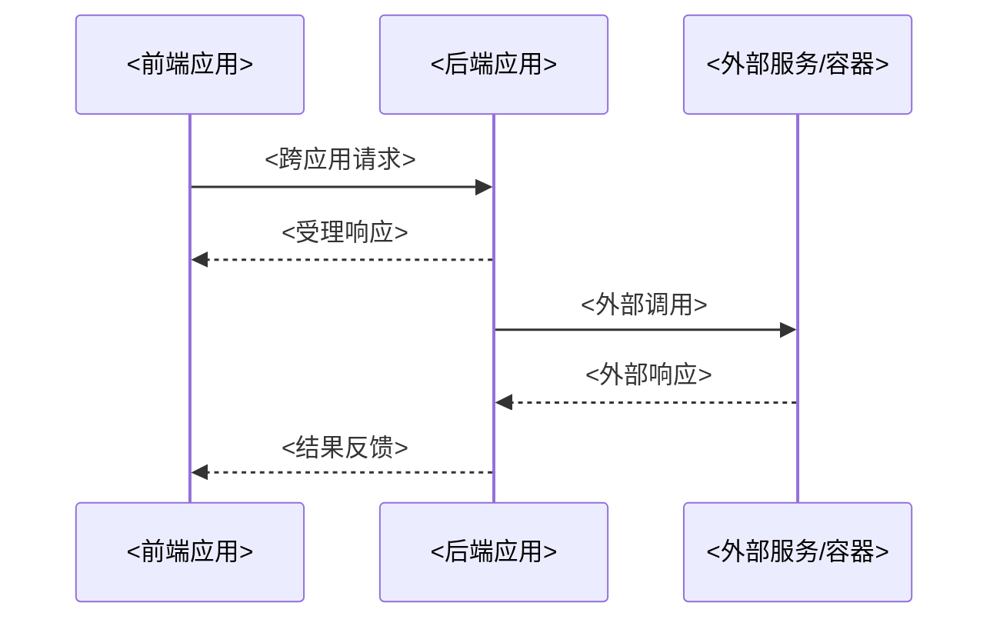
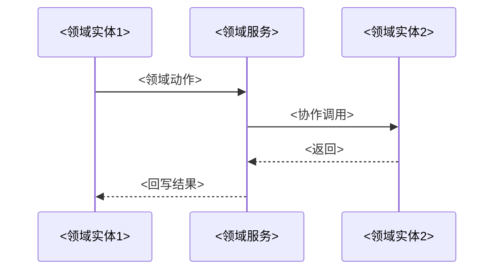
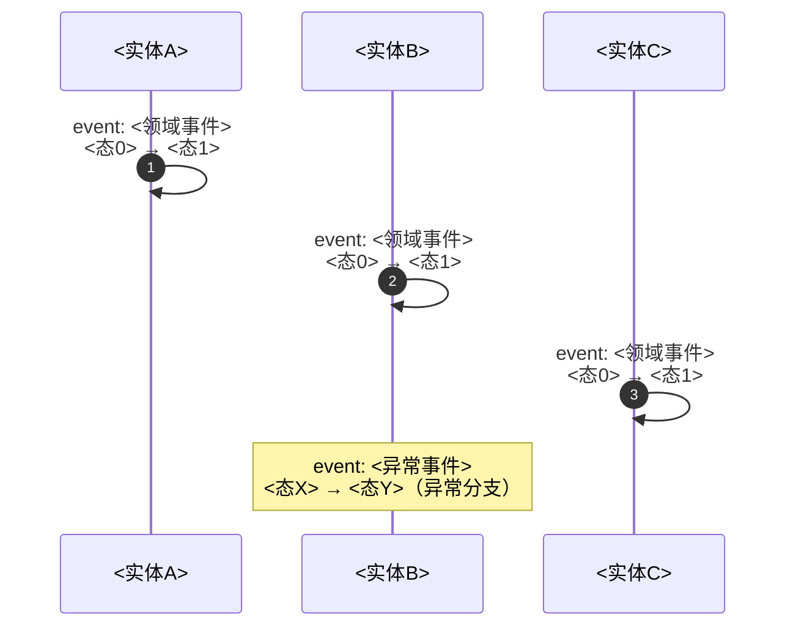

# DEEP-DIVE — 通用 Deep Dive 模板

> 本文档是「<项目名>」的 DEEP-DIVE（通用 Deep Dive 模板）——系统级问题描述文档（层归属 L2，内容跨越 L1-L4）。
> 【模板使用指引】复制为 `docs/L2/deep-dives/<name>.md`（`<name>` 用 kebab-case，如 `inference-pipeline`），按各章节指引填写。
> 【原则】① 系统级问题描述：deep-dive 回答一个具体的系统级问题（如"怎么上传文件并构建向量""怎么编排底稿生成"），从端到端视角描述——不限于单层，跨越 L1-L4；② 格式统一（分层时序图）：§1 应用级时序图（参与者=应用）→ §2 应用内部流程（参与者=领域实体，复杂应用才画）→ §3 实体状态流转 → §4 涉及接口；③ 代码即真相：细节一律用 `参见 File:Line` 链到代码，不复制代码、不复制 AGENTS.md；④ 引用不复制：实体定义在 [DOMAIN-MODEL](../domain/DOMAIN-MODEL.md)、接口契约在 [INTEGRATION](../../L3/INTEGRATION.md)、API 在 [API](../../L3/API.md)；⑤ 图用 Mermaid（sequenceDiagram，图规范见 references/diagram-spec.md），无元信息表、无变更记录；⑥ 严禁自创概念（完整规则见 notes）：deep-dive 是合成文档，参与者/实体/事件/状态/接口一律来自现有项目文档。
> 【覆盖范围】物理单 rule（DEEP-DIVE.md）通过 globs `*.md` 覆盖目录下多文档（含 INDEX.md——命中时按「索引基准」节维护，不生成 4 章骨架）。
> 【章节】4 章骨架指 §1-4。

---

## 1. 总览（应用级时序图）

> 【指引】本节给读者"这个系统级问题跨应用怎么走"的整体认知。参与者必须是 [APPLICATION-ARCHITECTURE](../APPLICATION-ARCHITECTURE.md) §2.2 的应用/系统（如前端应用、后端应用、外部服务、容器），不得下钻到应用内部模块/接口/组件（那些属于 §2 或代码层）。消息标注真实接口/事件名。只画一张应用级时序图。

---

## 2. 应用内部流程（按需 · 领域实体时序图）

> 【指引】当某个应用内部处理逻辑复杂（多领域实体协作、异步编排、状态推进）时，为该应用单独展开一张内部时序图——参与者是 [DOMAIN-MODEL](../domain/DOMAIN-MODEL.md) 的业务领域实体/领域服务（聚合根、实体、领域服务、值对象），不是模块/类/接口。简单应用可省略本节（生成时说明"无复杂内部流程，省略 §2"）。

---

## 3. 领域实体状态流转

> 【指引】本节列出 deep-dive 涉及的领域实体与领域服务，状态流转见 §3.2。实体名与状态定义以 domain/ 各域文档为准（入口 [DOMAIN-MODEL](../domain/DOMAIN-MODEL.md) §3）。

### 3.1 涉及实体

> 【指引】实体/领域服务名照抄 domain/ 各域文档（入口 DOMAIN-MODEL §3）（纯中文名，不加英文注音、不加属性数），业务域列取 DOMAIN-MODEL §2.1 业务域名（如 审计项目业务域 / AI 能力底座业务域）；非领域实体对象（跨域接口值对象、技术任务表）不入本表，接口类内容归 §4。

| 实体/领域服务 | 业务域   | 在本问题中的角色 |
| ------------- | -------- | ---------------- |
| <实体名>      | <业务域> | <作用描述>       |

### 3.2 状态流转

> 【指引】本节用 sequenceDiagram（时序图）表达：参与者=各实体（对齐 DOMAIN-MODEL），沿时间轴用自环消息标出每个实体的状态跃迁。自环消息两行：第一行 `event: <领域事件名>`（对齐 domain/ 各域文档「本域领域事件」，如"审计项目已立项"；无对应事件的内部步骤用动作动词），第二行直接写该实体的状态变化（`态A → 态B`，参与者即实体，不加 `entity:` 前缀）。多实体协同不用单一 stateDiagram（那只能画一个对象的状态机），也不用堆叠节点的 flowchart（时间轴不清晰）。异常/分段说明可用 Note over。

> 各实体状态定义见 domain/ 各域文档（入口 DOMAIN-MODEL §3），本图只标与本问题相关的跃迁。

---

## 4. 涉及接口

> 【指引】本节列出 deep-dive 涉及的接口（Inbound API、Outbound 契约，以及按需的 domain 层领域接口），只列与本问题相关的接口。

### 4.1 Inbound API（本系统对外提供）

| 接口     | 方法/路径      | 说明   | 文件             |
| -------- | -------------- | ------ | ---------------- |
| <接口名> | <METHOD /path> | <用途> | `docs/L3/API.md` |

### 4.2 Outbound 契约（本系统调用外部服务）

| 契约文件                                      | 外部服务 | 接口方法   | 说明   |
| --------------------------------------------- | -------- | ---------- | ------ |
| `docs/L3/integration-contracts/<contract>.md` | <服务名> | <接口签名> | <用途> |

### 4.3 领域接口（domain 层，按需）

> 【指引】仅当本问题涉及 domain 层接口（领域动作、框架解耦抽象）时保留本节；接口名与签名必须来自 DOMAIN-MODEL 或代码（File:Line），来源列必须指向具体文档名（如 domain/ 各域文档），禁止写「domain 层」「代码」等模糊来源。跨域接口（跨限界上下文的 Protocol，如 InferencePort）归各域文档「跨域接口」节，不入本表。本表只列框架解耦抽象（可替换实现的接口，如 ToolRegistry/PromptService/SkillRegistry/AuditRunState）与领域动作。deep-dive 不做任何概念的 SSOT——所有接口定义以来源文档为准，deep-dive 只做整合引用。

| 来源                                                                 | 名称     | 核心方法 | 说明   |
| -------------------------------------------------------------------- | -------- | -------- | ------ |
| domain/<域>.md §3（领域操作）/§7（框架解耦抽象）或 `src/xxx.py:Line` | <接口名> | <签名>   | <用途> |

---

## 索引基准（`docs/L2/deep-dives/INDEX.md`）

> 【指引】`docs/L2/deep-dives/INDEX.md` 为 deep-dives 目录唯一入口（宪法 §3.2 目录索引约定）：极简形态，只有一张「文件 | 说明」表——每 deep-dive 一行、一句话描述（这个文件是干啥的）；目录内新增/删除/合并 deep-dive 时同步本表。单列判定（2/4 阈值命中即单列）在生成单篇时执行，INDEX 不承载判定。

| 文件                   | 说明                       |
| ---------------------- | -------------------------- |
| [<name>.md](<name>.md) | <一句话：这个文件是干啥的> |
