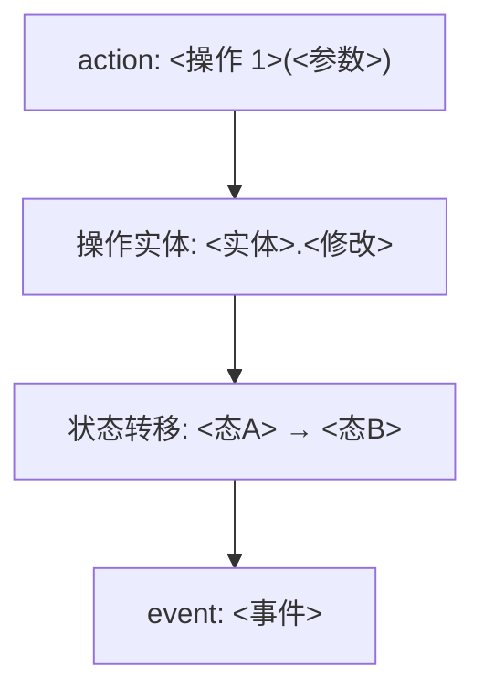

# <业务域名>业务域

> 本文档是「<项目名>」<业务域名>业务域的领域模型详情——<一句话：本域管什么>。
> 与 [DOMAIN-MODEL.md](DOMAIN-MODEL.md)（总文档：概述/划分/契约落地/Mapper）配合阅读。

---

## 1. 聚合

聚合根：<聚合根实体>

聚合边界内对象：

> 【指引】对象表「类型」列判据（建模方法论，不写入实例正文，供生成时判定）：实体 = 按 id 区分/追踪 + 拥有自身属性字段（生命周期由业务 Action 管理 → 可写实体，有 action/状态机/约束；由系统种子装载管理 → 只读实体，无写 action 无状态机）；聚合边界内除聚合根外的实体为子实体（本地身份，生命周期由聚合根管理，外部仅经聚合根方法访问与修改）；值对象 = 无身份、属性组合即意义、修改=整体替换；聚合非实体必然要求——聚合是事务一致性边界，无写 action 即无聚合。

| 对象   | 类型（实体/子实体/值对象） | 说明   |
| ------ | -------------------------- | ------ |
| <对象> | <类型>                     | <说明> |

> 【指引】对象表之后，每个实体一个独立子章节（`### 1.x <实体名>`，按对象表顺序编号）：一句角色说明 + 该实体的业务属性表（属性/类型/说明 三列）。
>
> 业务属性回答"这个实体在业务上有什么"：属性名用业务语言（与对象表、通用语言一致）；类型列写概念类型——文本 / 整数 / 布尔 / 时间 / 枚举：值1\|值2 / <值对象名> / 引用→<实体名> / 列表\<元素>；说明列写业务含义、值域与单字段约束（必填/默认值）。属性可以是标量，也可以是复合结构——值对象、领域枚举、对其他实体的引用、子实体集合（如订单的订单项列表）；跨字段的业务规则由 §2 业务约束承载。
>
> 实体的业务身份用编号/编码类属性表达（作为普通业务属性列出）；实体的持久化形态（表结构、存储字段、索引）由 DATA-ARCHITECTURE §5 与代码承载，并与本文档的业务属性保持映射（Mapper 三方对齐）。

### 1.1 <实体 1>

<一句角色说明>

| 属性   | 类型       | 说明                         |
| ------ | ---------- | ---------------------------- |
| <属性> | <概念类型> | <业务语义；单字段约束写这里> |

### 1.2 <实体 2>

<一句角色说明>

| 属性   | 类型       | 说明                         |
| ------ | ---------- | ---------------------------- |
| <属性> | <概念类型> | <业务语义；单字段约束写这里> |

领域类图（classDiagram，每聚合一张）：

> 【指引】本图为领域类图（Mermaid classDiagram，图规范见 references/diagram-spec.md）：每聚合一个，对象与上表一致。

```mermaid
classDiagram
  class <聚合根> {
    <<aggregate root>>
    +<操作>(<参数>) <返回>
  }
  class <实体> {
    +<属性>: <类型>
    +<操作>(<参数>) <返回>
  }
  class <值对象> {
    +<属性>: <类型>
  }
  <聚合根> o-- <实体> : 组合
  <聚合根> o-- <值对象> : 组合
  note for <聚合根> "约束: <规则ID> 见下方列表"
```

---

## 2. 业务约束

- R1 <约束 1>
- R2 <约束 2>

---

## 3. 领域操作

> 【指引】每个领域操作一个子章节（`### 3.x <操作名>(<参数>)`，按业务流程顺序编号）：方法详情竖表（项/内容 四行：方法签名/入参/返回/事件——业务代码签名以此为准，只收本聚合根操作；入参与返回的业务含义逐个说清楚，字段结构链 openapi schema）+ 行为说明（业务流程）+ 流程图（action → 操作实体 → 状态转移 → event；不触发状态转移的内容操作与查询类操作不配图）。一个业务操作可对应多个代码方法，每方法一张竖表、以方法名加粗起头；查询类操作无写事件。类型真源：DTO/值对象/枚举定义见 openapi schemas 与代码。

### 3.1 <操作 1>(<参数>)

| 项       | 内容                                       |
| -------- | ------------------------------------------ |
| 方法签名 | `def <方法>(<参数>) -> <返回>`             |
| 入参     | <参数逐一说明业务含义；字段结构见 openapi> |
| 返回     | <返回类型的内容构成>                       |
| 事件     | <事件/无>                                  |

<行为说明>



### 3.2 <操作 2>(<参数>)

| 项       | 内容                                       |
| -------- | ------------------------------------------ |
| 方法签名 | `def <方法>(<参数>) -> <返回>`             |
| 入参     | <参数逐一说明业务含义；字段结构见 openapi> |
| 返回     | <返回类型的内容构成>                       |
| 事件     | <事件/无>                                  |

<行为说明>

---

## 4. 本域状态机

> 【指引】每有状态对象一小节（stateDiagram-v2 + 状态转移表）；无状态对象不画。状态转移由聚合方法触发，同时发布对应领域事件——状态机收拢在本域文档，不设集中式状态机章。

### 4.1 <对象名>

```mermaid
stateDiagram-v2
 [*] --> <状态_初始>
 <状态_初始> --> <状态_处理中>: <Action>
 <状态_处理中> --> <状态_完成>: <Action>
 <状态_完成> --> [*]
```



状态转移表（带发布事件）：

| 起始态   | 触发命令 | 终止态   | 发布事件 |
| -------- | -------- | -------- | -------- |
| <起始态> | <触发>   | <终止态> | <事件>   |

---

## 5. 本域领域事件

> 【指引】领域事件只记已发生事实（过去时命名），从聚合 Action 的状态变更点抽象而来；事件与 Action 的映射关系已在领域操作（方法签名返回/事件列与流程图）中表达，不重复映射（建模方法论，不写入实例正文）。

> 本节放本域事件清单；事件详情见代码（domain events / port.py）。

| 事件     | 触发时机   | 消费者   | 关键载荷   |
| -------- | ---------- | -------- | ---------- |
| <事件名> | <触发时机> | <消费者> | <载荷字段> |

### <事件名>（可选 · 按需展开）

| 字段    | 类型   | 必填 | 说明               |
| ------- | ------ | ---- | ------------------ |
| eventId | string | 必填 | 全局唯一，用于幂等 |
| <字段>  | <类型> | 必填 | <说明>             |

---

## 6. 跨域接口（按需）

> 【指引】仅当本域对外暴露跨限界上下文的接口（Protocol/OHS 契约）时保留本节，无则整节删除。接口名与核心方法来自代码（File:Line），输入/输出值对象在代码（port.py dataclass）定义；消费方列写明哪个业务域在用。

> 本域对外暴露的跨业务域接口（Protocol），下游按 <模式缩写> 契约编程（关系模式见总文档 §2.3）。共享值对象（<值对象清单>）见代码 port.py。

| 接口     | 核心方法 | 输入/输出   | 消费方   |
| -------- | -------- | ----------- | -------- |
| <接口名> | `<签名>` | <输入→输出> | <业务域> |

---

## 7. 域内服务接口（按需）

> 【指引】仅当本域有框架无关的内部抽象接口（如工具注册表/提示词服务）时保留本节，无则整节删除。这些接口不跨域，属域内设计契约；其可替换实现的演进细节（实现替换、内部结构演进等）归 deep-dive，本文档只登记接口本身。

> 以下为<业务域名>域内的框架无关抽象接口，供<机制>解耦具体实现。不跨域，属域内设计契约，定义见代码（`<代码路径>`）。

| 接口     | 核心方法 | 说明   |
| -------- | -------- | ------ |
| <接口名> | `<签名>` | <用途> |

---

## 8. 通用语言表（按需）

> 【指引】仅当本域有特有术语需辨析（别称/禁止混用）时保留本节，无则整节删除。术语定义见本域实体节，此处只做辨析不重复定义；节号按实际顺延（本模板以 §8 示意）。

| 术语 | 含义（见本域 §x） | 别称/禁止混用 |
| ---- | ----------------- | ------------- |
| <术语> | <见 §x> | <辨析> |
