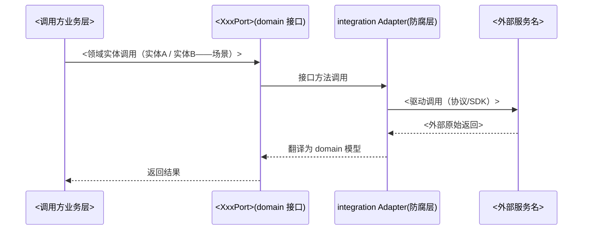

# <外部服务名> 契约

> 本文档是「<项目名>」外部服务 <服务名> 的契约文件——`docs/L3/integration-contracts/<service>.md`（kebab-case 服务名，如 llm-api.md）。
> 【模板使用指引】复制为契约文件，按各章节指引填写；本文件是字段级契约的维护处，INTEGRATION 说明书只引用不复制。
> 【原则】① 一服务一契约：字段术语/接口/错误码只在本文件维护；② 接口列表只覆盖本系统调用面，不替对方维护全集；③ 契约状态标注 mock/真实切换；④ 无元信息表、无变更记录。

---

## 1. 集成形态

> 【指引】先用一段话说清：对接什么、经哪个 ACL 防腐层 adapter（给代码路径）统一连接与翻译；再画同构时序图（骨架/消息约定单源见生成 notes「时序图同构骨架」条，本节不重复措辞）。接入细节不进本节：协议分型/地址/鉴权/失败策略归 §2 接入方式，本段不展开、不逐字复述。

<对接内容一句话：如「系统内置一个默认业务数据源，需接入真实业务数据供抽取同步」；经 `<集成层代码路径>`（ACL 防腐层）统一连接与抽取，防止外部数据模型污染内部模型。>

---

## 2. 接入方式

> 【指引】本节集中「怎么接」：先契约状态（谁在履行 + 怎么切换），再真实接入形态（分型/地址/鉴权/失败策略）。契约状态为「已上线」时省略 mock 实现/切换方式两项（仅保留契约状态）。mock 返回的示例数据集在「mock 实现」行说明；接入细节描述的是切换后的生效形态——mock 阶段未启用时在地址/鉴权行显式注明。错误码统一见 §5 错误码章（本节不列错误码表）。

- 契约状态：<mock 中 / 已交付 / 已上线>
- mock 实现：<如 InMemory<Xxx>Adapter，内置示例数据集/模拟行为>（契约状态为「已上线」时省略）
- 切换方式：<替换 Adapter 实现类（推荐，业务代码零改动）/ 修改连接配置指向真实服务；业务代码零改动>（契约状态为「已上线」时省略）
- 接入类型：<协议/驱动分型，如 API（HTTP/REST）/ SDK / Webhook>
- 接入地址：<base URL / 端点 / 连接配置来源；mock 阶段未启用时注明「切换真实实现后生效」>
- 鉴权：<AppSecret / Token / 签名>（必填；密钥经部署配置注入见 DEPLOYMENT；mock 阶段未启用时注明）
- 失败策略：<超时<毫秒数>ms / 重试<次数>次 / 降级<策略>>（必填，示例：超时5000ms/重试3次/降级返回缓存）

---

## 3. 接口列表（本系统调用面）

> 【指引】本表只列当前系统实际调用的接口（调用子集）——外部服务完整 API 以其官方文档为准（<外部 API 文档链接，无则此句省略>），不替对方维护全集。调用面变化 = 契约变更：同步本表 + §4 对应小节（两处一致；§1 时序图消息为领域实体概括，仅在调用方实体/场景变化时同步）。

| 接口名   | 方法签名                                            | 说明   |
| -------- | --------------------------------------------------- | ------ |
| <接口名> | <HTTP：`METHOD /path`；SDK/Port：`fn(args) -> Ret`> | <说明> |

---

## 4. 接口定义

> 【指引】每接口一小节，三件套结构固定：① 接口语义（用途一句话 + 幂等性/重复调用语义）；② 方法签名与出入参（签名 + 输入表 + 返回表）；③ 失败处理（本接口特殊的失败行为与处理——重试/状态回写/降级/部分成功等，强调与 §2 失败策略的差异；错误码统一登记 §5，本小节不重复列码表）。字段术语与 DATA-ARCHITECTURE §2/§5.6 及 DOMAIN-MODEL 总文档 §5 对齐。

### 4.1 <接口名>

接口语义：<用途一句话；幂等性与重复调用语义>

方法签名：<HTTP：`METHOD /path`；SDK/Port：`fn(args) -> Ret`>

输入：

| 参数    | 类型   | 必填  | 说明   |
| ------- | ------ | ----- | ------ |
| <param> | <type> | <Y/N> | <语义> |

返回：

| 字段    | 类型   | 说明   |
| ------- | ------ | ------ |
| <field> | <type> | <语义> |

失败处理：<本接口特殊的失败行为与处理（重试 / 状态回写 / 是否阻塞其他链路 / 部分成功处理）；涉及错误码时直接引用 §5 错误码章>

（每接口一小节，按 §3 接口列表逐个展开）

---

## 5. 错误码

> 【指引】本契约全量错误码集中此处（公共 + 接口特有，一张表），「适用」列标注范围（全接口 / 具体接口名）——§2 接入方式与 §4 接口小节均不重复列码，只做失败处理语义强调。「处理」列给动作（重试/中止/降级/排查配置）。

| 错误码   | 说明   | 适用     | 处理   |
| -------- | ------ | -------- | ------ |
| 鉴权失败 | <含义> | 全接口   | <处理> |
| <code>   | <含义> | <接口名> | <处理> |

---

## 6. 调用方

- 调用方：<调用方业务层/模块（应用级归属见 INTEGRATION §1）>

---

## 7. 我方定义契约的复杂服务（可选节）

> 【指引】可选节，仅复杂服务使用：当本契约由我方定义（非第三方给定）、且接口/字段复杂、需向外部团队交付实现时，用本节承载设计决策与语义约定。简单服务可省略本节。

### 7.1 背景与设计决策

> 【指引】说明本契约的产生背景与关键设计决策，供外部团队理解「为什么这么设计」。

| 决策项   | 决策内容 | 理由   |
| -------- | -------- | ------ |
| <决策项> | <决策>   | <理由> |

### 7.2 接口场景映射

> 【指引】将接口映射到业务驱动场景，说明每个接口在什么场景下被调用。保持紧凑表格形态——业务场景的长篇叙述（逐场景展开为什么）与流程图不进契约：高复杂度场景语义/链路图下沉 L2/deep-dives 单篇（命中 INDEX 判定即单列登记），契约侧一行文字提及；接口级硬性约定归 §7.5，不在场景说明里重复。

| 驱动场景 | 触发接口 | 说明   |
| -------- | -------- | ------ |
| <场景>   | <接口>   | <说明> |

### 7.3 设计理由

> 【指引】阐述接口/字段设计的核心理由（为何这样拆分、为何这样命名、边界如何划分）。

- <设计理由>

### 7.4 方案对比

> 【指引】列出备选方案与选定方案的对比（三方案表），说明为何选当前方案。

| 方案   | 优点   | 缺点   | 结论    |
| ------ | ------ | ------ | ------- |
| 方案 A | <优点> | <缺点> | <选/弃> |
| 方案 B | <优点> | <缺点> | <选/弃> |
| 方案 C | <优点> | <缺点> | <选/弃> |

### 7.5 关键语义（外部团队硬性约定）

> 【指引】本契约对外部团队实现的硬性约定（不可违背的语义/约束），外部团队必须遵守。

- <关键语义约定>

### 7.6 当前实现

> 【指引】标注当前实现状态与代码位置（File:Line）。

- 当前实现：<实现位置 / 状态>
