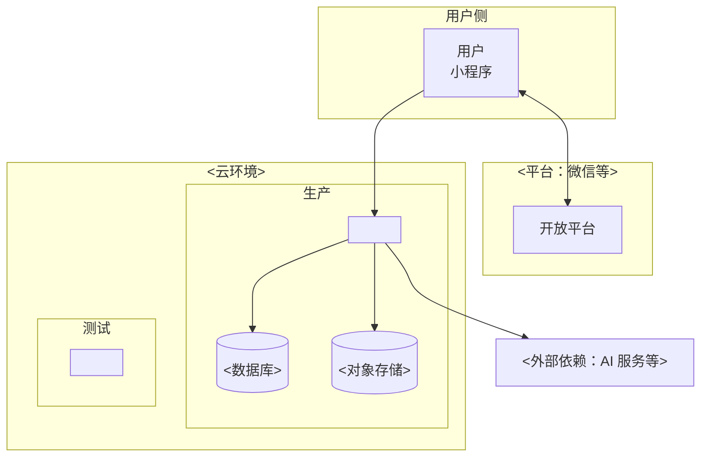
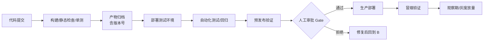

# DEPLOYMENT 文档更新规范（L4 交付层）

**本文档在修改 `docs/L4/DEPLOYMENT.md` 时生效。** 目标：按下方模板生成/更新 `docs/L4/DEPLOYMENT.md`，使其结构符合模板契约，保持 SSOT、不漂移、不遗漏联动。

## 触发条件

当以下任一情况发生时，本规则必须生效：

- 编辑、新增或重建 `docs/L4/DEPLOYMENT.md`
- 该文档关联的其他文档（见模板 `related`）发生变化，需要联动更新本文档
- 用户要求"生成/更新 DEPLOYMENT"

## 执行流程

1. **读模板 generation 元数据**：下方「模板全文」的 frontmatter `generation` 块是本文档的"生成/更新提示词"，逐字段执行：
   - `scan`：自主扫描列出的源（不问用户），作为更新依据
   - `ask_user`：仅当列出的决策点存在歧义时，才用询问工具问用户
   - `flow`：按列出的流程分支执行（全量重建 or 增量修改）
   - `reentrant`：支持可重入——全量重生成或增量修改都要能处理
   - `notes`：注意点（怎么生成，避免常见错误）
   - `checks`：生成后逐条反向核对（含 S8：文档不含 emoji）
   - `related`：关联模板与联动修改——更新本文档时，检查并同步 `related` 列出的关联文档
2. **按模板正文生成**：以下方「模板全文」的 Markdown 正文为结构基准，把模板复制为 `docs/L4/DEPLOYMENT.md`，按 `> 【指引】` 填写，**删除 generation 元数据块与全部 `> 【指引】` 说明**（实例不含这两者）。
3. **反向 check**：逐条执行模板 `generation.checks`，全部通过才算完成。

## 硬性要求

- **SSOT**：模板是本文档的唯一结构源；已合并/已删除的模板（如 DATA-ARCHITECTURE 已并入 DOMAIN-MODEL）不生成独立文档。
- **不用 emoji**（S8，grep 校验：`grep -P "[\x{1F300}-\x{1FAFF}\x{2600}-\x{27BF}]" <文档>`）。
- **联动**：`related` 列的关联文档必须同步检查；跨层引用单向向下，下层不链回上层。
- **图规范**：文档中的图按模板要求用 D2 / Mermaid / ASCII，绘制规范见 CONSTITUTION §3.2。

## 完成判定

模板 `generation.checks` 全部通过 + 文档与关联文档无漂移。

---

## 模板全文（本 rule 的生成依据）

以下是 `DEPLOYMENT` 的完整模板（frontmatter generation 元数据 + Markdown 正文，SSOT，来自 references/templates/L4/DEPLOYMENT.template.md）：

```markdown
---
title: DEPLOYMENT — 部署与发布
doc_type: template
layer: L4
description: L4 交付层 文档 DEPLOYMENT 的更新规范——修改 docs/L4/DEPLOYMENT.md 时触发，按模板 generation 元数据生成或更新该文档
globs:
  - "docs/L4/DEPLOYMENT.md"
# 生成提示词（元信息 · 仅模板持有，实例不含本块）
generation:
  # 自主扫描（AI 读源，不问用户）
  scan:
    - 读 APPLICATION-ARCHITECTURE §2.2：应用清单（部署单元来源）
    - 读 TECHNOLOGY-ARCHITECTURE：技术栈（部署方式参考）
    - 扫描目标文档：DEPLOYMENT 是否已存在
  # 需要用户决策的才问（无歧义则不问）
  ask_user:
    - 部署形态（云开发/自建）有分歧时 → 问用户
  flow: # 生成流程
    - 扫描（自主）：读应用清单 + 技术栈 + 目标文档
    - 已有 DEPLOYMENT → 参考旧文档有效信息，但结构按本模板重建
    - 按模板生成：§1 部署概述 → §2 环境 → §3 部署单元 → §4 操作手册 → §5 发布 → §6 灰度回滚 → §7 版本记录 → §8 密钥
  reentrant: # 可重入（全量/增量）
    - 全量重生成：收到"生成 DEPLOYMENT" → 从模板 + 扫描架构完整重建
    - 增量修改：已有且符合模板 → 只更新变化部署/发布，保留未变
  tools:
    - Mermaid flowchart（§2.2 环境拓扑 / §5.1 发布流程，图规范见宪法）
  notes: # 生成注意点（怎么生成）
    - 运维手册定位（非架构设计）：部署脚本/步骤/参数/环境
    - 部署单元来自 APPLICATION-ARCHITECTURE 应用划分图（引用不复制）
    - 版本号规则（SSOT 见宪法），此处只记发布记录
    - 密钥管理红线：密钥不入库、不落日志、不落前端包
    - 发布流程含人工审批 Gate + 回滚预案（能部署就能回滚）
  checks: # 生成后反向 check
    - "部署单元与 APPLICATION-ARCHITECTURE 应用划分一致"
    - "版本发布记录不含版本号规则（在 宪法）"
    - "密钥未出现在任何示例/配置（红线）"
    - "发布流程有审批 Gate + 回滚预案"
    - "S8：文档不含 emoji（grep 检查通过，详见 CONSTITUTION S8 依据）"
  related: # 关联模板与联动修改
    APPLICATION-ARCHITECTURE: 部署单元 SSOT 在它 §2.2，应用增减需同步部署
    TECHNOLOGY-ARCHITECTURE: 技术栈影响部署，选型变化需同步部署方式
    API: 接口上线需同步部署
    INTEGRATION: 外部服务密钥/回调需同步部署配置
    CONSTITUTION: 版本号规则 SSOT 在它 §4
---

# DEPLOYMENT — 部署与发布

> 本文档是「<项目名>」的 **DEPLOYMENT（部署与发布模板）**——L4 交付层的部署与发布文档（运维手册）。
> 【模板使用指引】复制为 `docs/L4/DEPLOYMENT.md`，按各章节指引填写。
> 【原则】① **运维手册定位**（非架构设计）：部署脚本、部署步骤、部署参数、环境配置——回答"怎么部署上线、怎么运维"；② 部署单元来自 APPLICATION-ARCHITECTURE 应用划分图（引用不复制）；③ 版本号规则（SSOT 见宪法），本文档只记录发布记录；④ 密钥管理红线：密钥不入库、不落日志、不落前端包；⑤ 图用 **Mermaid**；⑥ **不用 emoji**、无元信息表、无变更记录。

---

## 1. 部署概述

### 1.1 部署形态与范围

- 部署形态：<云开发 / 自建服务端 / 混合>
- 部署范围：<子系统清单>
- 不部署：<如管理后台是否纳入>

### 1.2 术语表

| 术语     | 含义                                    |
| -------- | --------------------------------------- |
| 环境     | 一套相互隔离的运行时（开发/测试/生产…） |
| 部署单元 | 最小可独立构建/发布/回滚的组件          |
| （补充） |                                         |

---

## 2. 环境

### 2.1 环境矩阵

> 【指引】环境 | 用途 | 入口 | 版本/分支 | 配置来源 | 数据源 | 负责人。小程序形态需同时覆盖「前端版本（体验/正式）」与「后端环境」两个维度。

| 环境      | 用途                 | 入口   | 版本/分支 | 配置来源   | 数据源   | 负责人 |
| --------- | -------------------- | ------ | --------- | ---------- | -------- | ------ |
| 本地/开发 | 开发者自测、联调     | <入口> | <分支>    | <本地 env> | 测试数据 |        |
| 测试      | 功能验证、提审前回归 | <入口> | <分支>    | <环境配置> | 测试数据 |        |
| 预发布    | 发布演练、验收       | <入口> | <分支>    | <环境配置> | 脱敏数据 |        |
| 生产      | 线上真实流量         | <入口> | <分支>    | <生产配置> | 生产数据 |        |

### 2.2 环境拓扑

> 【指引】本图为 **部署拓扑图**（Mermaid flowchart + subgraph 按环境分区，图规范见宪法）。用户 → 平台 → 系统 → 数据与外部依赖，按环境分区。



---

## 3. 部署单元清单

> 【指引】最小可独立构建/发布/回滚的组件。**来自 APPLICATION-ARCHITECTURE 应用划分图**（引用不复制）。启动顺序：数据层 → 基础服务 → 业务服务 → 前端发布（前端最后，需后端已就绪）。

| 单元     | 类型               | 部署方式 | 依赖   | 启动顺序 | 健康检查 | 回滚方式 |
| -------- | ------------------ | -------- | ------ | -------- | -------- | -------- |
| <单元 1> | <前端包/服务/数据> | <方式>   | <依赖> | <顺序>   | <检查>   | <方式>   |
| （补充） |                    |          |        |          |          |          |

---

## 4. 部署操作手册

> 【指引】本节是运维手册的核心——**具体怎么部署**（脚本/步骤/参数），供运维/开发者照做。

### 4.1 部署脚本

> 【指引】列出部署用到的脚本/命令（前端上传、后端部署、数据库迁移等）。

- <脚本/命令 1：用途>
- <脚本/命令 2：用途>

### 4.2 部署步骤

> 【指引】逐步操作清单，按执行顺序。

1. <步骤 1：如 前端构建 + 上传微信开发者工具>
2. <步骤 2：如 后端云函数部署>
3. <步骤 3：如 数据库迁移>
4. （补充）

### 4.3 部署参数

> 【指引】部署时需配置的参数（环境变量/端口/域名/密钥位置），按环境列。

| 参数     | 环境（dev/test/prod） | 值  | 说明 |
| -------- | --------------------- | --- | ---- |
| <参数名> |                       |     |      |
| （补充） |                       |     |      |

---

## 5. 发布流程

### 5.1 总体流程



### 5.2 构建 / 上传 / 发布 / 验证

- **构建**：<触发方式>；产物 <服务名>-<版本>-<commit>
- **上传/部署**：<各部署单元的上传/部署方式>
- **发布**：<全量/分阶段/灰度>；发布前确认审批人、变更单、回滚预案、监控就绪
- **验证**：冒烟用例（登录、核心业务、<关键链路> 等 3~5 条）+ 监控确认 + 观察期

### 5.3 发布检查单

- [ ] 变更审批已通过，变更单已记录
- [ ] 后端已就绪，前端版本与后端兼容
- [ ] <平台>合法域名/业务域名已配置且生效
- [ ] 数据库迁移已执行并校验
- [ ] 回滚预案已确认可执行
- [ ] 监控/告警/值班人员就位

---

## 6. 灰度与回滚

### 6.1 灰度发布

| 阶段   | 流量比例 | 验证内容 | 判定指标    | 负责人 |
| ------ | -------- | -------- | ----------- | ------ |
| 灰度 1 | 10%      | 核心功能 | 错误率 < X% |        |
| 灰度 2 | 50%      | 全功能   | 同上 + 容量 |        |
| 全量   | 100%     | -        | 稳定观察    |        |

### 6.2 回滚策略

| 场景           | 回滚方式                    | 执行人 | 耗时目标 |
| -------------- | --------------------------- | ------ | -------- |
| <前端>功能异常 | <平台回退线上版本>          |        |          |
| <服务>异常     | <重新部署上一版本/流量切换> |        |          |
| 配置异常       | <还原配置上一版本>          |        |          |
| 数据迁移异常   | <逆向迁移/回档>             |        |          |

- 回滚顺序：与发布顺序相反（先回滚后部署的单元，再回滚先部署的单元）
- 回滚后：验证恢复 → 记录根因 → 复盘补测试

---

## 7. 版本发布记录

> 【指引】每次发布在此登记（合并原 RELEASE）。版本号规则（SSOT 见宪法），此处只记录发布记录，不写规则。

### 7.1 版本记录表

| 版本号   | 发布时间 | 灰度比例 | 回滚出口   | 审核时间线 | 说明   |
| -------- | -------- | -------- | ---------- | ---------- | ------ |
| <版本>   | <日期>   | <比例>   | <回滚方式> | <审核节点> | <说明> |
| （补充） |          |          |            |            |        |

### 7.2 前后端版本兼容矩阵

> 【指引】新后端必须兼容旧前端（字段后向兼容）；新前端依赖的新接口需后端先上线再提审。

| 前端版本   | 后端版本   | 兼容性        |
| ---------- | ---------- | ------------- |
| <前端版本> | <后端版本> | <兼容/不兼容> |
| （补充）   |            |               |

---

## 8. 密钥与配置管理

> 【指引】配置分层：代码内置默认值（兜底）→ 环境级配置（域名/开关）→ 运行期配置（热更新）→ 密钥（严禁入库/落日志/落前端包，用密钥管理服务注入，支持轮换）。密钥安全红线详见 SECURITY。

| 层             | 内容            | 管理方式                        |
| -------------- | --------------- | ------------------------------- |
| 代码内置默认值 | 兜底配置        | 代码库（git 可追踪）            |
| 环境级配置     | 域名、URL、开关 | 环境变量/配置文件（按环境分离） |
| 运行期配置     | 动态开关、阈值  | 配置中心（可热更新）            |
| 密钥           | 密钥/token/证书 | 密钥管理服务 + 注入（严禁入库） |
```
