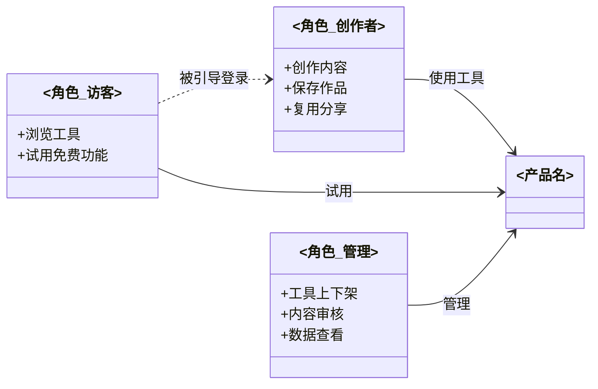
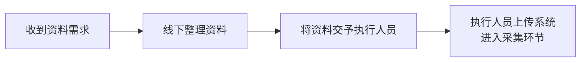
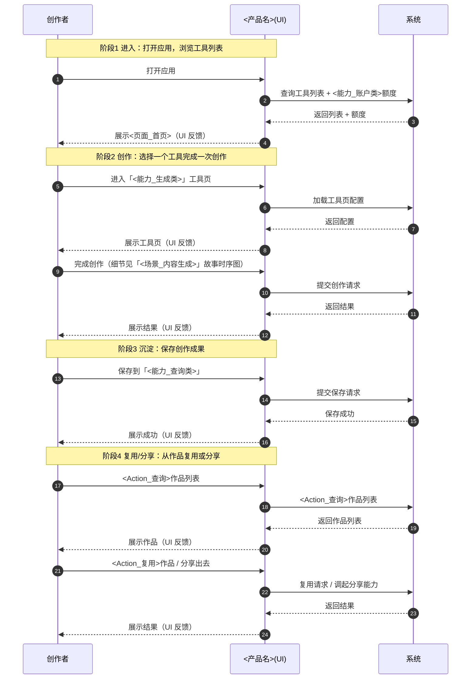
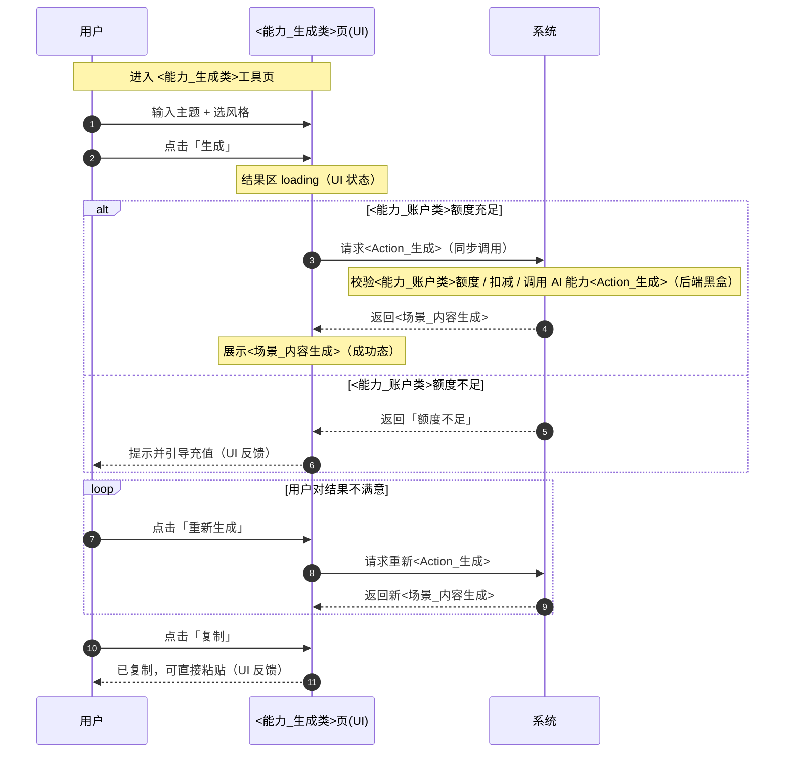

# USER-STORY — 用户故事

> 本文档是「<项目名>」的**用户故事（USER-STORY 模板）**——L1 产品层的需求源头文档。
> 【模板使用指引】复制为 `docs/L1/USER-STORY.md`，按各章节指引填写。
> 【原则】① 用户故事是**需求的源头**：先有故事，才能提炼产品规格（PRODUCT）与聚合操作（DOMAIN-MODEL §3 Action）；② 用户故事回答三个问题：**谁（Who）想要、想要什么（What）、为什么想要（Why）**——即 Connextra 三段式 `As a… I want… So that…`；③ 与具体技术栈/框架无关；④ 用户旅程（交互时序）是故事的**上文**——先画旅程，再从痛点派生故事（本模板 §4）。
> 【占位符声明】本文示例均用 <占位> 表示，实际填具体业务名；占位覆盖提取/转化/生成/交易/账户等场景类型。

---

## 1. 角色定义（先说清"谁"）

> 【指引】**本文档所有内容（用户故事、用户旅程）都以角色为组织单位**——所以最先说清：本项目有哪些角色、每个角色是干什么的。角色定义是后续一切的前提（每角色一张总旅程图、每角色一批故事）。
>
> 【填写规则】① 列出项目**全部**用户角色（含系统管理员/运营等非终端用户角色）；② 每个角色一句话说明定位与职责；③ **若角色间存在关系（依赖/调用/管理），用 1.2 的 ASCII 图表达**（简单项目无角色关系可省略图）；④ 新增角色时，同步补该角色的旅程图与故事（见 §4/§2）。

### 1.1 角色定位表

> 【示例】<产品名> 角色：

| 角色              | 定位                           | 主要职责                                               |
| ----------------- | ------------------------------ | ------------------------------------------------------ |
| **<角色_创作者>** | 核心用户：用 AI 工具生产内容   | 用 AI 撰写/配音/提取等工具创作内容，保存作品，复用分享 |
| **<角色_访客>**   | 潜在用户：先体验再决定是否注册 | 浏览工具首页，试用免费功能，被引导登录                 |
| **<角色_管理>**   | 运营方：维护系统               | 管理工具上下架、内容审核、用户/<能力_账户类>数据查看   |

> 【示例说明】本项目 3 个角色 → §4 将画 3 张总旅程图（<角色_创作者>/<角色_访客>/<角色_管理>各一张）。

### 1.2 角色关系图（classDiagram，复杂时必画）

> 【指引】当角色间存在**关系**（依赖/调用/管理/引导）时，用图表达角色与角色之间的关系——帮助理解"谁服务谁、谁依赖谁、谁管理谁"。简单项目（角色间无实质关系）可省略。
>
> **图源约定**：用 **Mermaid classDiagram**（类图）表达角色关系——UML 标准布局（整齐）、支持方向控制（`direction LR/TD`）、关系类型丰富（关联 `-->` / 依赖 `..>` / 聚合 `o--`）、关系可带标签、角色职责写入成员区。文本定义、Git 可 diff、Markdown 内嵌。



> 【示例说明】关系：<角色_创作者>与<角色_访客>使用系统；<角色_访客>被引导登录成为<角色_创作者>；<角色_管理>管理系统（工具/审核/数据）。
>
> 【填写指引】替换为项目自己的角色与关系：① 每个角色一个 `class`（职责写入成员区）；② 关系箭头标注类型（使用/依赖/管理/引导/审核…），关联用 `-->`、依赖用 `..>`、聚合用 `o--`；③ 复杂关系图用 `direction LR` 横排、简单用 `TD` 竖排。

---

## 2. 用户故事清单

> 【指引】一表汇总所有故事，让读者 30 秒看清"有哪些用户故事"。按**角色**组织，角色下再按**故事类型**分（系统内/系统外）。功能状态与优先级在 PRODUCT §2 产品能力架构图维护，此处不重复。
> **故事类型约定**：系统内故事（角色在系统内完成）→ 有关联 Action，§4.2.A 画三泳道时序图；系统外故事（角色无系统入口）→ 无 Action，flowchart 在 §3.B（§4.2.B 引用）。
> **关联功能列**（系统内）：故事 → PRODUCT §2.1 能力 + DOMAIN-MODEL Action 的**正向关联**，1 个故事可关联多个能力（每个能力可对应多个 Action，1:N 顿号分隔）。**关联说明列**（系统外）：该外部流程驱动/支撑的系统内环节，无 Action。
>
> 【示例】以「<产品名>」为例（下同）。**清单列全量故事；§3/§4.2 详情示例仅展开 1 个故事小节**（实际生成时按清单逐故事一一展开，checks「§2 行数 == §3 小节数」为生成后校验）。

### <角色_创作者> · 系统内故事

| 角色          | 故事标题                                 | 关联功能（能力 + Action）                                                            |
| ------------- | ---------------------------------------- | ------------------------------------------------------------------------------------ |
| <角色_创作者> | <Action_生成>快速生成一篇<场景_内容生成> | 能力：**<能力_生成类>**；Action：`<Action_生成>`（DOMAIN-MODEL §3）                  |
| <角色_创作者> | 把已发布的<场景_内容生成>转成语音        | 能力：**<能力_转化类>**；Action：`<Action_转化>`（DOMAIN-MODEL §3）                  |
| <角色_创作者> | <Action_查询>历史作品并复用              | 能力：**<能力_查询类>**；Action：`<Action_查询>`、`<Action_复用>`（DOMAIN-MODEL §3） |

### <角色_线下> · 系统外故事（无系统入口，无 Action）

| 角色        | 故事标题           | 关联说明（驱动/支撑的系统内环节）                       |
| ----------- | ------------------ | ------------------------------------------------------- |
| <角色_线下> | 线下配合提供某资料 | 支撑系统内「<能力_采集>」环节（§3.B.1）                 |
| <角色_线下> | 线下复核某产出     | 支撑「<能力_审核>」生效（审计方确认后才可推进；§3.B.2） |
| <角色_线下> | 线下整改并提交证据 | 支撑「<能力_整改>」闭环（代传证据；§3.B.3）             |

---

## 3. 用户故事详情

> 【指引】每个故事一节，按**角色**分大章节：系统内（§3.A）与系统外（§3.B）分开。与清单行一一对应。**只写意图 + 边界**，不写实现细节；写法约束由 rule 定义，正文精简提及不逐字重复。
> **系统内故事**：Connextra + Given-When-Then AC + 关联（见下 3.A 示例）。**系统外故事**：Connextra + 外部流程 flowchart + 驱动/支撑的系统内环节（无 AC，见 §3.B 示例）。

### 3.A <角色_创作者>的故事（系统内）

#### 3.A.1 <Action_生成>快速生成一篇<场景_内容生成>

**故事**（Connextra 三段式）：

> 作为 **<角色_创作者>**，我想要 **输入主题后一键<Action_生成><场景_内容生成>**，以便 **不用从零构思，几分钟就能拿到可用初稿**。

**验收标准（AC，Given-When-Then）**：

> 验收标准是故事的"完成定义"——帮助判断价值、推导测试、告知"何时停止加功能"。表达**意图而非实现**，保持相对高层。每条一个 Given-When-Then（不加序号，增删不引发重编号）。
> **AC 覆盖验收主路径**；§4.2.A 时序图分支（重新生成/退回/跳过/失败）为交互细节展开，测试按需覆盖，**不等同于 AC**。

- **Given** 我已输入主题（如"<示例输入>"）并选择风格，**When** 我点击"生成"，**Then** 系统返回一篇结构完整（标题+正文）的<场景_内容生成>
- **Given** 生成结果已展示，**When** 我对某段不满意并点击"重新生成"，**Then** 系统用同一主题给出不同版本
- **Given** <场景_内容生成>已生成，**When** 我点击"复制"，**Then** 全文进入剪贴板，可直接粘贴到发布平台
- **Given** 当日免费次数已用完，**When** 我点击"生成"，**Then** 系统提示"今日次数已用完"并引导查看充值入口

**关联**：

- 所属旅程阶段：§4.1 总旅程的「创作」阶段（触点：进入工具页 → 完成创作）
- 交互时序：§4.2.A 单故事时序图（细粒度系统交互）
- 关联功能：能力 **<能力_生成类>**（PRODUCT §2.1）+ Action `<Action_生成>`（DOMAIN-MODEL §3）
- 验收（业务 AC）：在此定义；技术验收在 TEST-PLAN（引用 `docs/L4/TEST-PLAN.md`）
- 业务规则：每日免费次数限制；生成内容需 AIGC 标识（见合规文档）

---

### 3.B <角色_线下>的系统外故事（系统外）

> <角色_线下>为**线下角色、无系统入口**，其故事是**系统外用户故事**——由业务流程引出（人员代传/线下协作），在系统**外部**完成。系统外故事**只写外部流程 + 驱动/支撑的系统内环节**，**不写 Given-When-Then**（无系统行为）、**不画系统内时序图**（用 flowchart）。

#### 3.B.1 线下配合提供资料

**故事**（Connextra 三段式）：

> 作为 **<角色_线下>**，我想要 **线下配合提供系统所需资料**，以便 **支撑系统内<能力_采集>环节的资料采集**。

**外部流程（flowchart）**：



**关联**：

- **类型**：系统外故事（无系统入口，无 Action）
- **驱动/支撑的系统内环节**：支撑「<能力_采集>」资料采集
- **系统内引用**：§3.A 对应系统内故事（资料入系统）
- 不参与 §4.1 系统旅程、§4.2.A 系统内时序

---

## 4. 用户旅程（必选）

> 【指引】用户旅程是故事的**上文**——展示用户端到端体验，从中派生故事。**必选，再简单也要画**——旅程是理解"故事在什么场景下发生"的最小上下文，参与方与链路要求见 §4 硬性要求（三角色+完整链路）。
>
> **流程**：先画旅程（发现阶段/触点/痛点）→ 从痛点**派生**用户故事（回链 §3）→ 故事进入开发。
>
> **图源约定**：用 **Mermaid sequenceDiagram**（时序图）展示交互顺序。文本定义、Git 可 diff、Markdown 内嵌。

> **总旅程画骨架，不画细节（避免图爆炸）**：
>
> - **总旅程 = 骨架图**：只画**阶段 + 每阶段的关键触点**（每阶段 1-3 个触点），不展开内部交互——细节下沉到各 User Story 的时序图（见 4.2 示例）
> - **粒度上限**：阶段数 ≤9（推荐≤7；>9 按子域拆图，如"创作流程"/"商业化流程"各一张），而不是塞进一张无限大的图
> - **按角色拆分（最重要）**：**每个用户角色一张总旅程图**。系统有几个角色，就有几张总旅程图——角色之间旅程差异大，混在一张图会互相干扰、无法看清任一角色的完整路径。例：本系统有「<角色_创作者>」「<角色_访客>」「<角色_管理>」3 个角色 → 画 3 张总旅程图（<角色_创作者>旅程 / <角色_访客>旅程 / <角色_管理>旅程），每张只画该角色从进入到完成价值的完整链路。
> - **分层关系**：宏观旅程（阶段骨架）→ 聚焦故事（§3 需求单元）→ 细粒度时序图（Story 落地时的系统交互）——三层各司其职，不重复
>
> **§4 角色语义约定（适用于 §4.1 总旅程和 §4.2.A 系统内单故事时序图；§3.B 系统外 flowchart 不适用三泳道）**：
>
> L1 时序图表达 **3 类参与者**（三泳道）：
>
> | 参与者类型         | 命名                                                       | 含义                                                                                                                                                              |
> | ------------------ | ---------------------------------------------------------- | ----------------------------------------------------------------------------------------------------------------------------------------------------------------- |
> | **用户**           | `<角色名>`                                                 | 真人（如「<角色_创作者>」「<角色_访客>」「<角色_管理>」）                                                                                                         |
> | **UI**             | `参与者ID as <页面名>(UI)` 或 `参与者ID as <整体UI名>(UI)` | 系统的前端可见层——产品视角的 UI（具体页面：`<能力_生成类>页(UI)`、`<页面_首页>(UI)`；骨架图用整体 UI：`<产品名>(UI)`）。UI 是独立泳道，显示"用户和系统之间的中介" |
> | **SYSTEM（后端）** | `系统`                                                     | 系统**后端**黑盒（不含 UI）——含云函数 + AI 服务 + 数据库 + 三方集成。SYSTEM 内部结构在 L2/L3 文档展开                                                             |
>
> 示例：`participant 工具箱 as <产品名>(UI)`——显示名(alias)必须带 `(UI)` 后缀，ID 可不带；禁止 `participant X` 无 alias 且无 `(UI)`。

> **❌ 不在 §4 时序图里出现的术语**（属 L2/L3）：
>
> - `云函数` / `AI服务` / `数据库` → L2（打开 SYSTEM 黑盒时展开）
> - `微信支付` / 具体三方名 → L3
> - `小程序` / `后台`（作为独立 actor） → 实际是「UI + 后端」的组合，应拆分为 `<页面名>(UI)` + `系统`
>
> **§4 硬性要求（违反即视为 L1 时序图不合格）**：
>
> 1. **三角色原则**：每张 §4 时序图必须有 3 个 participant——`用户`（即以 `<角色名>` 命名的真人）+ `<页面名>(UI)` 或 `<整体UI名>(UI)` + `系统`。禁止合并 UI 到系统（视为"纯前端图"——所有用户操作都依赖系统响应，省略即误导）。
> 2. **完整链路原则**：每个用户触点都必须画完整闭环——
>
> ```
> 用户 ──操作──→ UI ──请求──→ 系统 ──返回──→ UI ──展示──→ 用户
> ```
>
> 禁止省略 `UI → 系统`、`系统 → UI`、`UI → 用户` 中任何一条箭头。
> 骨架图（§4.1）也必须画完整链路——只画 `用户 → UI` 是错的（看上去系统是摆设，实际所有数据/响应都来自系统）。
>
> 3. **SYSTEM 不含 UI**：SYSTEM participant 仅代表后端（含云函数 + AI 服务 + 数据库 + 三方集成）。UI 是独立泳道，不合并入 SYSTEM。

### 4.1 总旅程（每角色一张骨架图，必选）

> 【指引】**角色定义见 §1**——先确认项目有哪些角色，然后**为每个角色画一张总旅程骨架图**（角色数量 = 总旅程图数量）。每张图：阶段 + 关键触点。
>
> 骨架图同样须满足 §4 硬性要求（三角色+完整链路）——必须画完整闭环，禁止纯前端图。
>
> 示例：<产品名> · **<角色_创作者>**端到端旅程——阶段骨架（每个阶段 1-3 个触点）：



> 【填写指引】按角色各画一张（<角色_创作者>一张、<角色_访客>一张、<角色_管理>一张…）。每张图替换为该项目角色自己的阶段骨架；每个阶段的"完成创作（细节见「<场景_内容生成>」故事时序图）"指向对应 User Story——**阶段粒度只到触点，交互细节在 §3 故事详情内展开**。⚠️ 图中 `autonumber` 是 Mermaid 自动编号（系统渲染），不违反"内容条目无顺序编号"约束。

### 4.2 单故事交互（UI 涉及 + 交互时序）

> 【指引】**硬性要求：§3 每个系统内故事在 §4.2.A 有对应小节（4.2.A.1…一一对应）；系统外故事 flowchart 在 §3.B（§4.2.B 仅引用不重复）**。漏画 = 故事覆盖不完整（§3 有 N 个系统内故事，§4.2.A 必须有 N 个小节）。按**角色**分大章节：§4.2.A 系统内（三泳道时序图）、§4.2.B 系统外（引用 §3.B）。
> **系统外故事**：线下角色无系统入口、无用户+UI+系统 三泳道交互，**不画 sequenceDiagram**，改用 **flowchart** 描述「在系统外做了什么、是什么流程」。
>
> **每个故事小节 =「涉及 UI」+「交互时序图」一体**（不是单独一张图）：
>
> | 小节组成       | 内容                                                                                                      | 说明                                                              |
> | -------------- | --------------------------------------------------------------------------------------------------------- | ----------------------------------------------------------------- |
> | **涉及 UI**    | 格式 `<页面名>(UI)（入口：<路径>，.pen：ui/<name>.pen）`——该故事用到的页面/弹窗（入口位置 + `.pen` 引用） | 回答"这个故事在哪些界面上发生"——UI 信息跟故事走，不单独建页面清单 |
> | **交互时序图** | `sequenceDiagram`，**三角色**（`用户` + `<页面名>(UI)` + `系统`）                                         | 回答"用户、UI、系统怎么协作完成这件事"                            |
>
> **图类型**：单张 `sequenceDiagram`，**三泳道**——`用户`（真人）+ `<页面名>(UI)`（系统的前端可见层，独立泳道）+ `系统`（系统后端，黑盒：云函数 + AI 服务 + 数据库 + 三方集成）。**SYSTEM 不含 UI**（UI 是独立泳道），SYSTEM 内部处理用 `note over 系统` 描述。
>
> **表达规则**（同一张图内按需选用）：
>
> | 表达内容                  | sequenceDiagram 语法                                                       |
> | ------------------------- | -------------------------------------------------------------------------- |
> | 用户操作（用户点了什么）  | `用户->>生成页: 点击「生成」`（消息标签带按钮名）                          |
> | UI 状态（loading/结果态） | `note over 生成页: 结果区 loading / 展示<场景_内容生成>`                   |
> | UI → 后端调用（粗粒度）   | `生成页->>系统: 请求<Action_生成>`                                         |
> | 后端内部处理（黑盒说明）  | `note over 系统: 校验<能力_账户类>额度 / 扣减 / 调用 AI 能力<Action_生成>` |
> | 后端 → UI 返回            | `系统-->>生成页: 返回<场景_内容生成>`                                      |
> | UI 反馈给用户             | `生成页-->>用户: 已复制，可直接粘贴`                                       |
> | 分支（不同按钮/弹窗）     | `alt <条件>` / `else <条件>`                                               |
> | 循环（重复点同一按钮）    | `loop <条件>`                                                              |
>
> ### L1 ↔ L2/L3 分层边界
>
> L1 时序图**只描述「用户 → UI → 系统后端」三泳道的协作，不打开 SYSTEM 黑盒**。打开 SYSTEM 黑盒（拆成 APPLICATION/CONTAINER/EXTERNAL SYSTEM）是 L2/L3 的事：
>
> | 黑盒内部内容                         | 展开位置                                                                   |
> | ------------------------------------ | -------------------------------------------------------------------------- |
> | SYSTEM（后端）拆成哪些 APPLICATION   | `APPLICATION-ARCHITECTURE §2.2 应用划分图`                                 |
> | APPLICATION 用什么技术栈             | `TECHNOLOGY-ARCHITECTURE §1-5`                                             |
> | APPLICATION 内部组件/容器            | `APPLICATION-ARCHITECTURE §2.2`（C4 Container）+ `TECHNOLOGY-ARCHITECTURE` |
> | 系统调哪些外部三方（微信/AI 供应商） | `INTEGRATION`                                                              |
> | 数据怎么存                           | `DOMAIN-MODEL §5 数据设计`                                                 |
> | 状态机/业务规则                      | `DOMAIN-MODEL §3`                                                          |
>
> **示例**：下方 4.2.A.1 是「<场景_内容生成>」完整示范——**每个故事小节 =「涉及 UI」+「交互时序图」一体**。其他故事按需挑选语法，不必照抄全部结构。

#### 4.2.A <角色_创作者>（系统内 · 三泳道时序图）

##### 4.2.A.1 <场景_内容生成>

**涉及 UI**：`<能力_生成类>页(UI)`（入口：<页面_首页>热门工具，`.pen`：`ui/<项目名>.pen`）



#### 4.2.B <角色_线下>（系统外）

> <角色_线下>为**系统外角色**（无系统入口），无用户+UI+系统三泳道交互——**不画 sequenceDiagram**；其外部流程 flowchart 已在 §3.B 对应小节定义（如 §3.B.1），**本节不重复**，引用 `§3.B.x` 即可。§4.2 只承载系统内故事的交互时序图。
