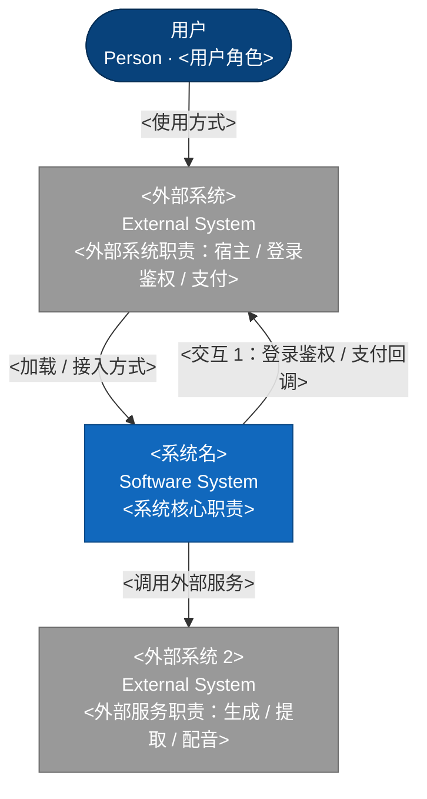

# APPLICATION-ARCHITECTURE — 应用架构

> 本文档是「<项目名>」的 **APPLICATION-ARCHITECTURE（应用架构模板）**——L2 架构层的应用架构文档。（实例化后删除模板自述行，保留【原则】与【与 deep-dives 分工】声明）
> 【模板使用指引】复制为 `docs/L2/APPLICATION-ARCHITECTURE.md`，按各章节指引填写。
> 【原则】① **应用架构视角**（TOGAF）：系统分几个应用、应用依赖什么——回答"系统怎么组织"；② 不写实现细节（类/接口/表结构在代码）；③ 与具体技术栈/框架无关；④ 图用 **Mermaid**（Context）+ **D2 容器图**（应用划分）无元信息表、无变更记录。
> 【与 deep-dives 分工】本 L2 根文档为**索引**，详情在 `deep-dives/<name>.md`——同一信息只在一处维护，其余详见 `deep-dives/<name>.md#锚点`，引用不复制。

---

## 1. 系统概述

> 【指引】系统一句话概述：这是什么系统、由哪些部分组成、解决什么问题。

<一句话系统概述>

---

## 2. 架构图（C4）

### 2.1 系统上下文（Context）

> 【指引】本图为 **C4 Context 图**（Mermaid flowchart 表达系统与外部关系，图规范见 references/diagram-spec.md）。展示系统与用户/平台/第三方服务的关系。



### 2.2 应用划分（Application）

> 【指引】本图为 **C4 容器图**（绘制方式见 references/diagram-spec.md）：系统按「应用 → 容器 → 外部系统」分层划分，另设用户层 [Person] 作上下文展示；图例区分「应用[应用] / 容器[容器] / 外部[外部] / 人物[Person]」。

```d2
# 图标准元信息
# 图名: 应用划分图（Application）
# 视角: 应用架构（应用划分）
# 图例: [应用]/[容器]/[外部]/[Person]

vars: {
 d2-config: {
 layout-engine: elk
 }
}

应用划分: {
 grid-rows: 1; grid-columns: 2; grid-gap: 16
 style.fill: "#ffffff"
 style.font-color: "#1e293b"
 style.stroke: "#94a3b8"
 style.border-radius: 16

 左主体: {
 grid-rows: 1; grid-columns: 1; grid-gap: 16
 style.font-color: "#1e293b"
 style.border-radius: 12

 用户层: {
 label: "① 用户层 [Person]"
 width: 1000; grid-columns: 3; grid-gap: 12; style.fill: "#f8fafc"; style.font-color: "#1e293b"; style.stroke: "#94a3b8"; style.border-radius: 12
 u1: { label: "<用户角色_主>"; width: 317; height: 50; class: mod }
 u2: { label: "<用户角色_管>"; width: 317; height: 50; class: mod }
 u3: { label: "<用户角色_客>"; width: 317; height: 50; class: mod }
 }

 前端层: {
 label: "② <前端应用> [应用]"
 width: 1000; grid-columns: 2; grid-gap: 12; style.fill: "#dbeafe"; style.font-color: "#1e293b"; style.stroke: "#2563eb"; style.border-radius: 12
 f1: { label: "<页面模块_首页>"; width: 482; height: 60; class: mod }
 f2: { label: "<页面模块_工作台>"; width: 482; height: 60; class: mod }
 }

 后端层: {
 label: "③ <后端应用> [应用]"
 width: 1000; grid-columns: 5; grid-gap: 12; style.fill: "#ede9fe"; style.font-color: "#1e293b"; style.stroke: "#7c3aed"; style.border-radius: 12
 b1: { label: "<模块_业务1>"; width: 186; height: 60; class: mod }
 b2: { label: "<模块_业务2>"; width: 186; height: 60; class: mod }
 b3: { label: "<模块_业务3>"; width: 186; height: 60; class: mod }
 b4: { label: "<模块_文件>"; width: 186; height: 60; class: mod }
 b5: { label: "<模块_权限>"; width: 186; height: 60; class: mod }
 a1: { label: "<模块_Agent编排>"; width: 186; height: 60; class: mod }
 a2: { label: "<模块_解析>"; width: 186; height: 60; class: mod }
 a3: { label: "<模块_检索>"; width: 186; height: 60; class: mod }
 a4: { label: "<模块_生成>"; width: 186; height: 60; class: mod }
 a5: { label: "<模块_规则库>"; width: 186; height: 60; class: mod }
 }

 数据层: {
 label: "④ 数据与基础能力层 [容器]"
 width: 1000; grid-columns: 1; grid-gap: 12; style.fill: "#cffafe"; style.font-color: "#1e293b"; style.stroke: "#0e7490"; style.border-radius: 12
 存储: { label: "存储组件"; width: 880; grid-columns: 3; grid-gap: 12; style.fill: "#e0f2fe"; style.font-color: "#1e293b"; style.stroke: "#0284c7"; style.border-radius: 8
 db: { label: "<数据库>"; shape: stored_data; width: 277; height: 72; class: mod }
 mo: { label: "<对象存储>"; shape: stored_data; width: 277; height: 72; class: mod }
 rd: { label: "<缓存>"; shape: stored_data; width: 277; height: 72; class: mod }
 }
 }
 }

 外部系统: {
 label: "⑤ 外部系统\n[外部·Boundary外]"
 grid-columns: 1; style.fill: "#e2e8f0"; style.font-color: "#1e293b"; style.stroke: "#64748b"; style.border-radius: 12
 e1: { label: "<外部_大模型API>"; width: 200; height: 50; class: mod }
 e2: { label: "<外部_邮件>"; width: 200; height: 50; class: mod }
 e3: { label: "<外部_数据源>"; width: 200; height: 50; class: mod }
 e4: { label: "<外部_他团队服务>\n（他团队）"; width: 200; height: 50; class: mod }
 }
}

# 应用间通信（完整路径，避免静默重复节点）
应用划分.左主体.用户层 -> 应用划分.左主体.前端层: 使用 { style.stroke: "#94a3b8" }
应用划分.左主体.前端层 -> 应用划分.左主体.后端层: HTTPS { style.stroke: "#7c3aed" }
应用划分.左主体.后端层 -> 应用划分.左主体.数据层: 读写 { style.stroke: "#0e7490" }
应用划分.左主体.后端层 -> 应用划分.外部系统: 对接 { style.stroke: "#64748b" }

classes: {
 mod: {
 style: { border-radius: 6; fill: "#ffffff"; stroke: "#64748b"; stroke-width: 1; font-size: 12; font-color: "#1e293b" }
 }
}
```

> 【填写指引】替换为系统实际应用；**四分类定义见 §2.2 上方指引**（应用[应用]是主体、容器[容器]你拥有、外部系统[外部]别人提供、用户层[Person]上下文展示）。应用内部再展开一层（api 接入层 / service+domain 业务层 / infra+integration 支撑层，分层规范见 STRUCTURE §3.1）。
>
> 【详见】应用内部展开详情详见 `deep-dives/<name>.md`。

---

## 3. 模块划分（应用内部模块）

> 【指引】**先分清两个概念**（避免把"能力"当"模块"）：
>
> - **能力（Capability）**：L1 产品层业务能力（产品规格能力图节点）——回答"产品做什么"，如 <能力_撰写>、<能力_变音>。**不在此处定义**。
> - **模块（Module）**：L2 应用内部代码组织单元——回答"代码怎么组织"。**按知识域/职责划分**（宪法 D 系列：高内聚低耦合），**不是**能力的别名。
>
> **模块命名以 §2.2 应用划分图为基准**（防一物多名，宪法通用语言贯穿）；**能力 → 领域/聚合 映射是 N:M（多对多）**，但该映射 **见 DOMAIN-MODEL §3 / PRODUCT §2.1**，**本节不重复**（应用架构只回答"应用内部有哪些模块"，不重复"能力由哪些聚合承载"）。

### 3.1 应用内模块划分（模块 → 应用）

> 回答"每个应用内部有哪些代码模块"。**模块按知识域划分**（承载哪些业务逻辑），不按能力划分，命名与 §2.2 应用划分图一致。

| 模块     | 归属应用          | 知识域（承载什么）                               |
| -------- | ----------------- | ------------------------------------------------ |
| <模块名> | <前端 / 后端 API> | <承载哪些业务逻辑，如 <能力_任务> / <聚合_算力>> |
| （补充） |                   |                                                  |

> 后端示例（按 STRUCTURE §3.1 固定分层）：`api`（接口/网关/鉴权）、`service`（各上下文应用服务：<能力_任务> / <聚合_算力> / <聚合_作品>）、`domain`（各上下文聚合/实体）、`infra`（数据访问/缓存）、`integration`（外部对接：<外部_支付A>/<外部_支付B>/<外部_AI>）。
> 前端示例：<模块_工具页>、<模块_作品页>、<模块_用户中心>。
>
> 【详见】模块（如 <模块_转换>）仅名字级，模块内部细节详见 `deep-dives/<name>.md`。
