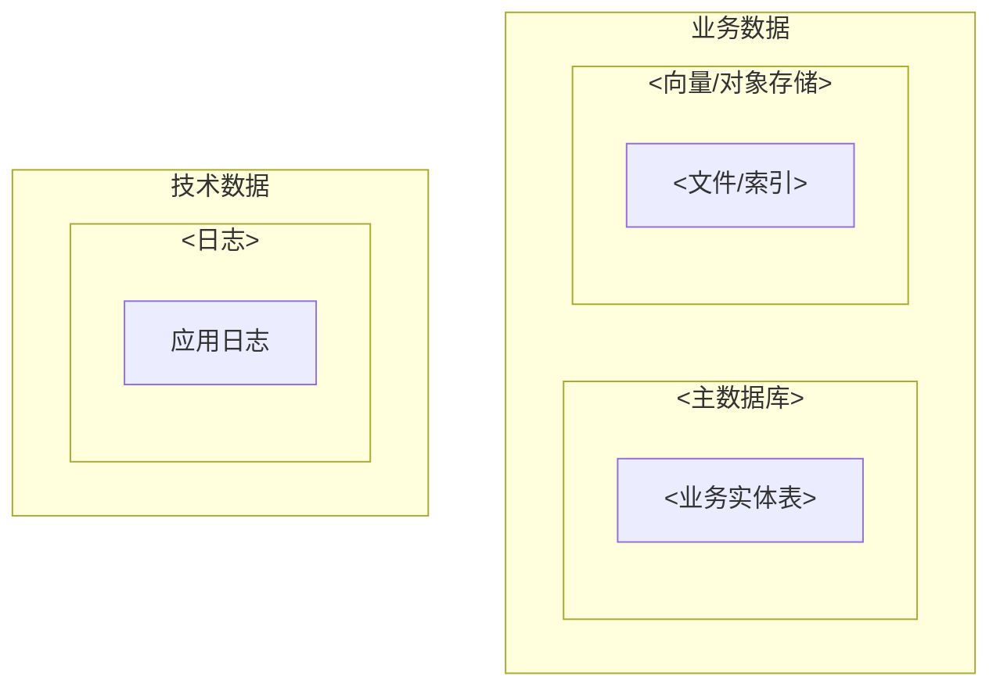

# DATA-ARCHITECTURE — 数据架构

> 本文档是「<项目名>」的 **DATA-ARCHITECTURE（数据架构模板）**——L2 架构层的数据架构文档。
> 【模板使用指引】复制为 `docs/L2/DATA-ARCHITECTURE.md`，按各章节指引填写。
> 【原则】① **数据架构视角**（TOGAF Data Architecture）：数据资产分类、存储选型、物理存储格式、ER、领域→存储映射——回答"数据怎么落库"；② 与 DOMAIN-MODEL 分工：DOMAIN-MODEL 定"业务怎么建模"（聚合/实体/状态机/事件，纯业务语义），本文档承载"领域→物理"的翻译层；③ **不重复字段级细节**——字段/枚举/校验在 DATA-DICTIONARY，本文档只写表/集合级结构；④ 存储选型的技术理由/性能容量预期在 TECHNOLOGY-ARCHITECTURE（本文档只写物理形态，不重复权衡理由）；⑤ 无元信息表、无变更记录。

---

## 1. 数据架构愿景与原则

> 【指引】说明 DOMAIN-MODEL 业务架构的物理数据来源（业务数据怎么落库——表设计/存储/映射）+ 技术数据（日志/锁/缓存/临时产物/编号序列）。核心原则：**数据分两大类——业务数据（业务产生/依赖）与技术数据（系统自身运行产生）**；领域模型只写业务语义，数据架构写物理实现；字段级细节见 DATA-DICTIONARY。

- **与领域模型关系**：领域模型写业务对象/状态机/事件 + 各业务域实体 ER 图（逻辑关系，见 DOMAIN-MODEL §3）；数据架构写这些对象的**物理数据来源**（表设计/存储/映射）——对应关系见 §5 物理存储格式。
- **业务数据 vs 技术数据**：§2 分类已按两大类划分；§5 物理存储格式按物理数据源分节。
- **与数据字典关系**：字段级细节见 DATA-DICTIONARY；本文档只到表/集合级。
- **与存储选型理由关系**：选型"为什么"在技术架构 §3；本文档写"存什么/怎么存"。
- **相关决策**：数据架构重要决策记 `docs/adr/`（如存储迁移预案）。

---

## 2. 数据资产分类

> 【指引】数据分两大类：**业务数据**（业务产生/依赖的数据）与**技术数据**（系统自身运行产生的数据，如日志/锁/缓存/临时产物）。

| 数据类       | 数据项      | 数据资产               | 存储位置     | 归属模块    |
| ------------ | ----------- | ---------------------- | ------------ | ----------- |
| **业务数据** | <业务实体>  | <如 审计项目及环节>    | <如 MySQL 8> | <如 项目>   |
|              | <知识/规则> | <如 预置规则文档>      | <如 RAGFlow> | <如 规则库> |
|              | <用户权限>  | <如 用户、角色与权限>  | <如 MySQL 8> | <如 用户>   |
| **技术数据** | <日志>      | <如 应用日志>          | <如 ES 8>    | <如 后端>   |
|              | <任务进度>  | <如 生成/同步任务进度> | <如 MySQL 8> | <如 生成>   |
|              | <临时产物>  | <如 解析分片/中间文件> | <如 磁盘>    | <如 生成>   |
| （补充）     |             |                        |              |             |

**数据全景图**：



---

## 3. 存储选型与拓扑

> 【指引】物理存储拓扑（选型理由/容量性能预期见 TECHNOLOGY-ARCHITECTURE §3，此处只列拓扑分类）。

| 存储类型 | 技术         | 承载数据       | 备注              |
| -------- | ------------ | -------------- | ----------------- |
| <关系型> | <如 MySQL>   | <如 业务数据>  | <如 主库>         |
| <向量>   | <如 RAGFlow> | <如 文件/索引> | <如 自部署中间件> |
| <日志>   | <如 ES>      | <如 应用日志>  | <如 可滚动清理>   |
| （补充） |              |                |                   |

---

## 4. 数据流转与血缘

> 【指引】本图为**数据血缘图**（D2，DFD 形状约定：圆柱 = 数据存储，矩形 = 加工）。**线型区分**：**实线 = 同步流转（强一致）**；**虚线 = 异步/最终一致**。主图仅表达业务数据主链，同质节点折叠；支链下钻附图。技术数据不在此图，见 §5。**主链节点数纪律**：主链 6-9 节点，同质节点折叠，折叠前业务实体符合 7±2。**线型按消费方式定**：同一数据源到不同目标可因消费方式不同采用不同线型（同步实线/异步虚线）。

### 4.1 主链（业务数据主链）

```d2
vars: { d2-config: { layout-engine: elk } }
direction: right
DS: <业务数据源> { shape: cylinder }
SYNC: <同步服务>
STORE: <主存储> { shape: cylinder }
GEN: <生成服务>
DOC: <业务文书> { shape: cylinder }
DS -> SYNC: 抽取同步
SYNC -> STORE: 落库
STORE -> GEN: 读取 {
  style.stroke-dash: 4
}
GEN -> DOC: 生成回写 {
  style.stroke-dash: 4
}
```

**主支关系**：主链为**必经**的正向血缘；支链为从主链分叉/回流的非必经分支，在主图上以 `→ 4.x 支链` 标注入口，详见下图。

### 4.2 支链（下钻，详见 §5 对应小节）

> 【指引】每条支链一小节（4.2/4.3…），D2 小图 + 一句话说明支链不占主图的原因。

**关键流转说明**：

- **同步链**：<如 外部数据源 → 同步服务抽取 → 镜像表/主库>
- **采集链**：<如 同步数据 + 被审文档 → 采集清单>
- **文书链**：<如 采集清单项 → 审计文书（取证/底稿/报告折叠为单节点，collection_item_id 溯源）>
- **生成链**：<如 生成服务 → 异步回写业务文书>
- **归档链**：<如 业务文书 → 归档资料（锁定 + 签名）>

---

## 5. 物理存储格式

> 【指引】每类存储/数据源一小节，含存储内容与键模式（物理层）；**字段明细统一在 DATA-DICTIONARY**，本文档不重复字段级定义（第2条），业务语义见 DOMAIN-MODEL §3。

### 5.1 <主数据库>（业务主库）

> 【指引】数据构建方式：说明本存储的数据如何写入（初始化/业务写入/同步/清理），按 <步骤_1/2/3> 分条列清。

> 【指引】**两层表达**：① 表关系总览图（表间关联，无字段）；② 单表清单（表名 + 一句话说明 + 字典锚点）。全量字段/类型/约束见 DATA-DICTIONARY。

**表关系总览**（表关联结构，无字段）：

```d2
vars: { d2-config: { layout-engine: elk } }
direction: down
<表1>: <说明> { style.border-radius: 8 }
<表2>: <说明> { style.border-radius: 6 }
<表1> -> <表2>
```

**单表结构（表级清单）**：

| 表名     | 说明     | 字典锚点                                     |
| -------- | -------- | -------------------------------------------- |
| `<表名>` | <一句话> | [§x <表>](../common/DATA-DICTIONARY.md#锚点) |
| （补充） |          |                                              |

> 【指引】与 §4 映射：表清单行对应 §4 血缘主链/支链节点（如取证/底稿/报告折叠对应主图审计文书节点），在表注或说明列标注对应节点。

### 5.2 <向量/对象存储>（如有）

> 【指引】集合/目录/键模式 + 存储内容 + 备注（DB 存元数据引用）。

> 【指引】数据构建方式：说明本存储的数据如何写入（初始化/业务写入/同步/清理），按 <步骤_1/2/3> 分条列清。

| 集合/目录/键 | 主键/路径/键模式 | 存储内容 | 备注   |
| ------------ | ---------------- | -------- | ------ |
| <集合>       | <键模式>         | <内容>   | <说明> |

### 5.3 <任务进度表>（如有，与业务同库或独立）

> 【指引】数据构建方式：说明本存储的数据如何写入（初始化/业务写入/同步/清理），按 <步骤_1/2/3> 分条列清。

| 表       | 主键   | 存储内容 | 备注   |
| -------- | ------ | -------- | ------ |
| <任务表> | <主键> | <内容>   | <说明> |

### 5.4 <日志存储>（如有）

> 【指引】数据构建方式：说明本存储的数据如何写入（初始化/业务写入/同步/清理），按 <步骤_1/2/3> 分条列清。

| 集合/索引 | 主键/滚动策略 | 存储内容 | 备注   |
| --------- | ------------- | -------- | ------ |
| <索引>    | <策略>        | <内容>   | <说明> |

### 5.5 <磁盘临时产物>（如有）

> 【指引】数据构建方式：说明本存储的数据如何写入（初始化/业务写入/同步/清理），按 <步骤_1/2/3> 分条列清。

| 目录   | 路径模式 | 存储内容 | 备注         |
| ------ | -------- | -------- | ------------ |
| <目录> | <模式>   | <内容>   | <完成后清理> |

### 5.6 <外部数据源>（如有，客户环境）

> 【指引】外部持有、本平台只读抽取的数据源；同步流向（源 → 平台内镜像/存储）。

> 【指引】数据构建方式：说明本存储的数据如何写入（初始化/业务写入/同步/清理），按 <步骤_1/2/3> 分条列清。

| 集合/目录/键 | 主键/路径/键模式 | 存储内容 | 备注   |
| ------------ | ---------------- | -------- | ------ |
| <源>         | <键模式>         | <内容>   | <说明> |
