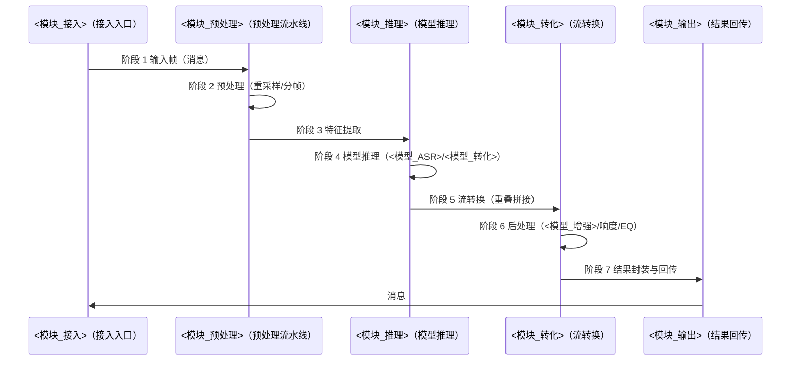

# DEEP-DIVE — 通用 Deep Dive 模板

> 本文档是「<项目名>」的 **DEEP-DIVE（通用 Deep Dive 模板）**——L2 架构层的高复杂度主题详情文档。
> 【模板使用指引】复制为 `docs/L2/deep-dives/<name>.md`（`<name>` 用 kebab-case，如 `inference-pipeline`），按各章节指引填写。
> 【原则】① **详情定位**：deep-dive 承载单个高复杂度主题的完整细节（参数/精度/步骤/缓存/限流/坑位），L2 三总览只放一行"详情见"引用（S2 同一信息只在一处维护）；② **代码即真相**：细节一律用 `参见 File:Line` 链到代码，不复制代码、不复制 AGENTS.md（1500 行）；③ ** 引用不复制**：参数总览在 [TECHNOLOGY-ARCHITECTURE](../TECHNOLOGY-ARCHITECTURE.template.md)、规则在 [DOMAIN-MODEL](../DOMAIN-MODEL.template.md)、env vars 在项目 env 文档（如 SPEC §5，存在则双向引用不复制）；④ 图用 **Mermaid / D2**（图规范见 references/diagram-spec.md），无元信息表、无变更记录。
> 【覆盖范围】物理单 rule（DEEP-DIVE.md）通过 globs `*.md` 覆盖目录下多文档；INDEX.md 由 [INDEX](INDEX.md) 单独管理（globs `*.md` 会匹配，但 flow 判别 INDEX.md 时由 INDEX rule 处理，本 rule 跳过）。
> 【章节】7 章骨架指 §1-7，§8 为相关文档导航。
> 【示例】全文图/表/步骤均以「推理流水线」为首篇实例，其他主题按实际替换（数量/档位/坑位按主题实际，无固定阈值）。

---

## 1. 总览

> 【指引】本节给读者"这个主题是什么、阶段怎么流转"的整体认知。**时序图**（Mermaid sequenceDiagram）画跨模块/跨系统调用时序；**总图**（D2 容器图）画主题涉及的容器/模块分层。图旁标注真实图类型（图规范见 references/diagram-spec.md，fallback 为 ASCII 图保持同样布局）。

### 1.1 阶段时序图

> 【指引】本图为**时序图**（Mermaid sequenceDiagram）。示例为推理流水线 7 阶段：<模块_接入> → <模块_预处理> → <模块_推理> → <模块_转化> → <模块_输出>。参与者用真实模块名，消息标注真实接口/事件名；其他主题按实际阶段数调整。



### 1.2 总图（D2 容器图）

> 【指引】本图为 **C4 容器图**（D2，绘制方式见 references/diagram-spec.md）。画主题涉及的容器/模块分层与依赖，只画与本主题相关的部分；每层子容器显式算 width（等宽居中，尺寸公式见 c4-container-diagram §6.13）。

```d2
# 图名: <主题> 总览（容器图）· 视角: 架构详情（deep-dive）· 只画与本主题相关的容器/模块

vars: {
 d2-config: {
 layout-engine: elk
 }
}

主题总览: {
 grid-rows: 1
 grid-columns: 1
 grid-gap: 24
 style.fill: "#ffffff"
 style.font-color: "#1e293b"
 style.stroke: "#94a3b8"
 style.stroke-width: 1
 style.border-radius: 16

 入口层: {
 label: "入口层"
 width: 1000
 style.fill: "#dbeafe"
 style.font-color: "#1e293b"
 style.stroke: "#2563eb"
 style.stroke-width: 2
 style.border-radius: 12
 grid-columns: 1
 e1: { label: "<模块_接入>\n接入入口"; width: 880; height: 70; class: mod }
 }

 处理层: {
 label: "处理层"
 width: 1000
 style.fill: "#ede9fe"
 style.font-color: "#1e293b"
 style.stroke: "#7c3aed"
 style.stroke-width: 2
 style.border-radius: 12
 grid-columns: 2
 grid-gap: 12
 p1: { label: "<模块_预处理>\n预处理流水线"; width: 494; height: 80; class: mod }
 p2: { label: "<模块_转化>\n流转换"; width: 494; height: 80; class: mod }
 }

 推理层: {
 label: "推理层"
 width: 1000
 style.fill: "#cffafe"
 style.font-color: "#1e293b"
 style.stroke: "#0e7490"
 style.stroke-width: 2
 style.border-radius: 12
 grid-columns: 1
 m1: { label: "<模块_推理>\n模型推理（<模型_ASR>/<模型_转化>/<模型_合成>）"; width: 880; height: 70; class: mod }
 }
}

# 层间调用（完整路径，避免静默重复节点）
主题总览.入口层 -> 主题总览.处理层: 音频帧 { style.stroke: "#2563eb" }
主题总览.处理层 -> 主题总览.推理层: 特征/推理 { style.stroke: "#7c3aed" }

classes: {
 mod: {
 style: { border-radius: 6; fill: "#ffffff"; stroke: "#64748b"; stroke-width: 1; font-size: 12; font-color: "#1e293b" }
 }
}
```

---

## 2. 永久参数

> 【指引】本节维护主题的**永久参数表**（长期存在、跨版本稳定的参数）。**每个参数必须带 `File:Line`**（`参见 <文件>:<行号>`），保证可跳转验证。参数总览 在 [TECHNOLOGY-ARCHITECTURE](../TECHNOLOGY-ARCHITECTURE.template.md) §3.1（存储选型明细），本表只列本主题专属参数。示例为推理流水线 6 项代表性参数（采样率/分帧/并发/队列/重叠/限流），其他主题按实际替换。

| Parameter       | Value | Purpose                       | File:Line                             |
| --------------- | ----- | ----------------------------- | ------------------------------------- |
| `sample_rate`   | 16000 | 采样率（<模型_ASR> 输入要求） | 参见 `src/<模块_预处理>/config.py:12` |
| `chunk_ms`      | 320   | 分帧时长（消息粒度）          | 参见 `src/<模块_接入>/handler.py:45`  |
| `max_conn`      | 100   | 最大并发连接                  | 参见 `src/<模块_接入>/server.py:78`   |
| `queue_size`    | 64    | 帧队列容量                    | 参见 `src/<模块_预处理>/queue.py:23`  |
| `overlap_ms`    | 40    | 流转换重叠时长                | 参见 `src/<模块_转化>/sola.py:56`     |
| `rate_limit_ws` | 30    | 消息限流（次/秒）             | 参见 `src/<模块_接入>/guard.py:67`    |
| `...`           | —     | 按主题补充                    | 参见 `src/<模块_xx>/...`              |

> 【指引】**File:Line 必须真实可跳转**（生成后校验）；参数值变化只改本表 + 代码，不复制到总览。env vars 相关参数**双向引用项目 env 文档**（如 SPEC §5，存在时）。**无对应代码时写 `TODO: 待 File:Line（原因）` 并问用户，不虚构行号**。

---

## 3. 精度分层

> 【指引】本节维护主题的**精度/性能分层**（同一能力多档精度取舍）。每档标注：模型、精度、用途、File:Line。**精度是强约束**（如 <模型_ASR> fp16 / <模型_转化> fp32 不可随意降档），依据不足时问用户。示例为推理流水线 2 档代表性精度（弱约束可降档 + 强约束不可降档），其他主题按实际替换。

| 档位 | 模型/模块   | 精度 | 用途                           | File:Line                            |
| ---- | ----------- | ---- | ------------------------------ | ------------------------------------ |
| P1   | <模型_ASR>  | fp16 | 识别（速度优先，弱约束可降档） | 参见 `src/<模块_推理>/asr.py:40`     |
| P2   | <模型_转化> | fp32 | 转换（质量强约束，不可降档）   | 参见 `src/<模块_推理>/convert.py:55` |

> （其余档位按主题补充，如 <模型_合成>/<模型_增强> 等）

> 【指引】**强约束档位（fp32）标注"不可降档"**，弱约束档位标注降档条件；精度分层依据（基准/实验）不足时问用户。

---

## 4. 流水线步骤

> 【指引】本节按处理顺序描述主题的**流水线步骤**。每步一个小节（**可插拔**：主题没有的步骤直接删小节），标注：输入/输出、关键算法、File:Line。示例为推理流水线步骤（重叠拼接 / <模型_增强> 降噪 / 响度归一 / EQ 等）。

### 4.1 预处理与特征提取

> 【指引】输入数据标准化（重采样/去噪/分帧）→ 模型输入特征。

- 输入：原始输入帧（消息）
- 处理：重采样至 `sample_rate`、分帧 `chunk_ms` → <特征提取算法>
- 输出：特征张量
- File:Line：参见 `src/<模块_预处理>/preprocess.py:20`、`src/<模块_预处理>/features.py:35`

### 4.2 模型推理

> 【指引】特征 → 推理结果（精度分层见 §3）。

- 输入：特征张量
- 处理：<模型_ASR>（识别）→ <模型_转化>（转换）→ <模型_合成>（合成）
- 输出：中间结果
- File:Line：参见 `src/<模块_推理>/infer.py:60`

### 4.3 流转换与后处理

> 【指引】流式输出的重叠拼接 + 输出前质量后处理，各处理**可插拔**（按需取舍）。

- 重叠拼接：`overlap_ms`，参见 `src/<模块_转化>/sola.py:56`
- <模型_增强> 降噪：`denoise_on` 开关，参见 `src/<模块_转化>/post.py:88`
- 响度归一：`lufs_target`，参见 `src/<模块_转化>/post.py:102`
- EQ 预设：`eq_profile`，参见 `src/<模块_转化>/post.py:115`

### 4.4 结果封装与回传

> 【指引】结果封装为消息并回传。

- 输入：后处理结果流
- 处理：封装（格式/元数据）
- 输出：消息
- File:Line：参见 `src/<模块_输出>/emit.py:30`

---

## 5. 缓存

> 【指引】本节维护主题的**缓存设计**。示例为推理流水线两级缓存：**一级引用缓存 + 二级 KV cache（模型上下文缓存）**。缓存命中率/失效策略是重点；两级 vs 单级按需取舍，不强行套用。

### 5.1 一级缓存：引用缓存

> 【指引】进程内引用缓存，避免重复解析/加载。

- 结构：引用缓存（dict，key = 引用 ID）
- 失效：<失效策略，如 LRU / TTL>
- 启动预热：<预热逻辑，如启动时预加载常用引用>
- File:Line：参见 `src/<模块_预处理>/ref_cache.py:15`

### 5.2 二级缓存：KV cache（模型上下文）

> 【指引】模型推理的 KV cache，避免重复计算历史上下文。

- 参数：`kv_batch = 3`（批大小 B）、`kv_len = 8192`（序列长度 L）
- 失效：<失效策略，如连接断开即清>
- File:Line：参见 `src/<模块_推理>/kv_cache.py:31`

> 【指引】缓存参数（B/L）带 File:Line；两级 vs 单级按需取舍，不强行套用。

---

## 6. 限流与并发控制

> 【指引】本节维护主题的**限流/并发控制**，与 [DOMAIN-MODEL](../DOMAIN-MODEL.template.md) 规则（R<n> 等）对应——**规则 在 DOMAIN-MODEL，本节只写实现细节**。示例为推理流水线双层限流。

| 机制        | 行为                                  | 对应规则             | File:Line                           |
| ----------- | ------------------------------------- | -------------------- | ----------------------------------- |
| 踢旧        | 新连接挤掉最旧连接                    | R<n>（连接数上限）   | 参见 `src/<模块_接入>/guard.py:40`  |
| 拒绝        | 超限新连接直接拒绝                    | R<n>（连接数上限）   | 参见 `src/<模块_接入>/guard.py:52`  |
| TOCTOU 防护 | 检查-使用间竞态防护（原子操作）       | R<n>（并发安全）     | 参见 `src/<模块_接入>/guard.py:60`  |
| 身份校验    | 连接身份校验（防伪造）                | R<n>（并发安全）     | 参见 `src/<模块_接入>/guard.py:75`  |
| 心跳保活    | 心跳保活（空闲超时 `idle_timeout_s`） | R<n>（连接生命周期） | 参见 `src/<模块_接入>/server.py:90` |

> 【指引】**规则 ID（R<n>）与 DOMAIN-MODEL 双向引用**：本节标注对应规则，DOMAIN-MODEL 规则条目链回本节；规则定义不复制。

---

## 7. 坑位

> 【指引】本节维护主题的**已知坑位**（易错点/反模式/踩坑记录），每条标注：现象、原因、规避、File:Line。示例为推理流水线 6 坑位，其他主题按实际替换。坑位表是**活文档**：踩坑即补，不追求一次写全。

| #   | 坑位          | 现象           | 原因                       | 规避                           | File:Line                                 |
| --- | ------------- | -------------- | -------------------------- | ------------------------------ | ----------------------------------------- |
| 1   | 采样率不匹配  | 识别结果乱码   | 输入采样率 ≠ `sample_rate` | 预处理强制重采样               | 参见 `src/<模块_预处理>/preprocess.py:20` |
| 2   | 分帧边界断裂  | 音频卡顿       | 帧边界无重叠               | 重叠拼接                       | 参见 `src/<模块_转化>/sola.py:56`         |
| 3   | fp16 溢出     | 音色失真       | <模型_转化> 用 fp16        | <模型_转化> 强制 fp32（§3 P2） | 参见 `src/<模块_推理>/convert.py:55`      |
| 4   | KV cache 超长 | 显存 OOM       | L 超 `kv_len`              | 截断/滑动窗口                  | 参见 `src/<模块_推理>/kv_cache.py:31`     |
| 5   | 连接数超限    | 新连接被拒     | 未限流                     | 拒绝 + 踢旧                    | 参见 `src/<模块_接入>/guard.py:52`        |
| 6   | TOCTOU 竞态   | 连接数统计错乱 | 检查-使用非原子            | 原子操作防护                   | 参见 `src/<模块_接入>/guard.py:60`        |

> （其余坑位按主题补充；坑位与 §2 参数/§3 精度/§6 限流交叉引用，如坑位 3 链 §3 P2）

---

## 8. 相关文档

- [INDEX](INDEX.md)：deep-dives 索引（本主题在索引 §2 列表登记）
- [TECHNOLOGY-ARCHITECTURE](../TECHNOLOGY-ARCHITECTURE.template.md)：参数总览 （§3.1 存储选型明细），详情在本 Deep Dive
- [DOMAIN-MODEL](../DOMAIN-MODEL.template.md)：规则 （R<n>），实现细节在本 Deep Dive
- [APPLICATION-ARCHITECTURE](../APPLICATION-ARCHITECTURE.template.md)：应用模块索引，模块详情在本 Deep Dive
- 项目 env 文档（如 SPEC §5）：env vars 定义（存在时）
