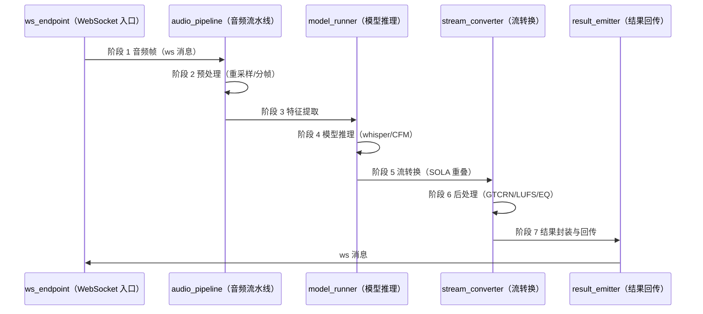

# DEEP-DIVE — 通用 Deep Dive 模板

> 本文档是「<项目名>」的 **DEEP-DIVE（通用 Deep Dive 模板）**——L2 架构层的高复杂度主题详情文档。
> 【模板使用指引】复制为 `docs/L2/deep-dives/<name>.md`（`<name>` 用 kebab-case，如 `inference-pipeline`），按各章节指引填写。
> 【原则】① **详情定位**：deep-dive 承载单个高复杂度主题的完整细节（参数/精度/步骤/缓存/限流/坑位），L2 三总览只放一行"详情见"引用（S2 同一信息只在一处维护）；② **代码即真相**：细节一律用 `参见 File:Line` 链到代码，不复制代码、不复制 AGENTS.md（1500 行）；③ **SSOT 引用不复制**：参数总览在 [TECHNOLOGY-ARCHITECTURE](../TECHNOLOGY-ARCHITECTURE.template.md)、规则在 [DOMAIN-MODEL](../DOMAIN-MODEL.template.md)、env vars 在 SPEC §5——本模板只引用不复制，SPEC 双向引用（SPEC 链到本 Deep Dive，本 Deep Dive 链回 SPEC §5）；④ 图用 **Mermaid / D2**（图规范见宪法 §3.2），无元信息表、无变更记录。
> 【覆盖范围】物理单 rule（DEEP-DIVE.md）通过 globs `*.md` 覆盖目录下多文档；INDEX.md 由 [INDEX](INDEX.template.md) 单独管理（globs 已排除）。
> 【章节】7 章骨架指 §1-7，§8 为相关文档导航。
> 【示例】全文图/表/步骤均以「推理流水线」为首篇实例，其他主题按实际替换（数量/档位/坑位按主题实际，无固定阈值）。

---

## 1. 总览

> 【指引】本节给读者"这个主题是什么、阶段怎么流转"的整体认知。**时序图**（Mermaid sequenceDiagram）画跨模块/跨系统调用时序；**总图**（D2 容器图）画主题涉及的容器/模块分层。图旁标注真实图类型（图规范见宪法 §3.2，fallback 为 ASCII 图保持同样布局）。

### 1.1 阶段时序图

> 【指引】本图为**时序图**（Mermaid sequenceDiagram）。示例为推理流水线 7 阶段：ws_endpoint → audio_pipeline → model_runner → stream_converter → result_emitter。参与者用真实模块名，消息标注真实接口/事件名；其他主题按实际阶段数调整。



### 1.2 总图（D2 容器图）

> 【指引】本图为 **C4 容器图**（D2，绘制方式见宪法 §3.2）。画主题涉及的容器/模块分层与依赖，只画与本主题相关的部分；每层子容器显式算 width（等宽居中，[详见 c4-container-diagram §6.13]）。

```d2
# 图标准元信息
# 图名: <主题> 总览（容器图）
# 视角: 架构详情（deep-dive）
# 说明: 只画与本主题相关的容器/模块

vars: {
  d2-config: {
    layout-engine: elk
  }
}

主题总览: {
  grid-rows: 1
  grid-columns: 1
  grid-gap: 24
  style.fill: "#ffffff"
  style.font-color: "#1e293b"
  style.stroke: "#94a3b8"
  style.stroke-width: 1
  style.border-radius: 16

  入口层: {
    label: "入口层"
    width: 1000
    style.fill: "#dbeafe"
    style.font-color: "#1e293b"
    style.stroke: "#2563eb"
    style.stroke-width: 2
    style.border-radius: 12
    grid-columns: 1
    e1: { label: "ws_endpoint\nWebSocket 入口"; width: 880; height: 70; class: mod }
  }

  处理层: {
    label: "处理层"
    width: 1000
    style.fill: "#ede9fe"
    style.font-color: "#1e293b"
    style.stroke: "#7c3aed"
    style.stroke-width: 2
    style.border-radius: 12
    grid-columns: 2
    grid-gap: 12
    p1: { label: "audio_pipeline\n音频流水线"; width: 494; height: 80; class: mod }
    p2: { label: "stream_converter\n流转换"; width: 494; height: 80; class: mod }
  }

  推理层: {
    label: "推理层"
    width: 1000
    style.fill: "#cffafe"
    style.font-color: "#1e293b"
    style.stroke: "#0e7490"
    style.stroke-width: 2
    style.border-radius: 12
    grid-columns: 1
    m1: { label: "model_runner\n模型推理（whisper/CFM/BigVGAN）"; width: 880; height: 70; class: mod }
  }
}

# 层间调用（完整路径，避免静默重复节点）
主题总览.入口层 -> 主题总览.处理层: 音频帧 { style.stroke: "#2563eb" }
主题总览.处理层 -> 主题总览.推理层: 特征/推理 { style.stroke: "#7c3aed" }

classes: {
  mod: {
    style: { border-radius: 6; fill: "#ffffff"; stroke: "#64748b"; stroke-width: 1; font-size: 12; font-color: "#1e293b" }
  }
}
```

---

## 2. 永久参数

> 【指引】本节维护主题的**永久参数表**（长期存在、跨版本稳定的参数）。**每个参数必须带 `File:Line`**（`参见 <文件>:<行号>`），保证可跳转验证。参数总览 SSOT 在 [TECHNOLOGY-ARCHITECTURE](../TECHNOLOGY-ARCHITECTURE.template.md) §3.1（存储选型明细）（引用不复制），本表只列本主题专属参数。示例为推理流水线 13 项，其他主题按实际替换。

| Parameter         | Value | Purpose                        | File:Line                               |
| ----------------- | ----- | ------------------------------ | --------------------------------------- |
| `sample_rate`     | 16000 | 音频采样率（whisper 输入要求） | 参见 `src/audio_pipeline/config.py:12`  |
| `chunk_ms`        | 320   | 分帧时长（ws 消息粒度）        | 参见 `src/ws_endpoint/handler.py:45`    |
| `max_conn`        | 100   | 最大并发连接                   | 参见 `src/ws_endpoint/server.py:78`     |
| `queue_size`      | 64    | 音频帧队列容量                 | 参见 `src/audio_pipeline/queue.py:23`   |
| `overlap_ms`      | 40    | SOLA 重叠时长                  | 参见 `src/stream_converter/sola.py:56`  |
| `denoise_on`      | true  | GTCRN 降噪开关                 | 参见 `src/stream_converter/post.py:89`  |
| `lufs_target`     | -14   | LUFS 响度目标                  | 参见 `src/stream_converter/post.py:102` |
| `eq_profile`      | vocal | EQ 预设                        | 参见 `src/stream_converter/post.py:115` |
| `kv_batch`        | 3     | KV cache 批大小 B              | 参见 `src/model_runner/kv_cache.py:31`  |
| `kv_len`          | 8192  | KV cache 序列长度 L            | 参见 `src/model_runner/kv_cache.py:32`  |
| `rate_limit_ws`   | 30    | ws 消息限流（次/秒）           | 参见 `src/ws_endpoint/guard.py:67`      |
| `rate_limit_conn` | 5     | 连接建立限流（次/分）          | 参见 `src/ws_endpoint/guard.py:71`      |
| `idle_timeout_s`  | 300   | 空闲连接超时                   | 参见 `src/ws_endpoint/server.py:90`     |
| `TEMP_example`    | —     | 占位                           | TODO: 待 File:Line（新模块未落地）      |

> 【指引】**File:Line 必须真实可跳转**（生成后校验）；参数值变化只改本表 + 代码，不复制到总览。env vars 相关参数**双向引用 SPEC §5**（SPEC 定义 env var 名，本表引用不复制）。**无对应代码时写 `TODO: 待 File:Line（原因）` 并问用户，不虚构行号**。

---

## 3. 精度分层

> 【指引】本节维护主题的**精度/性能分层**（同一能力多档精度取舍）。每档标注：模型、精度、用途、File:Line。**精度是强约束**（如 whisper fp16 / CFM fp32 不可随意降档），依据不足时问用户。示例为推理流水线 4 档，其他主题按实际替换。

| 档位 | 模型/模块 | 精度 | 用途                             | File:Line                              |
| ---- | --------- | ---- | -------------------------------- | -------------------------------------- |
| P1   | whisper   | fp16 | 语音识别（速度优先）             | 参见 `src/model_runner/whisper.py:40`  |
| P2   | CFM       | fp32 | 音色转换（质量强约束，不可降档） | 参见 `src/model_runner/cfm.py:55`      |
| P3   | BigVGAN   | fp16 | 波形生成（速度/质量折中）        | 参见 `src/model_runner/bigvgan.py:70`  |
| P4   | GTCRN     | fp32 | 降噪（稳定性强约束）             | 参见 `src/stream_converter/post.py:88` |

> 【指引】**强约束档位（fp32）标注"不可降档"**；弱约束档位标注降档条件。精度分层依据（基准/实验）不足时问用户。

---

## 4. 流水线步骤

> 【指引】本节按处理顺序描述主题的**流水线步骤**。每步一个小节（**可插拔**：主题没有的步骤直接删小节），标注：输入/输出、关键算法、File:Line。示例为推理流水线步骤（SOLA 重叠 / GTCRN 降噪 / LUFS / EQ 等）。

### 4.1 预处理

> 【指引】输入音频的标准化（重采样/去噪/分帧）。

- 输入：原始音频帧（ws 消息）
- 处理：重采样至 `sample_rate`、分帧 `chunk_ms`
- 输出：标准化帧队列
- File:Line：参见 `src/audio_pipeline/preprocess.py:20`

### 4.2 特征提取

> 【指引】帧 → 模型输入特征。

- 输入：标准化帧
- 处理：<特征提取算法>
- 输出：特征张量
- File:Line：参见 `src/audio_pipeline/features.py:35`

### 4.3 模型推理

> 【指引】特征 → 推理结果（精度分层见 §3）。

- 输入：特征张量
- 处理：whisper（ASR）→ CFM（音色）→ BigVGAN（波形）
- 输出：中间音频
- File:Line：参见 `src/model_runner/infer.py:60`

### 4.4 流转换（SOLA 重叠）

> 【指引】流式输出的重叠拼接（SOLA：Synchronous Overlap-Add），消除拼接断点。

- 输入：中间音频块
- 处理：SOLA 重叠（`overlap_ms`）
- 输出：连续音频流
- File:Line：参见 `src/stream_converter/sola.py:56`

### 4.5 后处理（GTCRN 降噪 / LUFS / EQ）

> 【指引】输出前的质量后处理，各处理**可插拔**（按需取舍）。

- GTCRN 降噪：`denoise_on` 开关，参见 `src/stream_converter/post.py:88`
- LUFS 响度归一：`lufs_target`，参见 `src/stream_converter/post.py:102`
- EQ 预设：`eq_profile`，参见 `src/stream_converter/post.py:115`

### 4.6 结果封装与回传

> 【指引】结果封装为 ws 消息并回传。

- 输入：后处理音频流
- 处理：封装（格式/元数据）
- 输出：ws 消息
- File:Line：参见 `src/result_emitter/emit.py:30`

---

## 5. 缓存

> 【指引】本节维护主题的**缓存设计**。示例为推理流水线两级缓存：**一级 `_get_ref_cache`（引用缓存）+ 二级 KV cache（模型上下文缓存）**。缓存命中率/失效策略是重点；两级 vs 单级按需取舍，不强行套用。

### 5.1 一级缓存：引用缓存（_get_ref_cache）

> 【指引】进程内引用缓存，避免重复解析/加载。

- 结构：`_get_ref_cache`（dict，key = 引用 ID）
- 失效：<失效策略，如 LRU / TTL>
- 启动预热：<预热逻辑，如启动时预加载常用引用>
- File:Line：参见 `src/audio_pipeline/ref_cache.py:15`

### 5.2 二级缓存：KV cache（模型上下文）

> 【指引】模型推理的 KV cache，避免重复计算历史上下文。

- 参数：`kv_batch = 3`（批大小 B）、`kv_len = 8192`（序列长度 L）
- 失效：<失效策略，如连接断开即清>
- File:Line：参见 `src/model_runner/kv_cache.py:31`

> 【指引】缓存参数（B/L）带 File:Line；缓存设计取舍（两级 vs 单级）按需，不强行套用。

---

## 6. 限流与并发控制

> 【指引】本节维护主题的**限流/并发控制**，与 [DOMAIN-MODEL](../DOMAIN-MODEL.template.md) 规则（R8/R9 等）对应——**规则 SSOT 在 DOMAIN-MODEL，本节只写实现细节**（引用不复制）。示例为推理流水线双层限流。

| 机制           | 行为                                  | 对应规则           | File:Line                           |
| -------------- | ------------------------------------- | ------------------ | ----------------------------------- |
| 4017 踢旧      | 新连接挤掉最旧连接                    | R8（连接数上限）   | 参见 `src/ws_endpoint/guard.py:40`  |
| 4016 拒绝      | 超限新连接直接拒绝                    | R8（连接数上限）   | 参见 `src/ws_endpoint/guard.py:52`  |
| TOCTOU 防护    | 检查-使用间竞态防护（原子操作）       | R9（并发安全）     | 参见 `src/ws_endpoint/guard.py:60`  |
| identity guard | 连接身份校验（防伪造）                | R9（并发安全）     | 参见 `src/ws_endpoint/guard.py:75`  |
| ws_ping        | 心跳保活（空闲超时 `idle_timeout_s`） | R8（连接生命周期） | 参见 `src/ws_endpoint/server.py:90` |

> 【指引】**规则 ID（R8/R9）与 DOMAIN-MODEL 双向引用**：本节标注对应规则，DOMAIN-MODEL 规则条目链回本节；规则定义不复制（SSOT 在 DOMAIN-MODEL）。

---

## 7. 坑位

> 【指引】本节维护主题的**已知坑位**（易错点/反模式/踩坑记录），每条标注：现象、原因、规避、File:Line。示例为推理流水线 11 坑位，其他主题按实际替换。坑位表是**活文档**：踩坑即补，不追求一次写全。

| #   | 坑位          | 现象           | 原因                       | 规避                       | File:Line                                  |
| --- | ------------- | -------------- | -------------------------- | -------------------------- | ------------------------------------------ |
| 1   | 采样率不匹配  | 识别结果乱码   | 输入采样率 ≠ `sample_rate` | 预处理强制重采样           | 参见 `src/audio_pipeline/preprocess.py:20` |
| 2   | 分帧边界断裂  | 音频卡顿       | 帧边界无重叠               | SOLA 重叠拼接              | 参见 `src/stream_converter/sola.py:56`     |
| 3   | fp16 溢出     | 音色失真       | CFM 用 fp16                | CFM 强制 fp32（§3 P2）     | 参见 `src/model_runner/cfm.py:55`          |
| 4   | KV cache 超长 | 显存 OOM       | L 超 `kv_len`              | 截断/滑动窗口              | 参见 `src/model_runner/kv_cache.py:32`     |
| 5   | 连接数超限    | 新连接被拒     | 未限流                     | 4016 拒绝 + 4017 踢旧      | 参见 `src/ws_endpoint/guard.py:52`         |
| 6   | TOCTOU 竞态   | 连接数统计错乱 | 检查-使用非原子            | 原子操作防护               | 参见 `src/ws_endpoint/guard.py:60`         |
| 7   | 身份伪造      | 越权访问       | 未校验连接身份             | identity guard             | 参见 `src/ws_endpoint/guard.py:75`         |
| 8   | 空闲连接泄漏  | 连接数缓慢上涨 | 无心跳/超时                | ws_ping + `idle_timeout_s` | 参见 `src/ws_endpoint/server.py:90`        |
| 9   | 响度过高      | 听感刺耳       | 未做 LUFS 归一             | `lufs_target` 归一         | 参见 `src/stream_converter/post.py:102`    |
| 10  | 降噪误伤人声  | 人声变闷       | GTCRN 参数过强             | 调 `denoise_on`/参数       | 参见 `src/stream_converter/post.py:88`     |
| 11  | 缓存未预热    | 首请求慢       | 引用缓存空                 | 启动预热                   | 参见 `src/audio_pipeline/ref_cache.py:15`  |

> 【指引】每条 File:Line 指向坑位所在代码；坑位与 §2 参数/§3 精度/§6 限流交叉引用（如坑位 3 链 §3 P2）。

---

## 8. 相关文档

- [INDEX](INDEX.template.md)：deep-dives 索引（本主题在索引 §2 列表登记）
- [TECHNOLOGY-ARCHITECTURE](../TECHNOLOGY-ARCHITECTURE.template.md)：参数总览 SSOT（§3.1 存储选型明细），详情在本 Deep Dive
- [DOMAIN-MODEL](../DOMAIN-MODEL.template.md)：R8/R9 等规则 SSOT，实现细节在本 Deep Dive
- [APPLICATION-ARCHITECTURE](../APPLICATION-ARCHITECTURE.template.md)：应用模块索引，模块详情在本 Deep Dive
- SPEC §5：env vars 定义（双向引用不复制）
