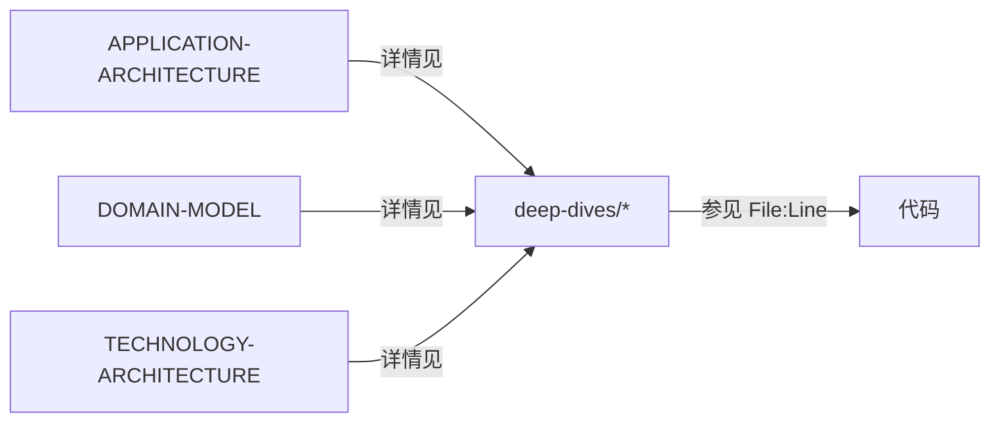

# L2/deep-dives — 索引

> 本文档是「<项目名>」的 **L2/deep-dives 索引（模板）**——L2 架构层 deep-dives 文档的索引。
> 【模板使用指引】复制为 `docs/L2/deep-dives/INDEX.md`，按各章节指引填写。
> 【原则】① **索引定位**：只做入口与收敛标准，不承载 deep-dive 内容；② **L2 三总览（APPLICATION-ARCHITECTURE / DOMAIN-MODEL / TECHNOLOGY-ARCHITECTURE）为索引，deep-dives 为详情**——总览章节只放一行"详情见"引用，deep-dive 不反向承载总览内容（S2 同一信息只在一处维护）；③ 收敛标准（§1）决定"什么主题值得单独成篇"；④ 列表（§2）按主题维护，含首篇与预留位；⑤ 图用 **ASCII / Mermaid**（图规范见宪法 §3.2），无元信息表、无变更记录。

---

## 1. 收敛标准（什么主题值得单独成篇）

> 【指引】deep-dive 是**高复杂度主题的详情页**，不是所有主题都值得单独成篇。命中以下 4 个阈值中 **任意 2 个** 即单列一篇；不足 2 个的并入 L2 三总览对应章节，不单独成篇。阈值来源：AWS Well-Architected Lens、arc42 §8、C4 model L3（Component）、Google Design Doc。

| #   | 阈值                     | 说明                                                                  | 来源                         |
| --- | ------------------------ | --------------------------------------------------------------------- | ---------------------------- |
| T1  | 跨模块/跨系统交互 ≥ 3 个 | 主题涉及 ≥3 个模块/系统协作，总览一节放不下                           | C4 L3（Component 层）        |
| T2  | 永久参数 ≥ 5 项          | 主题有 ≥5 项需长期维护的永久参数（每项带 File:Line，见 DEEP-DIVE §2） | arc42 §8（Cross-cutting）    |
| T3  | 精度/性能分层 ≥ 3 档     | 主题存在 ≥3 档精度/性能取舍（如模型精度分层）                         | AWS Lens（Performance）      |
| T4  | 坑位 ≥ 5 个              | 主题有 ≥5 个已知坑位（易错点/反模式）                                 | Google Design Doc（Lessons） |

> 【指引】**命中 ≥2 个阈值即单列**；命中 1 个或 0 个的并入总览。判定结果在 §2 列表的「判定」列标注（如 `T1+T2`）。**判定列填 `T1+T2` 等组合；<2 的不建行（并入总览）；预留位填 `TBD` 待启用后补**。收敛阈值有争议时问用户。

---

## 2. Deep Dive 列表

> 【指引】按主题维护 deep-dive 清单。**首篇为 inference-pipeline（推理流水线）**；预留位（如 grant-scheduling）在主题出现时启用。每篇标注：主题、判定（命中哪些阈值）、关联总览章节、状态。**本表为 SSOT**：新增/删除 deep-dive 只改本表。

| 主题       | 文件                                            | 判定          | 关联总览（索引）                                                                                                         | 状态 |
| ---------- | ----------------------------------------------- | ------------- | ------------------------------------------------------------------------------------------------------------------------ | ---- |
| 推理流水线 | [inference-pipeline](inference-pipeline.md)     | T1+T2+T3+T4   | [TECHNOLOGY-ARCHITECTURE](../TECHNOLOGY-ARCHITECTURE.template.md) §X / [DOMAIN-MODEL](../DOMAIN-MODEL.template.md) R8/R9 | 已建 |
| 授权调度   | [grant-scheduling](grant-scheduling.md)（预留） | T1+T2（示例） | [APPLICATION-ARCHITECTURE](../APPLICATION-ARCHITECTURE.template.md) §3                                                   | 预留 |

> 【指引】列表为 **SSOT**：新增/删除 deep-dive 只改本表；每篇 deep-dive 的「相关文档」章节反向链回本索引（单链，不双向复制）。预留位在主题出现时启用，启用后补判定与关联总览。

---

## 3. 引用声明（与 L2 三总览的关系）

> 【指引】**L2 三总览（APPLICATION-ARCHITECTURE / DOMAIN-MODEL / TECHNOLOGY-ARCHITECTURE）为索引，deep-dives 为详情**。总览章节只写"详情见 deep-dive X"一行引用；deep-dive 不复制总览内容（S2 同一信息只在一处维护）。引用方向单向：总览 → deep-dive → 代码（File:Line）。本图为**结构/拓扑图**（Mermaid flowchart，图规范见宪法 §3.2，fallback 为 ASCII 图保持同样布局）。

> 图注：实例路径为 INDEX.md，模板期指向 INDEX.template.md。

> 【指引】三总览各自在相关章节放一行"详情见 [deep-dives/INDEX](INDEX.md)"引用；deep-dive 正文不反向承载总览内容。

---

## 4. 与 STRUCTURE 的联动

> 【指引】目录结构 SSOT 在 [STRUCTURE](../../common/STRUCTURE.template.md)（common 层）。新增/删除 deep-dive 时，同步更新 STRUCTURE 中 `docs/L2/deep-dives/` 的说明（文件清单/职责），保持目录 ↔ 文档一致。

| 动作           | 本索引        | STRUCTURE                                                                        |
| -------------- | ------------- | -------------------------------------------------------------------------------- |
| 新增 deep-dive | §2 列表加行   | 同步 STRUCTURE §1 目录树（deep-dives 分支）+ §2 职责表（docs/L2/deep-dives/ 行） |
| 删除 deep-dive | §2 列表删行   | 同步 STRUCTURE §1 目录树（deep-dives 分支）+ §2 职责表（docs/L2/deep-dives/ 行） |
| 收敛标准调整   | §1 阈值表更新 | 无需联动（不涉及目录）                                                           |

> 【指引】STRUCTURE 是目录结构 SSOT，本索引只维护"主题 → 文件"映射；目录级说明一律以 STRUCTURE 为准，此处引用不复制。

---

## 5. 相关文档

- [DEEP-DIVE](DEEP-DIVE.template.md)：单篇 deep-dive 的通用模板（7 章骨架）
- [APPLICATION-ARCHITECTURE](../APPLICATION-ARCHITECTURE.template.md) / [DOMAIN-MODEL](../DOMAIN-MODEL.template.md) / [TECHNOLOGY-ARCHITECTURE](../TECHNOLOGY-ARCHITECTURE.template.md)：L2 三总览（索引）
- [STRUCTURE](../../common/STRUCTURE.template.md)：目录结构 SSOT（`docs/L2/deep-dives/` 说明）
