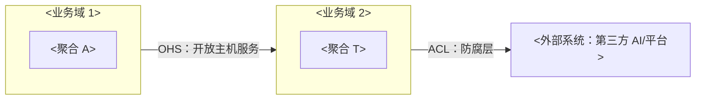

# DOMAIN-MODEL — 领域模型（总文档）

> 本文档是「<项目名>」的领域模型总文档（L2 架构层），登记全部业务域及其域文档。
> 【原则】① 领域建模视角（DDD）：限界业务域、聚合、实体、值对象、领域事件——回答"业务领域怎么建模"；② 从业务规则与行为出发建模；③ 关键建模决策记 ADR。

---

## 1. 业务域概述

### 1.1 背景与目标

> 【指引】该业务域解决什么问题、为什么需要领域建模（2~5 句）。

<背景与目标>

### 1.2 子域划分（核心/支撑/通用）

> 【指引】先切子域（业务问题分类），再划限界业务域（解决方案边界）。子域决定投资优先级，避免过度建模。判断标准：
>
> - 核心子域：差异化竞争力（做不好公司会输）→ 重点建模、优先投入
> - 支撑子域：必须有但不构成壁垒 → 适当投入，不外包
> - 通用子域：行业有现成方案/可买/SaaS → 直接引入，不重复造轮子

| 子域     | 类型（核心/支撑/通用） | 判断理由                      | 对应业务域 |
| -------- | ---------------------- | ----------------------------- | ---------- |
| <子域 1> | <核心>                 | <为何是核心竞争力/为何可外购> | <业务域>   |
| （补充） |                        |                               |            |

> 【指引】子域只切到"够指导架构设计"的粒度（一般 3~9 个），不再细分；复杂度交给限界业务域承载（一个子域可对应多个业务域）。

---

## 2. 业务域划分

> 【指引】业务模型的边界划分：每个业务域内概念含义唯一。业务域清单列核心聚合；映射图表达协作关系（ACL 防腐层/开放主机服务等模式）。

### 2.1 业务域清单

| 业务域     | 职责     | 核心聚合 | 依赖的业务域 | 被谁依赖   |
| ---------- | -------- | -------- | ------------ | ---------- |
| <业务域 1> | <干什么> | <聚合>   | <依赖>       | <谁依赖它> |
| （补充）   |          |          |              |            |

### 2.2 业务域映射图



> 【指引】标注业务域间协作模式（ACL 防腐层 / 开放主机服务 / 共享内核…），防止外部模型污染内部模型。本图为业务域映射图（Mermaid flowchart，模式定义见本节【指引】9 模式表，图规范见 references/diagram-spec.md）。

### 2.3 本域映射关系（模式标注）

> 【指引】DDD 9 种模式标准术语（来源 Eric Evans《领域驱动设计》+ Vaughn Vernon《实现领域驱动设计》）。按下面的决策速查，为每条业务域关系选择关系模式（在 §2.2 图的连线标注「缩写：名称」，实现技术按需附后）。核心目的：防止外部/不可控模型污染内部核心模型。下方 9 模式标准表与决策速查为建模方法论，不写入实例正文——实例 §2.3 只保留「本域映射关系」业务表（模式缩写含义已在本【指引】，实例图连线按「缩写：名称」标注）。
>
> <details>
> <summary>决策速查（Q1-Q6 决策树）</summary>
>
> ```
> Q1 完全不相关？→ SW；Q2 上游外部/不可控？→ 必须 ACL；Q3 上游无资源响应？→ CF（或自建 ACL）
> Q4 上游希望被多下游消费？→ OHS；Q5 同团队可共享小模型？→ SK（严格限定范围）；Q6 其余 → C-S
> ```
>
> </details>
>
> | 关系模式         | 缩写 | 何时用                                                               | 模型层面发生什么                                                       |
> | ---------------- | ---- | -------------------------------------------------------------------- | ---------------------------------------------------------------------- |
> | 防腐层       | ACL  | 下游对接外部/不可控系统（巨头 API、遗留系统）时，保护自己核心域      | 边界加翻译层：外部模型 → 翻译 → 本地领域模型，核心域永远见不到外部模型 |
> | 共享内核     | SK   | 两业务域愿意共享一小块明确划定的模型（共用一个值对象库）         | 同一份模型代码被两业务域共用；共享范围必须极小，扩大即耦合             |
> | 开放主机服务 | OHS  | 上游把多个业务域能力当公共协议暴露（REST/gRPC/SDK），有 SLA/版本 | 上游定义标准化协议模型，下游按它编程                                   |
> | 顺奉者       | CF   | 上游不可控且翻译成本 > 收益时，被迫接受上游模型                  | 下游直接跟随上游模型不翻译；代价是模型污染，慎用                       |
> | 客户-供应商  | C-S  | 上游决定交付，但下游需求能进入上游排期协商                           | 下游部分接受上游模型，但有谈判权                                       |
> | 合作关系     | P    | 两业务域荣辱与共，绑定同一交付节奏                                   | 两模型共同演化，无谁主导                                               |
> | 发布语言     | PL   | 上游模型需被多下游集成时，定义与实现解耦的交换语言（如事件契约）     | 下游按发布语言集成，不直接依赖上游内部模型                             |
> | 大泥球       | BB   | 未划分边界的遗留混杂模型（识别现状用，不作为目标）                   | 模型纠缠无边界；识别后用 ACL/划分逐步拆解                              |
> | 另谋他路     | SW   | 两业务域根本不集成                                                   | 双方模型零接触，各自独立                                               |
>
> 【指引】范式（CF 治理）（治理流程，不写入实例正文）：发现 CF（业务域直接用对方模型，无翻译）→ 记 drift 清单 `.omo/drift/` → 演进为 ACL。CF 是流程演进中需优化的信号，不作为常态。

| 上游     | 下游     | 模式缩写      | 实现技术        |
| -------- | -------- | ------------- | --------------- |
| <上游域> | <下游域> | <ACL/OHS/PL…> | <契约包/翻译层> |

### 2.4 跨聚合服务（Domain Service · 域间关系）

> 【指引】跨聚合/跨业务域的领域行为（如并发控制下的核算逻辑）——域间协作属"关系"视角，归业务域划分章（不放在域详情内，避免横切混杂）。
>
> 【指引】领域服务 vs 应用服务判据（方法论，不写入实例正文）：
>
> | 维度           | 领域服务（Domain Service）               | 应用服务（Application Service） |
> | -------------- | ---------------------------------------- | ------------------------------- |
> | 放哪层         | `domain/`（领域层）                      | `service/`（应用层）            |
> | 管什么         | 跨聚合的业务规则（如转账涉及两账户） | 编排用例（事务/权限/协调）  |
> | 有没有业务规则 | 有（转账校验、核算）                     | 无（只编排）                    |
> | 厚度           | 可厚                                     | 薄                              |
>
> - 领域服务：操作多个聚合的业务行为，无法归属到单个实体/值对象时用（如 `TransferService`）；应用服务：编排用例流程，调领域服务/聚合根，管事务与权限，不承载业务规则（薄），在应用架构文档（APPLICATION-ARCHITECTURE）的 service 层描述——本节只列领域服务

| 领域服务 | 所属业务域 | 职责   | 涉及聚合 |
| -------- | ---------- | ------ | -------- |
| <服务>   | <业务域>   | <行为> | <聚合>   |
| （补充） |            |        |          |

---

## 3. 业务域详情（域文档清单）

> 【指引】每个业务域一文档（按 DOMAIN 域文档模板生成 `docs/L2/domain/<域>.md`），收拢该域全部内容（实体/约束/领域操作/状态机/本域事件）——读者读一个域文档即获得该域完整模型。本表为域文档清单（总文档兼索引，宪法 §3.2 总文档例外——domain/ 不设 INDEX.md）；新增/删除/合并域文档时同步本表。
>
> 【指引】领域事件原则（建模方法论，不写入实例正文——各域文档「本域领域事件」节（§5）只放事件清单与详情卡片）：事件只记已发生的事（过去时命名），本质是变更事件——从聚合 Action 的状态变更点抽象而来，读取不产生事件；目录标准：事件归发布方 `service/<业务域>/domain/`（事件文件与聚合/实体/领域服务同置，文件不计层级；domain/ 为第四级即上限），Payload 共享值对象放 `service/shared-kernel/`，事件机制（EventBus）放 `infra/` 或 `integration/`。

| 业务域     | 文档               | 说明                 |
| ---------- | ------------------ | -------------------- |
| <业务域 1> | [<域>.md](<域>.md) | <一句话：本域管什么> |
| （补充）   |                    |                      |

---

## 4. 跨业务域契约落地

> 【指引】业务域关系（SK/OHS）的代码落地标准（代码放哪）。关系语义在 §2 业务域映射，落地标准在此。

### 4.1 共享内核（SK）目录标准

> 【指引】shared-kernel 的目录落地标准（这是"代码放哪"的标准，不是原则）。当两个及以上业务域要共享一小块模型时，用独立共享模块。

标准（目录层级自项目根计数，backend/ 计第 1 级、上限四级（文件不计入层级，见 STRUCTURE §3 ①）：backend/ 下 controller/service/infra/integration 四个顶层分层模块目录，全小写；service/<业务域>/{contract,service,domain}、integration/<外部系统>/adapter/ 等域内嵌套为四级目录）：

```
controller/ ← 接入层（薄，翻译 + HTTP）
 └─ <业务域A>/schemas.py + router.py ← 翻译 DTO↔Domain
service/ ← 业务层（含 domain 横向层）
 ├─ shared-kernel/ ← SK 共享模块（需要共享的业务域都依赖它）
 └─ <业务域A>/ ← 依赖 shared-kernel
    └─ contract/ ← OHS 契约（层级见 §4.2）
infra/ ← 支撑层-内部（自己管：DB/缓存）
 └─ db/repositories.py ← 翻译 Domain↔ORM
integration/ ← 支撑层-外部（别人管：<平台_接入方A>/AI/支付）
 └─ <外部系统A>/adapter/<适配_外部A>_adapter.py ← ACL 防腐层
```

> 【指引】其余业务域/文件按此模式补充（不写入实例正文）。

规则：

| 规则                            | 说明                                                                                                      |
| ------------------------------- | --------------------------------------------------------------------------------------------------------- |
| 独立模块                    | SK 用独立目录 `shared-kernel/`（或独立软件包/库），不属于任何业务域——SK 无主、共同拥有                    |
| 命名不用 common/user-shared | 不叫 `common/`（暗示所有都能访问）；不叫 `<业务域B>-shared/`（暗示属于 <业务域B>）——就叫 `shared-kernel/` |
| 只装共享值对象/契约         | 只放真正共享的值对象、ID、集成事件契约、Entity 基类等；绝不装工具类/helper/业务服务                   |
| 范围小                      | 共享范围要极小（业界红线：超过 ~20 个类 = 出问题）                                                        |
| 依赖管理控制范围            | 谁能访问靠构建依赖（Maven/Gradle 只让需要的业务域声明依赖），不靠包名                                     |
| 共同维护                    | 改 SK 两边要一起同步 + 持续集成，发现共享模型破坏                                                         |

### 4.2 契约包（Contract）目录标准（OHS 落地）

> 【指引】契约包的目录落地标准（这是"代码放哪"的标准，不是原则）。当一个业务域要对外暴露稳定接口供其他业务域调用（OHS 开放主机服务）时，用独立契约包。

标准：

```
service/<业务域A>/ ← <业务域A>（上游，有契约包）
 ├─ contract/ ← OHS 契约包（只放接口 + DTO，下游依赖它）
 │ ├─ <业务域A>_service.py ← 接口（Protocol）
 │ └─ <业务域A>_schemas.py ← DTO（dataclass）
 ├─ service/ ← 应用服务层（编排）
 └─ domain/ ← 领域层（横向层，聚合/实体/值对象）

service/<业务域C>/ ← <业务域C>（下游）
 └─ 依赖 service/<业务域A>/contract/

# 每层的翻译器（每层都有翻译，都叫翻译）：
controller/<业务域A>/schemas.py + router.py ← 翻译 DTO↔Domain
infra/db/repositories.py ← 翻译 Domain↔ORM
integration/<外部系统B>/adapter/<适配_外部A>_adapter.py ← 翻译 外部→Domain（ACL）
```

规则：

| 规则                   | 说明                                                                                                      |
| ---------------------- | --------------------------------------------------------------------------------------------------------- |
| 按业务域放         | 契约包在所属业务域内部（如 `<业务域A>/contract/`），不放顶层 `api/`——归属明确                         |
| 只放契约           | 只放对外暴露的接口（interface）+ DTO（请求/响应）；不放领域对象/实现/工具类                           |
| 可控暴露           | 想让外部看到的才放 `contract/`，内部实现随便改不影响外部（内部不暴露）                                    |
| 下游只依赖契约     | 下游（如 `<业务域C>`）只 `import <业务域A>/contract/`，不 import `<业务域A>/service/`/`<业务域A>/domain/` |
| 不叫 api/interface | 不叫 `api/`（避免与接入层混淆）；不叫 `interface/`（Java/Go 关键字）——就叫 `contract/`                    |
| 有需要才建         | 只有被别的业务域依赖时才建契约包；不被依赖就不用建（避免过度设计）                                        |

---

## 5. Mapper（层间模型映射）

> 【指引】领域对象不直接跨层，每跨一层必经 mapper（Clean Architecture 的 interface adapter）翻译一次——本节定义各层模型清单、映射矩阵、字段级非平凡转换与禁令。同名直映不逐列，§5.3 只登记非平凡转换。

### 5.1 模型清单（按层）

| 层                   | 模型                | 命名约定                                                     | 定义归属                              |
| -------------------- | ------------------- | ------------------------------------------------------------ | ------------------------------------- |
| 接入层（controller） | 请求/响应 DTO       | `<XxxRequest>` / `<XxxResponse>`（每端点独立，不复用同一类） | openapi 契约                          |
| 业务层（domain）     | 聚合根/实体/值对象  | 纯领域名（带行为，无传输后缀）                               | 各域文档方法签名                      |
| 持久层（infra）      | ORM 模型（PO）      | 与表一一对应                                                 | DATA-ARCHITECTURE §5 / 代码 models.py |
| 外部（integration）  | 外部服务请求/响应体 | 外部定义                                                     | integration-contracts/                |

### 5.2 映射矩阵

| 跨层                 | 翻译器          | 位置                              | 方向                  | 示例                      |
| -------------------- | --------------- | --------------------------------- | --------------------- | ------------------------- |
| controller ↔ domain  | router/schemas  | `controller/{业务}/`              | DTO ↔ Domain          | `router.to_domain()`      |
| domain ↔ infra       | 仓储/repository | `infra/db/repositories.py`        | Domain ↔ PO           | `to_po()/to_domain()`     |
| domain ↔ integration | Adapter (ACL)   | `integration/<外部系统>/adapter/` | 外部 → Domain（单向） | `<X>_adapter.to_domain()` |

### 5.3 字段级映射规则（非平凡转换）

> 【指引】只登记命名差异、类型转换、枚举映射、敏感字段处理等非平凡规则；全量字段定义在代码 models.py，接口字段在 openapi，此处不重复。

| 转换           | 源 → 目标                   | 规则                                                                   |
| -------------- | --------------------------- | ---------------------------------------------------------------------- |
| 命名转换       | <如 snake_case ↔ camelCase> | <统一机制转换（alias 生成器），不逐字段手写>                           |
| 服务端控制字段 | DTO → Domain                | <id/创建时间等服务端生成字段 inbound 忽略，防客户端越权设置>           |
| 敏感字段暴露   | Domain → DTO                | 白名单出参（只列可外发字段），不用黑名单排除——新增域字段默认不外发 |
| 枚举映射       | PO ↔ Domain ↔ DTO           | 取值唯一源为代码 enums，三侧同一取值集                                 |
| 派生字段       | Domain → DTO                | <响应派生字段在组装时计算，非存储列>                                   |

### 5.4 约束与禁令

- mapper 无业务规则：校验/计算归 domain 层（聚合方法或领域服务），鉴权/事务归 service 层；单 mapper 方法超过 ~15 行即说明转换已长成业务逻辑，应抽回领域层（聚合方法或领域服务）
- DTO 扁平精简：响应 DTO 只带消费者所需字段，关联用 id+名称快照表达，不嵌套对象树（防 over-fetching 与循环序列化）
- 领域对象不外发：禁止把聚合/实体直接序列化为响应（安全泄露 + schema 耦合 + 懒加载副作用三重风险）
- Adapter 单向：外部模型 → 领域模型 only（ACL 防腐），领域模型不向外泄漏
- 命名统一：<按 Python 惯例：`router.py`/`schemas.py`（接入层翻译）/ `repositories.py`（持久层翻译）/ `*_adapter.py`（集成层 ACL）>

### 5.5 完备性校验

- 字段三方对齐：openapi DTO ↔ 域文档方法签名 ↔ 代码 models.py 表字段，可 diff 机检（缺失/口径不一致 = 漂移，按宪法 §2.2 第4条修复）
- 双向映射对称：toDTO 带出的字段在 domain 有来源；toEntity 接收的字段在 domain 被消费（孤儿字段 = 删除候选）
