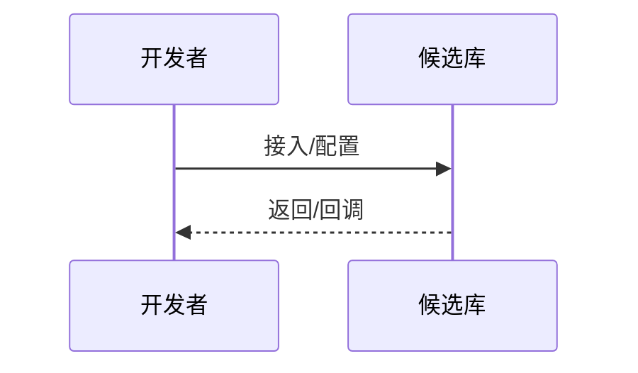

# RESEARCH — 通用调研模板

> 本文档是「<项目名>」的 **RESEARCH（通用调研模板）**——L2 架构层的选型/对比/技术验证类调研文档（含内部 POC 与部署验证，第三方/自建不限）。
> 【模板使用指引】复制为 `docs/L2/research/<kebab-name>.md`（`<kebab-name>` 用 kebab-case，如 `tech-xxx`、`competitor-yyy`），按各章节指引填写。
> 【原则】① **调研定位**：research 承载单个选型/对比/技术验证主题的完整调研（候选/对比/验证/成本/风险/结论，含内部 POC 与部署验证），[TECHNOLOGY-ARCHITECTURE](../TECHNOLOGY-ARCHITECTURE.template.md) 只放一行"调研见"引用（S2：SSOT 单源原则，同一信息只在一处维护，见宪法 §2.2）；② **结论 在 TECHNOLOGY**：本调研的最终选型结论写入 TECHNOLOGY §3.1/§4，research 只做论证过程，不反向承载结论；③ **决策链**：结论链到 [ADR](../ADR.template.md)（`见 ADR-xxx`），ADR 承载决策记录；研究证据（数据来源/版本/验证环境）保留在本文附录属当前意图 G（generation，见宪法 S6），文档演进历史（合并/改名等）归 git log；④ 图用 **Mermaid**（图规范见 references/diagram-spec.md），无元信息表、无变更记录；⑤ **小体量豁免**：候选≤2且无需成本对比时§4/§5可合并，未覆盖 POC 维度标"否+原因"即可。
> 【章节】6 章骨架指 §1-6，§7 为相关文档导航。
> 【示例】全文图/表/步骤均以「技术选型」为示例，其他主题按实际替换（候选/维度/验证按主题实际）。

---

## 1. 背景 / 目标

> 【指引】本节说明**为什么做这次调研**：要解决什么问题、在什么约束下、期望产出什么结论。目标要可判定（调研完成后能明确"选 A 还是 B"）。

- 背景：<为什么需要调研（业务/技术驱动）>
- 目标：<本次调研要回答的问题 / 要产出的结论>
- 约束：<时间 / 成本 / 团队能力 / 合规等硬约束>
- 关联：<关联的 TECHNOLOGY 章节 / 触发本次调研的上下文>

> 【指引】目标不清晰时问用户；目标应能落到 §6 结论的"推荐 + ADR 链"。

---

## 2. 候选对比

> 【指引】本节列出 **≥2 个候选**，从 **≥3 个维度**（功能/性能/成本/许可证/生态等）对比。**每个候选必须带 `File:Line` 或官网链接**，保证可跳转验证。**例外：单候选但含多维度验证（如环境预检/部署验证）亦可单列**，属技术验证类调研。对比表为 SSOT：候选/维度增减只改本表。

| 维度   | 候选 A（如 tech-xxx）  | 候选 B（如 competitor-yyy） | 说明 / 依据（File:Line / 官网）                     |
| ------ | ---------------------- | --------------------------- | --------------------------------------------------- |
| 功能   | <功能覆盖>             | <功能覆盖>                  | 参见 `docs/xxx.md:12` / [官网](https://example.com) |
| 性能   | <性能指标>             | <性能指标>                  | 参见 `docs/xxx.md:20` / [官网](https://example.com) |
| 成本   | <接入/运维/许可证成本> | <接入/运维/许可证成本>      | 参见 `docs/xxx.md:28` / [官网](https://example.com) |
| 许可证 | <许可证类型/条款>      | <许可证类型/条款>           | 参见 `docs/xxx.md:36` / [官网](https://example.com) |
| 生态   | <社区/文档/扩展>       | <社区/文档/扩展>            | 参见 `docs/xxx.md:44` / [官网](https://example.com) |

---

## 3. 验证（POC）

> 【指引】本节记录**多维度实际验证**，证明候选在真实环境可用。**POC 必有**：无验证的调研结论不可信。验证维度至少覆盖 **代码/文档/流程/性能** 4 项（按需增删：安全/可观测/兼容性），每维度带可复现证据（代码片段/File:Line/日志/截图/官网链）。

### 3.1 验证维度与范围

> 【指引】先声明**本次 POC 验证了什么/没验证什么**，避免“只跑通 demo 就下结论”。

| 维度      | 验证点                     | 是否覆盖 | 证据形式             | 说明                                      |
| --------- | -------------------------- | -------- | -------------------- | ----------------------------------------- |
| 代码      | 源码可读性/可维护性/扩展点 | 是/否    | File:Line / 代码片段 | 关键模块 `src/xxx:Line`，扩展是否需改源码 |
| 文档      | 官方文档完整性/示例可跑通  | 是/否    | 官网链 + 复现结果    | 文档与实现是否一致                        |
| 流程设计  | 接入/使用/异常流程是否闭环 | 是/否    | Mermaid 流程图       | 流程断点/人工环节                         |
| 性能      | 基准测试（RT/QPS/资源）    | 是/否    | 日志/截图            | 与 §2 性能维度呼应                        |
| 兼容/迁移 | 历史数据/版本兼容/回滚     | 是/否    | 脚本/记录            | 迁移成本                                  |
| （补充）  | <按主题增>                 |          |                      |                                           |

> 【指引】维度 ≥4 项必选；未覆盖维度显式标“否 + 原因”，不省略。

### 3.2 环境与分支

> 【指引】POC 运行环境 + 代码分支，保证可复现。

- 环境：<硬件/软件/版本/依赖，如 Node 18 + Postgres 14>
- 分支：<`git branch` / commit，如 `poc/tech-xxx#abc123`，含复现脚本路径 `scripts/poc-xxx.sh`>
- 数据：<测试数据集/规模>

### 3.3 深度验证

> 【指引】分维度展开验证过程，每维度独立小节，含 **代码/文档/流程设计的深度阅读**。

#### 3.3.1 代码验证

- 源码结构：<目录/分层是否清晰，关键文件 `src/xxx:Line`>
- 扩展点：<是否可插件/配置化，或需改源码，`src/xxx:Line`>
- 代码片段（可复现）：

```ts
// 最小可跑示例，含 File:Line 引用
import { xxx } from "tech-xxx"; // 参见 `src/poc.ts:12`
```

- 问题：<可读性/坑位>

#### 3.3.2 文档验证

- 完整性：<API 文档/示例是否齐全，官网 `https://...`>
- 可跑通：<官方示例是否一键可跑，复现命令 `npm run poc` 结果>
- 偏差：<文档与实现不一致处，`docs/xxx:Line`>

#### 3.3.3 流程设计验证

- 接入流程：<从接入到跑通的步骤，Mermaid 时序图>



- 异常流程：<异常/回滚/重试是否闭环>
- 流程断点：<需人工介入环节>

#### 3.3.4 性能/其他验证（与§2/§3.1呼应，性能维度若§2已列则必验证）

- 基准：<RT/QPS/内存，对比 §2 性能行>
- 日志/截图：<`poc.log:Line` / 截图>

### 3.4 结果与复现

> 【指引】POC 结果需 **量化 + 与 §2 对比表呼应**，并保证可复现。

| 候选   | 维度 | 结果（量化）      | 与 §2 对比是否一致 | 偏差原因 |
| ------ | ---- | ----------------- | ------------------ | -------- |
| 候选 A | 代码 | <可维护/扩展评估> | 是/否              | <原因>   |
| 候选 A | 流程 | <闭环/断点>       | 是/否              | <原因>   |
| 候选 B | 性能 | <QPS 1200>        | 是/否              | <原因>   |

- 复现：<`git checkout poc/xxx && ./scripts/poc-xxx.sh` 一键可复现，产物 `poc.log:Line`>
- 结论：<验证通过/部分通过/未通过，呼应 §6 推荐>

---

## 4. 成本

> 【指引】本节评估**接入/运维/许可证**成本，供 §6 结论权衡。小体量（候选≤2且无需成本对比）可与§5合并为"成本与风险"一节；无许可证成本写"开源无费用，运维成本见本节"类明确表述，不写"无"空话。

| 成本项     | 候选 A        | 候选 B        | 说明 / 依据           |
| ---------- | ------------- | ------------- | --------------------- |
| 接入成本   | <人天/复杂度> | <人天/复杂度> | 参见 `docs/xxx.md:52` |
| 运维成本   | <人力/资源>   | <人力/资源>   | 参见 `docs/xxx.md:60` |
| 许可证成本 | <费用/条款>   | <费用/条款>   | 参见 `docs/xxx.md:68` |

> 【指引】成本项按主题增删；每项带 `File:Line` 或官网链；成本数据缺失时问用户。

---

## 5. 风险 / 合规

> 【指引】本节评估**许可证 / 数据 / vendor lock-in** 等风险与合规约束。**风险合规齐全**：无则显式标注"无"并给依据，不省略；小体量可与§4合并。

| 风险项         | 描述                  | 影响 / 规避   | 依据                  |
| -------------- | --------------------- | ------------- | --------------------- |
| 许可证风险     | <许可证条款/传染性>   | <影响 / 规避> | 参见 `docs/xxx.md:76` |
| 数据风险       | <数据安全/隐私/合规>  | <影响 / 规避> | 参见 `docs/xxx.md:84` |
| vendor lock-in | <供应商锁定/迁移成本> | <影响 / 规避> | 参见 `docs/xxx.md:92` |

> 【指引】风险项按主题增删；每项带 `File:Line` 或官网链；合规约束（如数据出境/许可证）缺失时问用户。

---

## 6. 结论

> 【指引】本节给出**推荐 + ADR 链**。推荐结论写入 [TECHNOLOGY-ARCHITECTURE](../TECHNOLOGY-ARCHITECTURE.template.md) §3.1/§4，本调研只做论证；决策记录链到 [ADR](../ADR.template.md)（`见 ADR-xxx`）。**决策规则**：各维度按主题设权重（例：功能 40% / 性能 25% / 成本 20% / 生态 15%）对候选加权打分；存在**一票否决项**（如许可证传染性、硬约束不满足）的候选直接淘汰，不参与加权；推荐 = 加权得分最高且无否决项的候选；证据不足的维度显式标注并相应扣分，不模糊带过；若全员被否决则标注【阻塞-需放宽约束】并问用户；示例权重按主题自定义，未定时问用户。

- 推荐：<推荐候选 + 理由（呼应 §2 对比 / §3 POC / §4 成本 / §5 风险，按权重打分 + 注明一票否决项）>
- 结论 ：写入 [TECHNOLOGY-ARCHITECTURE](../TECHNOLOGY-ARCHITECTURE.template.md) §3.1/§4
- 决策链：见 `ADR-xxx`（[ADR](../ADR.template.md)）

> 【指引】推荐必须可追溯到 §2-5 证据；ADR 链缺失时问用户（是否已建 ADR）。

---

## 7. 相关文档

- [TECHNOLOGY-ARCHITECTURE](../TECHNOLOGY-ARCHITECTURE.template.md)：选型结论 （§3.1/§4），调研详情在本 RESEARCH
- [ADR](../ADR.template.md)：决策链（`见 ADR-xxx`）
