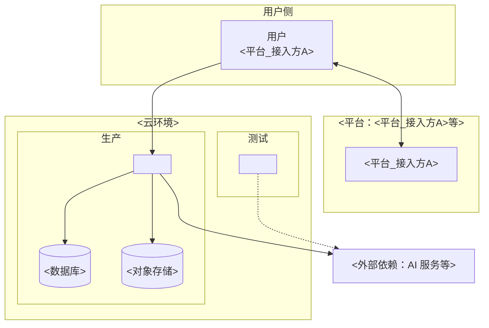

# DEPLOYMENT — 部署与发布

> 本文档是「<项目名>」的 **DEPLOYMENT（部署与发布模板）**——L4 交付层的部署与发布文档（运维手册）。
> 【模板使用指引】复制为 `docs/L4/DEPLOYMENT.md`，按各章节指引填写。
> 【原则】① **运维手册定位**（非架构设计）：部署脚本、部署步骤、部署参数、环境配置——回答"怎么部署上线、怎么运维"；② 部署单元来自 APPLICATION-ARCHITECTURE 应用划分图；③ 版本号规则 + 发布记录在本节 §7（SSOT）；④ 密钥管理红线见 §6；⑤ 图用 **Mermaid**、无元信息表（版本号规则与发布记录见 §7）。

---

## 1. 部署概述

### 1.1 部署形态与范围

- 部署形态：<云开发 / 自建服务端 / 混合>
- 部署范围：<子系统清单>
- 不部署：<如管理后台是否纳入>

### 1.2 术语表

| 术语     | 含义                                                  |
| -------- | ----------------------------------------------------- |
| 环境     | 一套相互隔离的运行时（开发/测试/生产…）               |
| 部署单元 | 最小可独立构建/发布/回滚的组件                        |
| （补充） | 仅当出现本文档特有术语时增行，最多 3 行；无则删去此行 |

---

## 2. 环境

### 2.1 环境矩阵

> 【指引】环境 | 用途 | 入口 | 版本/分支 | 配置来源 | 数据源 | 负责人。<平台_接入方A>形态需同时覆盖「前端版本（体验/正式）」与「后端环境」两个维度；非<平台_接入方A>形态（纯 Web/服务端）可裁剪「前端版本」维度，仅保留「后端环境」。环境行数按实际需要增删，至少保留「本地/开发」与「生产」两行；本地与开发可合并为一行或拆为两行（按团队习惯二选一）。**§4 部署步骤须按本节实际环境行展开**（合并则步骤按合并后环境写，拆分则按拆分后环境写，保持一致）。

| 环境      | 用途                 | 入口   | 版本/分支 | 配置来源   | 数据源   | 负责人 |
| --------- | -------------------- | ------ | --------- | ---------- | -------- | ------ |
| 本地/开发 | 开发者自测、联调     | <入口> | <分支>    | <本地 env> | 测试数据 |        |
| 测试      | 功能验证、提审前回归 | <入口> | <分支>    | <环境配置> | 测试数据 |        |
| 预发布    | 发布演练、验收       | <入口> | <分支>    | <环境配置> | 脱敏数据 |        |
| 生产      | 线上真实流量         | <入口> | <分支>    | <生产配置> | 生产数据 |        |

### 2.2 环境拓扑

> 【指引】本图为 **部署拓扑图**（Mermaid flowchart + subgraph 按环境分区，图规范见 references/diagram-spec.md）。用户 → 平台 → 系统 → 数据与外部依赖，按环境分区。节点与连线必须与 §3 单元清单一一对应，环境分区与 §2.1 环境矩阵一致。

---

## 3. 部署单元清单

> 【指引】最小可独立构建/发布/回滚的组件。**来自 APPLICATION-ARCHITECTURE 应用划分图**。**硬性**：部署单元数必须等于 APPLICATION-ARCHITECTURE §2.2 应用数，不多不少；应用增减必须同步本节。**启动顺序/健康检查/回滚三列仅列单元级概览**（启动顺序：数据层 → 基础服务 → 业务服务 → 前端发布，前端最后需后端已就绪）；各单元的详细部署步骤、健康检查与回滚操作见 §4，本节不重复展开。

| 单元     | 类型               | 部署方式 | 依赖   | 启动顺序 | 健康检查 | 回滚方式 |
| -------- | ------------------ | -------- | ------ | -------- | -------- | -------- |
| <单元 1> | <前端包/服务/数据> | <方式>   | <依赖> | <顺序>   | <检查>   | <方式>   |
| （补充） |                    |          |        |          |          |          |

> **（补充）行**：每新增一个部署单元复制一行并填全 7 列（单元数须等于 APPLICATION-ARCHITECTURE §2.2 应用数，见上指引）；无补充则删去此行。

---

## 4. 部署操作手册

### 4.0 总述

> 【指引】本节是运维手册的核心——**具体怎么部署**（脚本/步骤/参数），供运维/开发者照做。**按应用分环境展开**：每个应用一节（§4.1、§4.2…），节内含部署方式/脚本/步骤/健康检查/**回滚操作**；参数与配置文件详见 §5。**每个应用都必须分环境部署，密钥红线见 §6**。

### 4.1 <应用 1：如 前端<平台_接入方A>>

> 【指引】部署方式：<构建产物/静态托管/上传平台>；部署脚本：<上传/发布命令>；部署步骤：<按环境差异说明>；健康检查：<版本号核对/冒烟>；回滚操作：<回滚命令/回退版本方式>。

- **部署方式**：<如 构建静态包 + 上传<工具_发布>提审>
- **部署脚本**：<如 npm run build:prod → <工具_发布> upload>
- **部署步骤**（按环境差异说明）：

1.  <dev/test：构建 dev/test 包，上传体验版>
2.  <prod：构建 prod 包，正式版提审发布>
3.  （补充：仅当存在额外环境/步骤时增行，最多 3 行；无则删去）

- **健康检查**：<如 线上版本号核对、核心页面冒烟>
- **回滚操作**：<如 <工具_发布> 回退上一版本 / 切回旧产物>

### 4.2 <应用 2：如 后端 API>

> 【指引】部署方式：<容器/云函数/服务编排>；部署脚本：<构建/部署命令>；部署步骤：<按环境差异说明>；健康检查：<探针/接口自检>；回滚操作：<镜像回退/上一版本>。

- **部署方式**：<如 容器镜像 + k8s 部署>
- **部署脚本**：<如 docker build → kubectl apply>
- **部署步骤**（按环境差异说明）：

1.  <dev/test：构建 dev 镜像，部署测试环境>
2.  <prod：构建 prod 镜像，灰度/全量发布>
3.  （补充：仅当存在额外环境/步骤时增行，最多 3 行；无则删去）

- **健康检查**：<如 就绪/存活探针、健康接口>
- **回滚操作**：<如 kubectl rollout undo / 回退镜像 tag>

> 【说明】每个应用都必须分环境部署；配置与发布命令脚本按环境列清，详见 §5。

---

## 5. 配置与发布命令脚本记录（分应用）

> 【指引】按应用记录配置与发布命令脚本，配置按环境差异列清，命令脚本可直接执行。多环境同文件时合并一行（dev/test/prod），分文件时按环境各一行，二选一全篇一致。

### 5.1 <应用 1：如 前端<平台_接入方A>>

- **配置文件**：

| 文件路径    | 环境          | 关键配置项        | 说明   |
| ----------- | ------------- | ----------------- | ------ |
| <如 env.js> | dev/test/prod | <后端 API 域名等> | <说明> |
| （补充）    |               |                   |        |

> 配置文件行按实际文件数增删，每文件一行；无补充则删去此行。

- **发布命令脚本**：

| 步骤         | 命令脚本                | 环境          | 说明   |
| ------------ | ----------------------- | ------------- | ------ |
| <如 1. 构建> | <如 npm run build>      | dev/test/prod | <说明> |
| <如 2. 发布> | <如 <工具_发布> upload> | prod          | <说明> |
| （补充）     |                         |               |        |

> 命令脚本行按实际步骤数增删，每步一行；无补充则删去此行。

### 5.2 <应用 2：如 后端 API>

- **配置文件**：

| 文件路径                  | 环境 | 关键配置项    | 说明   |
| ------------------------- | ---- | ------------- | ------ |
| <如 application-dev.yml>  | dev  | <数据源/日志> | <说明> |
| <如 application-prod.yml> | prod | <生产数据源>  | <说明> |
| （补充）                  |      |               |        |

- **发布命令脚本**：

| 步骤             | 命令脚本           | 环境     | 说明   |
| ---------------- | ------------------ | -------- | ------ |
| <如 1. 构建镜像> | <如 docker build>  | dev/prod | <说明> |
| <如 2. 部署>     | <如 kubectl apply> | prod     | <说明> |
| （补充）         |                    |          |        |

### 5.3 部署资产登记（部署脚本/配置文件集中登记）

> 【指引】**部署资产**（compose / Dockerfile / nginx.conf / backend config / scripts / .env 等启动脚本与配置文件）**集中登记于 `docs/L4/deployment/README.md`**（路径 + 用途，引用不复制）。**文件本体保留在运行位置，不移动**——compose/Dockerfile 相对路径互引，移动即断构建。本小节只放**快速入口引用**，登记清单以 `deployment/README.md` 为 SSOT。

- **登记目录**：`docs/L4/deployment/README.md`（部署资产清单 SSOT：路径 + 用途 + 关联说明）
- **登记原则**：
  1. 启动脚本/配置文件（compose/Dockerfile/nginx/config/scripts/.env 等）增删改 → **同步更新登记清单**
  2. 文件本体不移动（保留在运行位置，相对路径互引）
  3. 本文档 §5.1/§5.2 只列应用级配置与命令，资产级清单引用 `deployment/README.md`（引用不复制，S2）

| 部署资产                | 路径                           | 说明                                   |
| ----------------------- | ------------------------------ | -------------------------------------- |
| <如 docker-compose.yml> | <如 deploy/docker-compose.yml> | <如 服务编排 + 启动顺序 + healthcheck> |
| （补充）                |                                |                                        |

---

## 6. 密钥与配置管理

> 【指引】配置分层：代码内置默认值（兜底）→ 环境级配置（域名/开关）→ 运行期配置（热更新）→ 密钥（严禁入库/落日志/落前端包，用密钥管理服务注入，支持轮换）。密钥安全红线详见 SECURITY §6。

| 层             | 内容            | 管理方式                        |
| -------------- | --------------- | ------------------------------- |
| 代码内置默认值 | 兜底配置        | 代码库（git 可追踪）            |
| 环境级配置     | 域名、URL、开关 | 环境变量/配置文件（按环境分离） |
| 运行期配置     | 动态开关、阈值  | 配置中心（可热更新）            |
| 密钥           | 密钥/token/证书 | 密钥管理服务 + 注入（严禁入库） |

---

## 7. 版本发布记录

> 【指引】**版本号规则（SSOT，本节定义）** + 发布记录（按时间倒序，每发一版加一行）。

**版本号规则（SSOT，本节）**：

- **格式**：SemVer `MAJOR.MINOR.PATCH`（MAJOR=不兼容变更 / MINOR=新功能 / PATCH=bug 修复）
- **预发布**：`-alpha` / `-beta` / `-rc.1`，优先级低于正式版
- **不可篡改**：已发布版本号不可修改；回滚通过新版本而非改动旧版本
- **首版**：`1.0.0`（或开发期 `0.y.z`）
- 发布文档、README 等一律引用本节，不得另写

**发布记录**（每次发布一行，含灰度比例/回滚出口/审核时间线）：

| 版本号      | 日期            | 变更内容                    | 环境   |
| ----------- | --------------- | --------------------------- | ------ |
| <如 v1.0.0> | <如 2026-09-01> | <如 首次发布：核心能力上线> | <prod> |
| （补充）    |                 |                             |        |
