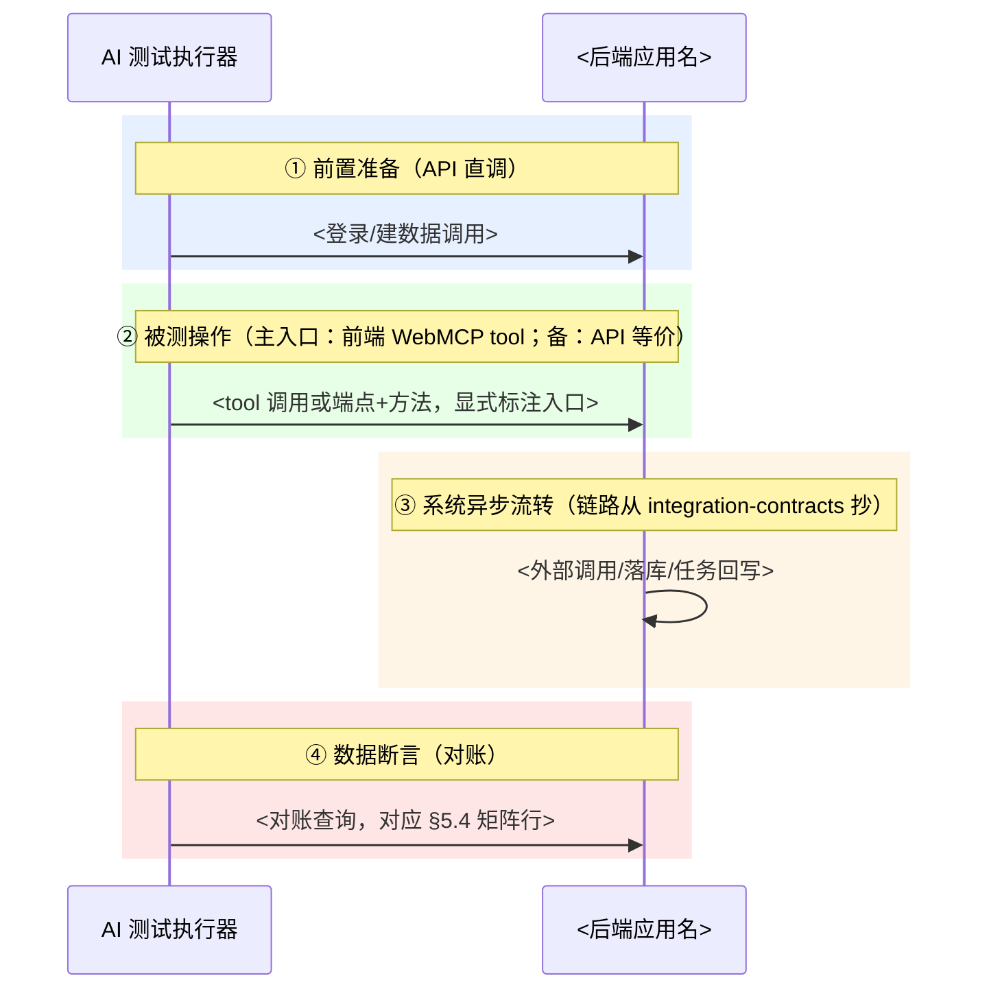

# TEST-PLAN — 测试计划

> 本文档是「<项目名>」的 TEST-PLAN（测试计划模板）——L4 交付层的测试文档。
> 【模板使用指引】复制为 `docs/L4/TEST-PLAN.md`，按各章节指引填写；流程/接口用例逐条落盘 `docs/L4/testcases/`（模板见下方「用例文件落盘模板」）。
> 【原则】① 测试视角：测试分类/策略/用例/报告——回答"怎么验证质量"；② 依赖链：用户故事（需求场景）→ PRODUCT/DOMAIN-MODEL（功能/事件）→ openapi/integration-contracts（契约入口与落库链路）→ TEST-PLAN（测试计划）；③ 测试分三类：接口（API 契约）、流程（三件套：场景声明+时序图蓝图+补充断言）、UT；④ 用例与 PRODUCT/DOMAIN-MODEL/用户故事追溯；⑤ AI 可执行：三层入口驱动 + 落库对账定胜负 + 逐条用例单文件落盘（主文档只留索引）；⑥ 无元信息表、无变更记录。

---

## 1. 概述

### 1.1 目的

- <本次测试验证什么>

### 1.2 范围

> 【指引】本次测试覆盖哪些功能（对应 PRODUCT + DOMAIN-MODEL）、哪些用户场景（对应用户故事）。

<测试范围>

### 1.3 引用文档与追溯（RTM）

> 【指引】需求追溯矩阵（RTM）：用户故事 → PRODUCT/DOMAIN-MODEL → 测试用例（UT/接口/流程）三层对应。正向追溯保证不遗漏，反向追溯保证无冗余。

| 用户故事场景 | 能力/聚合（PRODUCT + DOMAIN-MODEL） | 接口用例          | 流程用例           | UT 用例          |
| ------------ | ----------------------------------- | ----------------- | ------------------ | ---------------- |
| <场景>       | `<能力名 / 聚合名>`                 | API-<模块>-<序号> | FLOW-<模块>-<序号> | UT-<模块>-<序号> |
| （补充）     |                                     |                   |                    |                  |

### 1.4 术语表

> 【指引】除 RTM/接口/流程/UT 外，AI 执行范式术语（三层入口模型/WebMCP tools/数据落库对账/执行入口）在此给面向读者的定义。

- <测试相关术语>（项目级术语见 CODE-GUIDE §2 架构通用术语表与各域文档通用语言表）

---

## 2. 测试策略

### 2.1 测试分类与比例

> 【指引】三类测试的定位与分布比例。参考：测试金字塔（单元 > 接口 > 旅程）、敏捷测试象限。表中「比例（参考）」为默认值，可按技术架构调整。

| 分类       | 测什么                           | 方式                              | 比例（参考） |
| ---------- | -------------------------------- | --------------------------------- | ------------ |
| UT（单元） | 函数/类/模块逻辑                 | 代码测试                          | 70%          |
| 接口       | API 契约/状态机/数据流转         | 代码测试（接口调用）              | 20%          |
| 流程       | 用户旅程级（打开页面→点击→验证） | Gherkin + 浏览器自动化 + 截图视觉 | 10%          |

### 2.2 自动化与手动分工（三层入口模型）

> 【指引】写入三层入口模型表（后端入口/前端入口/数据验证），并给自动化（AI 编排）与手动（语义审核/视觉终审/关键路径终验）分工。范式决策（三层入口/AI 编排）记入 ADR。

| 入口       | 资产                                      | 用途              |
| ---------- | ----------------------------------------- | ----------------- |
| ① 后端入口 | <openapi 契约目录与规模>                  | <AI 直调，零胶水> |
| ② 前端入口 | <WebMCP tools（状态：已实现/前置建设项）> | <直调页面能力>    |
| ③ 数据验证 | <contracts + DEPLOYMENT 数据源清单>       | <落库对账>        |

### 2.3 工具栈

> 【指引】工具栈选型在技术架构，此处只列本项目实际使用的工具，不复制选型理由。含 AI 执行通道/数据观测工具与落盘现状。

| 分类                 | 工具                                           |
| -------------------- | ---------------------------------------------- |
| 后端入口（接口用例） | <pytest/httpx + OpenAPI 直调>                  |
| 前端入口（流程）     | <WebMCP tools + 降级策略>                      |
| AI 执行通道          | <chrome-devtools-mcp / Playwright MCP>         |
| 数据观测（对账）     | <MySQL 查询/向量服务 API/对象存储与临时盘检查> |
| 视觉断言             | <Playwright toHaveScreenshot()>                |
| 取证                 | <Trace Viewer + 分段结果 + 对账输出>           |

### 2.4 不测什么

> 【指引】明确排除项 + 原因（如第三方服务不测、低风险模块跳过、LLM 语义不进断言）。

- <不测项>：<原因>

### 2.5 AI 测试基座（前置建设）

> 【指引】前端 WebMCP tools 注册规划（按能力域列 tool 清单与覆盖操作）+ 执行通道配置 + 就绪判定；标注前置依赖与降级策略（基座未就绪时 case 入口降级 API 等价调用）。实现标准：浏览器原生 WebMCP（`document.modelContext.registerTool()`，Chrome 149+），前端逐页注册、浏览器未启用时 no-op；生成实例 §2.5 时写明该实现命名。

<基座规划表>

---

## 3. 测试环境

> 【指引】环境口径单源见生成 notes「环境口径」条（本节不重复措辞），按该口径填写本章各小节。

### 3.1 环境清单

| 环境     | 用途   | 入口   | 运行形态与依赖 |
| -------- | ------ | ------ | -------------- |
| <环境名> | <用途> | <地址> | <形态/依赖>    |

### 3.2 数据准备

- <种子数据 / 测试账号（引用 DEPLOYMENT） / Mock 现状 / 测试数据命名约定>

### 3.3 数据观测点连接表

> 【指引】入口 ③ 对账依据：观测点（业务库/向量服务 API/对象存储/临时盘/mock 落盘）× 连接位置 × 对账内容 × 凭据来源（引用）。

| 观测点 | 连接位置 | 对账内容 | 凭据来源 |
| ------ | -------- | -------- | -------- |
| <点>   | <位置>   | <内容>   | <引用>   |

### 3.4 环境隔离

- <环境间数据隔离策略（共享依赖时写实际隔离手段，如命名前缀+后置清理）>

---

## 4. 入口 / 出口标准

### 4.1 进入测试的条件

> 【指引】含「AI 执行通道就绪」条款（MCP 连接可登录、基座未就绪域已确认降级路径）。

- <如：PRODUCT/DOMAIN-MODEL 已基线、契约与代码一致、代码冻结、环境就绪、AI 执行通道就绪>

### 4.2 退出测试的条件

- <如：通过率 ≥95%、P0 缺陷 = 0、覆盖率达标、流程 case ④段对账全过>

---

## 5. 测试用例集

### 5.1 单元测试（UT）覆盖清单

> 【指引】只列要测哪些单元（模块/函数 + 覆盖目标 + 关联领域操作 Action）。写法（框架/覆盖率/命名/Mock 策略）见本节 §5.5。UT 与接口/流程平级落盘：每条 UT 落 `docs/L4/testcases/UT-<ID>.md` 执行卡（五段，见「用例文件落盘模板」），本表为索引；无代码时只定格式不建空壳。

| 单元 ID          | 模块   | 函数/类 | 覆盖目标   | 关联领域操作（Action） |
| ---------------- | ------ | ------- | ---------- | ---------------------- |
| UT-<模块>-<序号> | <模块> | <函数>  | <覆盖分支> | `<Action_聚合名>`      |
| （补充）         |        |         |            |                        |

### 5.2 接口测试用例（基于 OpenAPI 契约）

> 【指引】接口用例基于 openapi 契约生成（每个 x-action 至少一条覆盖，正向：契约→用例）。用例清单索引表（主文档不承载执行内容）；每条用例执行详情落 `docs/L4/testcases/<API-ID>.md` 执行卡（六段，见「用例文件落盘模板」）。主通道=入口 ① 契约直调（路径相对 openapi servers base，与 x-action 对齐）。待规划能力状态列标「待规划」，不得臆造端点。

| 用例 ID           | 关联 Action（x-action） | 状态            | 用例文件                                                         |
| ----------------- | ----------------------- | --------------- | ---------------------------------------------------------------- |
| API-<模块>-<序号> | `<Action_聚合名>`       | <已实现/待规划> | [testcases/API-<模块>-<序号>.md](testcases/API-<模块>-<序号>.md) |
| （补充）          |                         |                 |                                                                  |

### 5.3 流程测试用例（三件套）

> 【指引】流程用例基于 USER-STORY 用户故事场景生成（每场景一条主路径，正向：故事→用例）。三件套（Gherkin 场景声明 + mermaid 时序图执行蓝图 + 补充断言）逐条落盘 `docs/L4/testcases/<FLOW-ID>.md`（模板见「用例文件落盘模板」），主文档只留索引表。规范见正文 §5.6（参与者表 + 四段结构），生成实例时不得改参与者名。

| 用例 ID            | 用户故事场景 | 主入口（②段）                             | 用例文件                                                           |
| ------------------ | ------------ | ----------------------------------------- | ------------------------------------------------------------------ |
| FLOW-<模块>-<序号> | <场景名>     | <前端 WebMCP tool（备：API 等价）/待规划> | [testcases/FLOW-<模块>-<序号>.md](testcases/FLOW-<模块>-<序号>.md) |
| （补充）           |              |                                           |                                                                    |

### 5.4 数据验证矩阵

> 【指引】入口 ③ 的对账清单：每类操作的数据落位处与验证方式；时序图④段每条查询对应本矩阵一行；字段术语遵循对应契约文件定稿口径。

| 操作   | 数据落位 | 验证方式（对账） | 来源契约 |
| ------ | -------- | ---------------- | -------- |
| <操作> | <落位处> | <查询/断言>      | <契约>   |

### 5.5 单元测试写法规范

> UT 写法规范在此唯一定义——本文档 §5.1 只列「要测哪些单元」清单，本节定义「怎么写」（框架/覆盖率/命名/Mock 策略）。

#### 5.5.1 框架与运行

- 框架：<后端测试框架>（<后端运行时>）；<前端测试框架>（<前端框架>）
- 运行命令：<后端命令>；<前端命令>
- 运行环境：本地与 CI 均需通过

#### 5.5.2 覆盖率要求

- 行覆盖率门槛：<如 ≥ 80%>
- 分支覆盖率门槛：<如 ≥ 70%>
- 关键模块门槛：<如核心链路/数据边界/鉴权 ≥ 90%>

#### 5.5.3 命名与组织

- 命名规范：<后端 test_xxx.py（与被测模块同目录）>；<前端 xxx.test.ts>
- 组织：<与源码目录镜像，测试文件就近放在被测模块目录>
- 数据准备：<fixture 优先于构造器；数据库依赖用测试容器或内存库>

#### 5.5.4 断言与 Mock 策略

- 断言库：<后端内置 assert；前端断言库（如 Vue Test Utils）>
- Mock 策略：<外部服务 mock（如 大模型 API/ES/SMTP/MinIO），内部依赖（DB/缓存）尽量真实；恒真实依赖（如向量服务）如实标注>
- 异常路径：<每个函数至少覆盖成功 + 异常两条路径>

### 5.6 用例编写规范（AI 执行版）

> 【指引】本节是 §5.2/§5.3 与 testcases/ 文件的书写约定（面向评审读者与 AI 执行器，属实例业务内容），三块固定：① 时序图参与者规范表（层/参与者名/来源文档/出现条件，AI 执行器恒出现为发起端、后端应用恒出现，其余按断言需要）；② 四段结构约定（颜色 rect/段名/②段入口标注/③段契约一致/④段对应矩阵行）；③ 落盘共同约定与文件填写法（三件套结构 / 执行卡六段 / 数据卫生 / 入口降级 / 待规划 / 双向同步义务）。实例正文按项目实际填参与者来源，不保留占位。

<参与者规范表 + 四段结构约定 + 落盘共同约定>

---

## 6. 风险与缓解

> 【指引】除技术风险外，含范式风险：「前端 WebMCP 基座未就绪→case 入口降级 API」「AI 编排的非确定性→断言全部基于结构化返回与落库对账，不做语义断言」「待规划能力→用例标待规划不阻塞」。

| 风险            | 影响   | 缓解       |
| --------------- | ------ | ---------- |
| <测试技术风险>  | <影响> | <缓解措施> |
| <环境/数据风险> |        |            |

---

## 7. 交付物与报告

### 7.1 测试报告

> 【指引】测试执行结果汇总：通过/失败/阻塞，遗留缺陷。

| 功能   | 用例数 | 通过 | 失败 | 阻塞 | 备注 |
| ------ | ------ | ---- | ---- | ---- | ---- |
| <功能> |        |      |      |      |      |

遗留缺陷：<清单>

### 7.2 缺陷流转

> 【指引】缺陷证据含时序图分段结果与对账查询输出（不只 Trace 回放/截图）。

- <缺陷记录/跟踪方式>

---

## 用例文件落盘模板（docs/L4/testcases/，一用例一文件，与主文档索引表同步维护）

> 【模板使用指引】本节为 rule 侧落盘模板，供生成 testcases/ 用例文件用，不写入实例 TEST-PLAN.md。

### docs/L4/testcases/FLOW-<ID>.md（三件套）

````markdown
# FLOW-<模块>-<序号> · <业务功能名>

> 用例形态规范（参与者表/四段结构/三件套）：TEST-PLAN §5.6；落库对账矩阵：TEST-PLAN §5.4；环境地址/凭据/mock 现状：TEST-PLAN §3；入口降级策略：TEST-PLAN §2.5。

## ① 场景声明（Gherkin，人类评审用）

```gherkin
# language: zh-CN
# @<用户故事场景> @<聚合名> @FLOW-<模块>-<序号>
功能: <业务功能名>
 作为 <角色>
 我想要 <目标>
 以便 <业务价值>

 背景:
 假设 <流程上下文（前置数据状态）>

 场景: <场景名>
 当 <业务操作 1>
 并且 <业务操作 2>
 那么 <业务结果 1>
```

## ② 执行蓝图（时序图，AI 执行器据此编排）



## ③ 补充断言

<toHaveScreenshot 截图项等>
````

### docs/L4/testcases/API-<ID>.md（执行卡六段）

```markdown
# API-<模块>-<序号>

> 用例清单：TEST-PLAN §5.2；落库对账矩阵：TEST-PLAN §5.4；列填法规范：TEST-PLAN §5.6；环境/凭据：TEST-PLAN §3（引用 DEPLOYMENT）。

## 测什么（关联 Action/Event）

## 契约入口

## 关键断言

## 执行入口（主/备）

## 数据断言（对账）

## 执行流程
```

### docs/L4/testcases/UT-<ID>.md（执行卡五段）

```markdown
# UT-<模块>-<序号>

> 覆盖清单：TEST-PLAN §5.1；写法规范：TEST-PLAN §5.5；环境/凭据：TEST-PLAN §3（引用 DEPLOYMENT）。

## 测什么（关联 Action）

## 代码位置

## 覆盖目标

## Mock 策略

## 运行命令
```

> 共同约定（数据卫生 `<前缀>-` 命名约定、入口降级、待规划标注、双向同步义务）见实例正文 §5.6「落盘共同约定」。本目录不设独立索引文件——TEST-PLAN §5.2/§5.3 索引表即用例入口（宪法 §3.2 总文档例外）。
