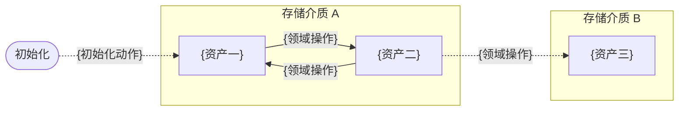

# 1. 文档描述

<!-- 生成提示:begin -->
写清本文档覆盖什么（本域各数据模型的数据资产、存储实体、模型内数据关系与数据流转）与不覆盖什么（数据模型清单、存储选型与拓扑、数据全景图、
模型间锚定与模型关系（ER）见同目录 `DATA-MODEL-MAP.md`；领域业务语义见 `docs/L2/domain/{域}.md`
）。再用一句话说明本域有几个数据模型（等于几个聚合）、各叫什么。
`{...}` 是待替换的元变量，不留在产物中。
<!-- 生成提示:end -->

# 2. {数据模型}

<!-- 生成提示:begin -->
一个聚合一个数据模型，一章一个模型：按本域实际的聚合数量顺延编号（1..n，n 为聚合个数，与 `docs/L2/domain/{域}.md`
的聚合章一一对应），章节标题写模型名（写聚合根名）。
章内依次写：数据资产、存储实体、数据关系（ER）、数据流转。本域是能力域（没有聚合）时，按该域的只读实体逐个成模型。`{...}`
是待替换的元变量，不留在产物中。
<!-- 生成提示:end -->

## 数据资产

<!-- 生成提示:begin -->
该模型（=该聚合）的数据资产：承接该聚合的实体 / 值对象与关联表（1:N）；技术数据不单独成模型、作为本模型的技术资产列出，同一模型的多份资产可落在不同存储介质。
逐行列出「数据资产 → 存储介质 + 类型（业务数据 / 技术数据）」。`{...}` 是待替换的元变量，不留在产物中。
<!-- 生成提示:end -->

| 数据资产 | 存储介质 | 类型 |
|----------|----------|------|

## 存储实体

<!-- 生成提示:begin -->
该模型在不同存储介质里的存储实体（每个介质一个，实体组装起来构成模型）；逐行给 存储介质 / 存储实体 / 表或文件 /
关键字段（表与集合列字段，文件类给结构）/ 键模式 / 数据构建方式（初始化 / 业务写入 / 同步 /
清理）。模型内锚定（同一模型的多个资产靠模型标识——主键 / stem / id——跨介质锚定）写在键模式列；
每个存储实体只在这里写一次。
<!-- 生成提示:end -->

| 存储介质 | 存储实体 | 表 / 文件 | 关键字段 | 键模式 | 数据构建方式 |
|----------|----------|-----------|----------|--------|--------------|

## 数据关系（ER）

<!-- 生成提示:begin -->
画本模型内部各数据资产之间的关系：实体 = 本模型的全部数据资产（业务与技术），每个存储介质一个 `subgraph`
（子图），资产之间的关联用带标签连线标出，标签写关联键（主键 / 外键 / stem 等）；每个模型都要画，只有一个资产、或资产之间无关联时也要画出实体。
<!-- 生成提示:end -->

## 数据流转

<!-- 生成提示:begin -->
用 Mermaid 流程图——每个存储介质一个 `subgraph`（子图），节点 = 该介质里的数据资产（与数据关系（ER）同一批）；边 = 导致数据写入 /
变更 / 流转的领域操作（Action），标签写动作名（取自 docs/L2/domain/
的领域操作），纯读操作不入图，跨介质流转用子图之间的连线标出。初始化 / 迁移写入用固定的 `初始化` 起点节点 +
虚线边（标签写初始化动作），运行期动作用实线；每个模型都要画，只有一个资产、不发生流转时也要画出来；图后写明与哪些模型锚定。
<!-- 生成提示:end -->

