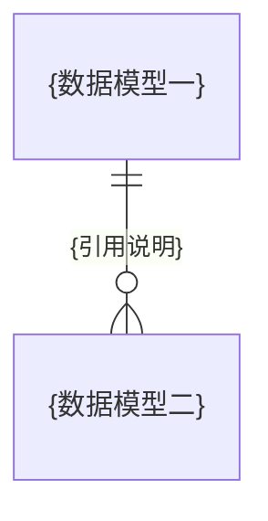
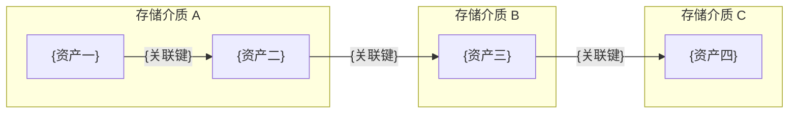
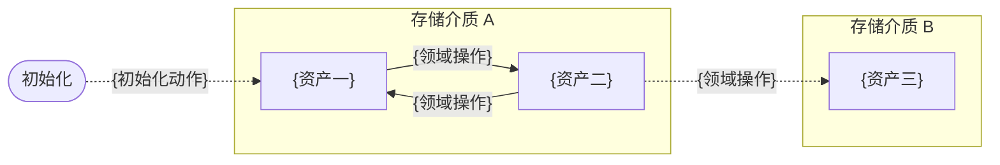

# 1. 文档描述

<!-- 生成提示:begin -->
写清本文档覆盖什么（数据模型与数据资产、存储选型与拓扑、锚定关系、模型关系（ER）、数据全景图、逐模型的数据资产 / 存储实体 /
数据关系（ER） /
存储来源 / 数据流转）与不覆盖什么（领域模型、技术选型理由、日志 / 备份 / 运行产物与部署归部署文档）。
<!-- 生成提示:end -->

# 2. 数据全景

## 2.1 数据模型与数据资产

<!-- 生成提示:begin -->
数据模型都是业务数据模型；一个模型对应多个数据资产（1:
N），技术数据不单独成模型、作为所属业务模型的技术资产列出，同一模型的多份资产可落在不同存储介质。日志 / 备份 /
模型权重缓存等运行产物归部署文档，不入本文档。逐行列出「数据模型 →
数据资产」，每个资产标注所属存储介质与类型（业务数据 / 技术数据）。表与图覆盖同一批资产、不重不漏。`{...}` 是待替换的元变量，不留在产物中。
<!-- 生成提示:end -->

| 数据模型 | 数据资产 | 存储介质 | 类型 |
|----------|----------|----------|------|

## 2.2 存储选型与拓扑

<!-- 生成提示:begin -->

- 存储类型：关系型 / 键值 / 对象存储 / 搜索 / 向量 等。
- 技术：具体技术或产品。
- 承载数据：该存储承载哪些数据。
- 备注：补充说明（不写选型理由）。

<!-- 生成提示:end -->

| 存储类型 | 技术 | 承载数据 | 备注 |
|----------|------|----------|------|

## 2.3 锚定关系

<!-- 生成提示:begin -->
只写模型内锚定：同一模型的多个资产靠模型标识（主键 / stem / id）跨介质锚定；模型间引用归 §3 模型关系（ER），这里不重复。
`{...}` 是待替换的元变量，不留在产物中。
<!-- 生成提示:end -->

## 2.4 数据全景图

<!-- 生成提示:begin -->
D2
容器图（elk）：顶层按存储介质分容器，自上而下按接近核心程度排列，容器数量按实际存储介质增删；容器内列数据项、列数按数据项数量与可读性设定，允许折成多行、不强行单行；数据项按业务数据 /
技术数据用两种颜色区分，并附图例（4 等列 + 两侧透明占位块居中）。`{...}` 是待替换的元变量，不留在产物中。
<!-- 生成提示:end -->

```d2
# 图名: 数据全景
# 视角: 存储介质视角（自上而下按接近核心程度排列，容器内数据项用颜色区分业务 / 技术）
# 用途: 说明数据分别存在哪些存储介质、各介质里有哪些数据
# 反映的问题: 数据落在哪些存储、每类存储承载什么、业务数据与技术数据如何分布
# 边界: 不展开表字段与键模式（见 §4 起各模型章）
vars: { d2-config: { layout-engine: elk } }

数据全景: {
  grid-rows: 1
  grid-columns: 1
  grid-gap: 16
  style.border-radius: 16

  存储一: {
    label: "① {存储介质}（{最贴核心的定位}）"
    width: 1240
    grid-columns: 5
    grid-gap: 12
    class: layer
    a1: { label: "{数据项}"; width: 233; height: 56; class: biz }
    a2: { label: "{数据项}"; width: 233; height: 56; class: biz }
    a3: { label: "{数据项}"; width: 233; height: 56; class: biz }
    a4: { label: "{数据项}"; width: 233; height: 56; class: biz }
    a5: { label: "{数据项}"; width: 233; height: 56; class: tech }
  }
  存储二: {
    label: "② {存储介质}（{定位}）"
    width: 1240
    grid-columns: 3
    grid-gap: 12
    class: layer
    b1: { label: "{数据项}"; width: 397; height: 56; class: biz }
    b2: { label: "{数据项}"; width: 397; height: 56; class: biz }
    b3: { label: "{数据项}"; width: 397; height: 56; class: biz }
  }
  存储三: {
    label: "③ {存储介质}（{定位}）"
    width: 1240
    grid-columns: 5
    grid-gap: 12
    class: layer
    c1: { label: "{数据项}"; width: 233; height: 56; class: tech }
    c2: { label: "{数据项}"; width: 233; height: 56; class: tech }
    c3: { label: "{数据项}"; width: 233; height: 56; class: tech }
    c4: { label: "{数据项}"; width: 233; height: 56; class: tech }
    c5: { label: "{数据项}"; width: 233; height: 56; class: tech }
  }
  存储四: {
    label: "④ {存储介质}（{最边缘的定位}）"
    width: 1240
    grid-columns: 3
    grid-gap: 12
    class: layer
    d1: { label: "{数据项}"; width: 397; height: 56; class: tech }
    d2: { label: "{数据项}"; width: 397; height: 56; class: tech }
    d3: { label: "{数据项}"; width: 397; height: 56; class: tech }
  }

  图例: {
    width: 1240
    grid-columns: 4
    grid-gap: 12
    class: legend
    pad1: { label: ""; width: 295; height: 48; style.fill: transparent; style.stroke: transparent; style.border-radius: 6 }
    lb: { label: "业务数据"; width: 295; height: 48; class: biz }
    lt: { label: "技术数据"; width: 295; height: 48; class: tech }
    pad2: { label: ""; width: 295; height: 48; style.fill: transparent; style.stroke: transparent; style.border-radius: 6 }
  }
}

classes: {
  layer: { style: { border-radius: 12; fill: "#f8fafc"; stroke: "#334155"; font-color: "#0f172a"; stroke-width: 1 } }
  legend: { style: { border-radius: 8; fill: "#ffffff"; stroke: "#cbd5e1"; font-color: "#334155"; stroke-dash: 3 } }
  biz: { style: { border-radius: 6; fill: "#dbeafe"; stroke: "#2563eb"; font-color: "#1e3a8a"; stroke-width: 1 } }
  tech: { style: { border-radius: 6; fill: "#ffedd5"; stroke: "#ea580c"; font-color: "#7c2d12"; stroke-width: 1 } }
}
```

# 3. 模型关系（ER）

<!-- 生成提示:begin -->
以数据模型为节点画 Mermaid erDiagram，只含业务数据、技术数据不入：每个业务数据模型一个实体，边 =
模型间引用（模型之间靠引用锚定，标签写谁引用谁）；模型内锚定与资产关系画在各模型章，这里不重复。
<!-- 生成提示:end -->



# 4. {数据模型}

<!-- 生成提示:begin -->
按 §2.1 的数据模型逐个成章：有几个模型写几章（与 §2.1 一一对应），标题写模型名，编号从 4 起顺延。本章写单个数据模型的细节，含
数据资产 / 存储实体 / 数据关系（ER） / 存储来源 / 数据流转 五节。`{...}` 是待替换的元变量，不留在产物中。
<!-- 生成提示:end -->

## 数据资产

<!-- 生成提示:begin -->
该模型的资产（承接 §2.1），标注存储介质与类型。
<!-- 生成提示:end -->

## 存储实体

<!-- 生成提示:begin -->
该模型在不同存储介质里的存储实体（每个介质一个，实体组装起来构成模型）；逐行给 存储介质 / 存储实体 / 表或文件 /
关键字段（表与集合列字段，文件类给结构）。
<!-- 生成提示:end -->

| 存储介质 | 存储实体 | 表 / 文件 | 关键字段 |
|----------|----------|-----------|----------|

## 数据关系（ER）

<!-- 生成提示:begin -->
画本模型内部各数据资产之间的关系：实体 = 本模型的全部数据资产（业务与技术），每个存储介质一个 `subgraph`
（子图），资产之间的关联用带标签连线标出，标签写关联键（主键 / 外键 / stem 等）；每个模型都要画，只有一个资产、或资产之间无关联时也要画出实体。
<!-- 生成提示:end -->



## 存储来源

<!-- 生成提示:begin -->
该模型的资产分别落在哪些存储（可多个）；每个来源写清 存储内容 / 键模式 / 数据构建方式（初始化 / 业务写入 / 同步 / 清理）。
<!-- 生成提示:end -->

## 数据流转

<!-- 生成提示:begin -->
用 Mermaid 流程图——每个存储介质一个 `subgraph`（子图），节点 = 该介质里的数据资产（与数据关系（ER）同一批）；边 = 导致数据写入 /
变更 / 流转的领域操作（Action），标签写动作名（取自 docs/L2/domain/
的领域操作），纯读操作不入图，跨介质流转用子图之间的连线标出。初始化 / 迁移写入用固定的 `初始化` 起点节点 +
虚线边（标签写初始化动作），运行期动作用实线；每个模型都要画，只有一个资产、不发生流转时也要画出来；图后写明与哪些模型锚定。
<!-- 生成提示:end -->


