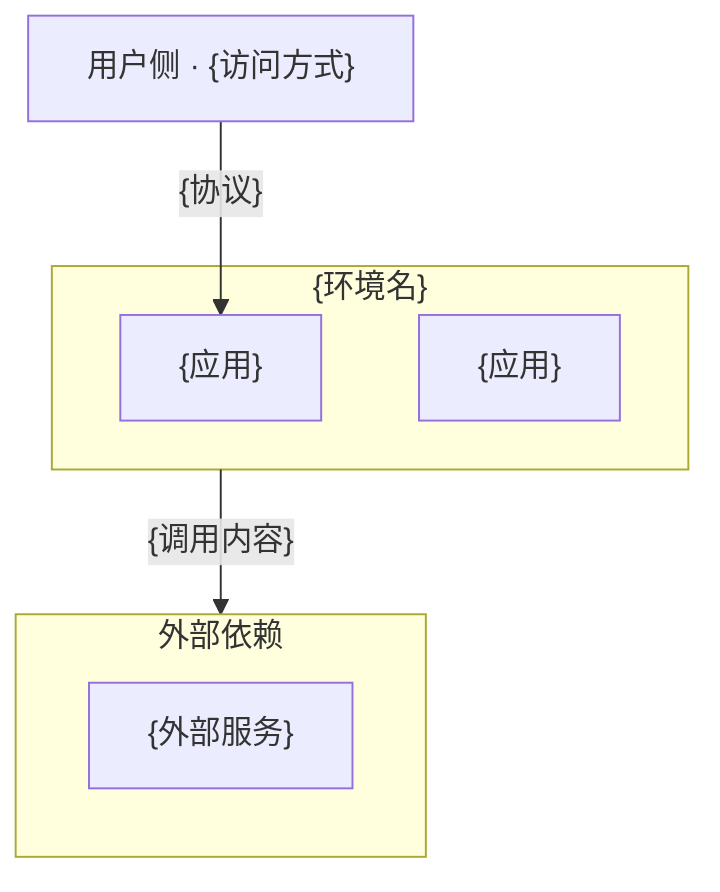

# 1. 文档描述

<!-- 生成提示:begin -->
写清本文档是哪个环境的部署说明书（环境名 = 所在目录名 = `.env.<env>`
后缀）、覆盖什么（本环境的部署形态，以及逐个应用——每个应用一章，含该应用的部署、配置与密钥、资产、运行产物）与不覆盖什么（其他环境各有一份自己的部署说明书；应用划分与模块归架构文档）。
<!-- 生成提示:end -->

# 2. 部署形态

<!-- 生成提示:begin -->
写本环境的部署形态（容器编排 / 裸进程 等）、代码包或发布物与本环境的对应关系，以及本环境区别于其他环境的关键事实。
<!-- 生成提示:end -->

# 3. 本环境

## 3.1 应用

<!-- 生成提示:begin -->
逐行列本环境承载的应用；表下补 访问入口与依赖关系、待澄清项。本表是后续各应用章的唯一来源：应用有几个，第 4 章起就有几个应用章。

- 应用：应用名。
- 入口：访问入口。
- 配置来源：配置从哪来。
- 依赖：依赖哪些服务。
- 运行形态：怎么跑。

<!-- 生成提示:end -->

| 应用 | 入口 | 配置来源 | 依赖 | 运行形态 |
|------|------|----------|------|----------|

## 3.2 环境拓扑

<!-- 生成提示:begin -->
用 Mermaid flowchart 画本环境拓扑：用户侧一个节点，本环境一个 `subgraph`（内含 §3.1 的各应用），外部依赖一个 `subgraph`
（内含各外部服务），边写交互方式与协议。
<!-- 生成提示:end -->

# 4. {应用}

<!-- 生成提示:begin -->
按 §3.1 的应用表逐个应用成章（应用有几个就写几章，标题写应用名），章内写该应用的部署、配置与密钥、资产、运行产物。多个应用共用同一中间件或配置时，在各应用章内分别写（重复可接受）。
<!-- 生成提示:end -->

## 部署

<!-- 生成提示:begin -->
写该应用的启动、发布、验证与运维命令（命令与预期结果），执行位置写清在哪台机器或哪个目录执行；部署单元的健康检查与回滚也写在本节内。

- 步骤：步骤名。
- 命令：该步命令。
- 执行位置：在哪执行。
- 失败处理：失败怎么办。

<!-- 生成提示:end -->

| 步骤 | 命令 | 执行位置 | 失败处理 |
|------|------|----------|----------|

### 部署前置规则（版本标识）

<!-- 生成提示:begin -->
写该应用的版本标识机制与部署前置校验。版本标识的目的，是能核对目标机上跑的是不是本次要发的版本；手段逐环境不同、与用户对齐（如
SemVer / 提交号 / 包摘要 / 时间戳 / OSS ETag 等），写清本环境怎么打、打在哪、怎么核对。
<!-- 生成提示:end -->

### 运维命令

<!-- 生成提示:begin -->
写该应用的部署、重启、回滚、日志查看，逐条给命令与执行位置。
<!-- 生成提示:end -->

| 目的 | 命令 | 执行位置 |
|------|------|----------|

### 种子凭据（如有）

<!-- 生成提示:begin -->
写该应用在启动 / 迁移时初始化的种子用户的凭据、角色与用途；不需要初始数据的应用可删本小节。
<!-- 生成提示:end -->

## 配置与密钥

<!-- 生成提示:begin -->
写该应用的配置与密钥：参数与配置文件、密钥的分层与来源；跨应用共享的配置与密钥在本应用章内写全。
<!-- 生成提示:end -->

### 参数与配置文件

<!-- 生成提示:begin -->
逐项列出该应用的参数与配置文件（含密钥所在文件）。

- 参数或文件：参数名或文件名。
- 路径：它的路径。
- 说明：用途。

<!-- 生成提示:end -->

| 参数或文件 | 路径 | 说明 |
|------------|------|------|

### 密钥

<!-- 生成提示:begin -->

- 密钥项：密钥名。
- 环境变量或来源：对应环境变量名或来源。
- 用途：它用来做什么。

<!-- 生成提示:end -->

| 密钥项 | 环境变量或来源 | 用途 |
|--------|----------------|------|

## 资产

<!-- 生成提示:begin -->
按该应用相关的磁盘内容逐项登记（脚本 / 二进制 / 证书 / hook /
配置模板）；纯配置取值文件归「配置与密钥」，本节不重复。运行类资产单列，说明其保留位置与是否进版本库；脚本按应用各自独立，不跨应用共享。

- 条目：资产条目名。
- 路径：它的路径。
- 生效机制：怎么生效。
- 用途：做什么用。

<!-- 生成提示:end -->

| 条目 | 路径 | 生效机制 | 用途 |
|------|------|----------|------|

## 运行产物

<!-- 生成提示:begin -->
逐项列出该应用运行期产生的产物（日志、备份、模型权重缓存、临时产物等）；只列属于本应用的，共用产物在各应用章内分别写；业务数据模型归
docs/L2/DATA-MODEL.md，本节不重复。

- 产物：产物名。
- 路径：存放路径。
- 产生方式：谁在什么时机产生。
- 保留与清理：保留多久、怎么清理。
- 进版本库：是否进版本库。

<!-- 生成提示:end -->

| 产物 | 路径 | 产生方式 | 保留与清理 | 进版本库 |
|------|------|----------|------------|----------|

# {n+1}. {应用}

<!-- 生成提示:begin -->
结构同 §4。
<!-- 生成提示:end -->

# {n+2}. 全量部署（所有应用）

<!-- 生成提示:begin -->
写一次部署全部应用的流程与运维命令（= 各应用部署之和，或专用的全量入口）。
<!-- 生成提示:end -->
