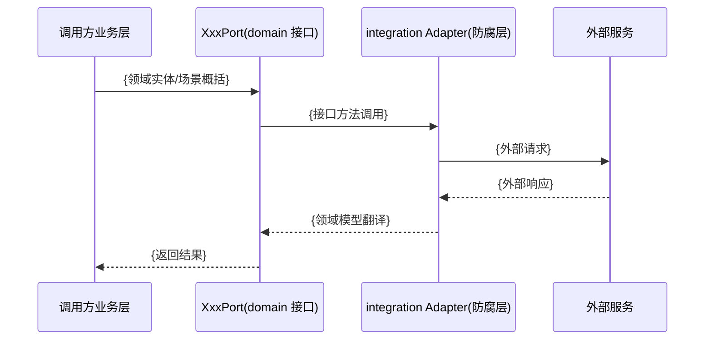

# OUTBOUND 与外部服务契约模板

## 产物一：OUTBOUND.md

### 文件头

<!-- 生成提示：写外部集成说明书的标题与方向说明。 -->

```markdown
# OUTBOUND — 外部集成说明书（Outbound）

> L3 Outbound 外部集成说明书。
```

### 1. 外部集成总览

<!-- 生成提示：写外部服务、用途、鉴权方式与归属应用的总览表；数据库、对象存储、缓存属基础设施，不列入外部集成。 -->

| 外部服务   | 用途     | 鉴权方式     | 归属应用     |
|------------|----------|--------------|--------------|
| `{服务名}` | `{用途}` | `{鉴权方式}` | `{归属应用}` |

### 2. 集成详情（概览）

<!-- 生成提示：按外部服务逐项写定位、契约文件引用与契约状态。 -->

#### 2.1 `{外部服务名}`

定位：`{一句话说明该外部服务在本系统中的用途}`

契约文件：`outbound-contracts/{service}.md`

契约状态：`{mock 中 / 已交付 / 已上线}`

### 3. 契约文件目录

<!-- 生成提示：本节只做人类可读的索引——逐服务列契约文件名与服务名，便于读者从说明书跳到契约文件；`outbound-contracts/` 的目录结构、文件命名规则与资产齐全性判定不在本节，以本 skill 的 [contract-assets.md](../references/contract-assets.md) §1 为准，本节不作为判定依据。 -->

| 契约文件                       | 外部服务   | 一句话说明                   |
|--------------------------------|------------|------------------------------|
| `outbound-contracts/{服务}.md` | `{服务名}` | `{一句话：这个契约覆盖什么}` |

## 产物二：outbound-contracts/{service}.md

### 文件头

<!-- 生成提示：写外部服务名称、契约文件标题与字段级契约声明。 -->

```markdown
# {service} 契约

> 本文档是外部服务 `{service}` 的字段级契约。
```

### 1. 集成形态

<!-- 生成提示：写对接对象、ACL 防腐层 Adapter 与四参与者集成时序图。 -->

对接内容：对接 `{外部服务}`，经 `{集成 Adapter 代码路径}` 统一连接与翻译。



### 2. 接入方式

<!-- 生成提示：写契约状态、Mock 切换信息、接入类型、地址、鉴权与失败策略；契约状态只取 mock 中 / 已交付 / 已上线三态，已上线时省略 Mock 相关字段。 -->

| 字段             | 内容                                        |
|------------------|---------------------------------------------|
| 契约状态         | `{mock 中 / 已交付 / 已上线}`               |
| mock 实现        | `{Mock Adapter 或示例数据集；已上线时删除}` |
| 切换方式         | `{切换到真实 Adapter 的方式；已上线时删除}` |
| 接入类型         | `{HTTP/REST、SDK 或其他接入类型}`           |
| 接入地址         | `{Base URL、端点或连接配置来源}`            |
| 鉴权（必填）     | `{Token、签名、密钥等鉴权方式}`             |
| 失败策略（必填） | `{超时、重试、降级等策略}`                  |

### 3. 接口列表（本系统调用面）

<!-- 生成提示：写本系统实际调用的接口、方法签名与接口说明；只列本系统调用面，不替外部服务维护完整 API。 -->

| 接口名     | 方法签名                                          | 说明         |
|------------|---------------------------------------------------|--------------|
| `{接口名}` | `{HTTP：METHOD /path；SDK/Port：fn(args) -> Ret}` | `{接口说明}` |

### 4. 接口定义

#### 4.1 `{接口名}`

接口语义：`{用途；幂等性与重复调用语义}`

方法签名：`{HTTP：METHOD /path；SDK/Port：fn(args) -> Ret}`

输入：

| 参数      | 类型     | 必填    | 说明         |
|-----------|----------|---------|--------------|
| `{param}` | `{type}` | `{Y/N}` | `{参数语义}` |

返回：

| 字段      | 类型     | 说明         |
|-----------|----------|--------------|
| `{field}` | `{type}` | `{返回语义}` |

失败处理：`{本接口的重试、状态回写、降级、部分成功等特殊行为；错误码引用 §5}`

### 5. 错误码

<!-- 生成提示：写公共错误码与接口特有错误码的集中表；错误码集中于此，接入方式与接口定义不重复维护错误码表。 -->

| 错误码   | 说明         | 适用                | 处理         |
|----------|--------------|---------------------|--------------|
| `{code}` | `{错误含义}` | `{全接口 / 接口名}` | `{处理动作}` |

### 6. 调用方

<!-- 生成提示：写调用该外部服务的业务层或模块。 -->

- 调用方：`{业务层/模块；应用级归属见 OUTBOUND.md §1}`

### 7. 我方定义契约的复杂服务（可选节）

<!-- 生成提示：写我方定义且需要交付外部团队的复杂契约背景、设计与实现信息。 -->

#### 7.1 背景与设计决策

<!-- 生成提示：写契约产生背景与关键设计决策。 -->

| 决策项     | 决策内容     | 理由     |
|------------|--------------|----------|
| `{决策项}` | `{决策内容}` | `{理由}` |

#### 7.2 接口场景映射

<!-- 生成提示：写驱动场景、触发接口与场景说明的紧凑映射。 -->

| 驱动场景 | 触发接口 | 说明     |
|----------|----------|----------|
| `{场景}` | `{接口}` | `{说明}` |

#### 7.3 设计理由

<!-- 生成提示：写接口、字段拆分、命名与边界的核心理由。 -->

- `{设计理由}`

#### 7.4 方案对比

<!-- 生成提示：写备选方案与当前方案的对比。 -->

| 方案     | 优点     | 缺点     | 结论     |
|----------|----------|----------|----------|
| `{方案}` | `{优点}` | `{缺点}` | `{结论}` |

#### 7.5 关键语义（外部团队硬性约定）

<!-- 生成提示：写外部团队必须遵守的接口级语义与约束。 -->

- `{关键语义约定}`

#### 7.6 当前实现

<!-- 生成提示：写当前实现状态与代码位置。 -->

- 当前实现：`{实现位置或状态}`
